# 问题情报平面开发计划

```yaml
ARTIFACT_CLASS: ssot-development
APPLICABILITY_DECISION: ssot
GOVERNANCE_REASON: "跨文献资料、问题状态、新颖性审计、分级发布和控制台接线需要长期决策与七个独立发布切片；现行路线图仍是唯一工程权威。"
TARGET_EVIDENCE_LEVEL: source
PLAN_VERSION: 3
DAG_VERSION: 2
INTERFACE_FREEZE_VERSION: 2
NODE_CONTRACT_VERSION: 2
SSOT_SCHEMA_VERSION: 2
SSOT_PLANNING_COMPILER: .ssot/planning-compiler.json
SSOT_MACHINE_SOURCE: .ssot/manifest.json
```

## 一、业务结论与范围

### 术语说明

“问题情报平面”是研究流程中的支持层：它整理公开资料、记录问题在某个时间点的开放状态，并在产生候选结果后单独检查新颖性。它不是证明系统，也不拥有最终数学结论的晋升权。本文所说的“开放”只表示在明确资料范围和观察时间内尚未得到足够反证；它不等于永久证明问题没有答案。

本计划把评审建议收敛成七个可以分别验收、分别停止的发布切片。新增的第六、第七发布切片（`PI-R6`、`PI-R7`）仅是本计划的源级修订合同；控制台切片决定节点（`D3`）的决定内容已获用户批准，但其执行受问题情报平面发布节点（`A5`）的失效状态阻塞。任何控制台实现节点（`U1` 至 `U5`）或新增验收节点（`A6`、`A7`）都不得被本文件解释为已实现、已验收或已发布。计划不改变现有论文准备路线，也不改变正式结论的唯一晋升入口。

本修订版本 2 固定机器源中的两组定义：

1. 四路检索分别是：从正典来源展开前向引用；检索名称、别名和等价表述；按陈述与数学结构做语义检索；以及记录综述、作者、问题源和专家线索。每一路都必须独立保留查询范围、命中和未决项，不能把单一路“没有搜到”当作开放性证明。
2. 三种真实档案分别是：弗兰克尔（Frankl）q=6 问题，用于保留既有覆盖和不作新颖性宣传；数据库标记为开放（open）但文献实际已解决的碰撞题，用于验证状态失效和人工复核；当前确实需要继续研究的问题，用于验证证据不足时不自动升级结论。三例只验证资料、状态和预算闭环，不预先证明开放状态或结果新颖性。

首个目标是形成一条最小的“资料观察—问题状态—新颖性审计—预算授权”链路。它先服务现有的论文准备和资料登记能力，再用一个主题和三份真实档案验证边界。只有回归记录表明流程稳定，才考虑扩大主题数量或增加长期观测。

## 二、用户、角色与受影响行为

### 术语说明

“资料观察”是对论文元数据、版本、许可依据和内容摘要的可追溯记录；“证明证据”是已经通过现有证明门的材料，二者不能互相替代。“问题状态证书”回答目标问题在观察日期的状态；“候选结果新颖性审计”回答本次结果是否已在资料中出现，这两个问题由不同记录和不同人员复核。

| 角色 | 需要完成的工作 | 计划带来的行为变化 |
|---|---|---|
| 研究负责人 | 选择是否启动支持性小切片、确定首个主题、接受发布边界 | 在没有批准前不能把候选方案当作已排期 |
| 研究基础设施负责人 | 建立统一资料观察和受预算约束的导入 | 重复资料只产生可核对的同一记录，新版本保留独立观察 |
| 问题状态负责人 | 维护命题版本、开放状态证书和失效关系 | 命题摘要变化或证书过期会收回相应预算授权 |
| 文献审计负责人 | 执行四条检索路线并复核解决碰撞 | “没有搜到”不能单独成为开放性证明 |
| 主题观测负责人 | 运行一次性同步并整理三份真实档案 | 预算耗尽、游标重跑和高风险事件停在人工通道 |
| 评测负责人 | 建立小型回归集、消融记录和难度量表 | 小样本只报告命中、漏检和人工耗时，不包装成泛化性能 |
| 仓库所有者 | 维护当前路线图和权威文件边界 | 未获批准的支持层不能绕过现行路线图进入主线 |

## 三、明确排除的工作

本计划不包含常驻后台观测程序、多主题抓取、大规模候选池、付费出版社全文自动归档、自动把普通相关文章改写为问题状态、未经校准的统计性能声明，也不包含“已解决”或“已确认新颖性”的宣传。首个主题已接受为并集封闭问题（`union-closed`），但该选择不预先证明开放状态或任何结果的新颖性。

任何实现都不得改写唯一的正式结论晋升入口（`ResearchTrace.promote_claim()`）；资料观察、问题状态和新颖性审计只能提供受限输入或阻塞信号，不能自行制造正式数学结论。

## 四、已接受的人工决定

### 术语说明

这里的“支持性小切片”是把问题情报能力明确登记为现有论文准备和资料登记的辅助发布；它不等于批准完整平台。“首个主题”是一次性观测的范围边界；修订批准记录（`decision.problem-intelligence.amendment@2`）是让后续正式消费者依赖的人工决定。控制台的全屏入口页（`landing`、`login`）归属仍待后续产品决定，但不扩大当前阻塞范围。

1. 支持性小切片路线已由研究负责人和仓库所有者接受（`decision.problem-intelligence.activation-route@2`）：范围限于现有论文准备和资料登记，不得绕过现行唯一工程决策入口。该决定供支持性小切片决定节点（`D1`）、修订接受节点（`A1`）及其正式消费者使用。
2. 首个监测主题已由研究负责人接受（`decision.problem-intelligence.first-topic@2`）：采用并集封闭问题，并保留资料范围、预算和不宣称事项；该选择决定检索合同、三种真实档案定义和回归样本，但不预先证明任何结果新颖。该决定供首个主题决定节点（`D2`）、修订接受节点（`A1`）及主题观测切片使用。
3. 当前路线图修订批准记录（`decision.problem-intelligence.amendment@2`）已由研究负责人和仓库所有者接受：它解锁已接受的资料底座和当前问题状态模型节点（`S1`）的正式前沿，但不替代任何后续切片各自的验收。
4. 控制台切片决定（`decision.problem-intelligence.console-slices@1`）已由研究负责人和仓库所有者在用户规格中批准：纳入第六、第七发布切片（`PI-R6`、`PI-R7`）的范围、节点和边；这只是控制台切片决定节点（`D3`）的决定内容，该执行节点当前为阻塞（`BLOCKED`），不解锁控制台语义节点（`U1`），也不构成新增验收节点（`A6`、`A7`）的人工验收或发布。全屏入口页（`landing`、`login`）的产品归属仍待决定，但不作为控制台切片决定节点（`D3`）的当前阻塞项。

活动假设（`ASM-ACTIVATION-ROUTE`）仅保留为修订批准前的可撤销隔离草稿历史，不再描述当前主视图的执行资格；所有正式消费者统一绑定修订批准记录（`decision.problem-intelligence.amendment@2`）。

## 五、七个发布切片摘要

| 发布切片 | 业务价值 | 独立验收边界 | 失败时的处理 |
|---|---|---|---|
| `PI-R1` 治理准入与修订 | 明确是否启动支持层、首个主题和负责人 | 权威对账、两个选项和修订决定可追溯 | 未批准则不解锁实现 |
| `PI-R2` 统一文献资料底座 | 让公开资料可去重、可追溯并受预算约束 | 资料观察、开放资料导入和信任门通过专项测试 | 资料停留在待审观察 |
| `PI-R3` 问题状态与新颖性审计 | 分离开放状态与候选结果新颖性 | 状态对象、四路检索和失效规则通过负面测试 | 冻结完整预算和公开定性 |
| `PI-R4` 一次性主题观测与三例档案 | 用一个主题验证重放、恢复、去重和人工闭环 | 同一游标可重放，三种失败模式各有证据 | 进入人工复核，不自动改状态 |
| `PI-R5` 回归集、难度记录与分级披露 | 比较检索路线增量并约束发布措辞 | 小型回归、三张量表和披露模板完成 | 只报告具体命中与缺口 |
| `PI-R6` 控制台接线 | 研究者在控制台看到真实工作区的证明结构、过程链、工具台账、轮次和评审队列，且外观与原型一致 | 门禁全绿、视觉一致性清单和人工 H-01 | 任一 live 视图与基线不一致即退回演示标注，不发布 |
| `PI-R7` 本地域投影与运营域 | 选题投影和运营账本只读可见、边界诚实 | 不推断状态、重放字节不变和人工 H-01 | 未配置项显示 `not_configured`，不发布外部能力 |

## 六、实施路径摘要

先由治理对账确认当前权威边界，再并行形成“是否启动”和“首个主题”两个选项；只有二者都被正式接受，才进入统一资料底座。资料底座验收后建立问题状态与新颖性审计竖切，再运行一次性主题观测和三份真实档案，最后才建立回归集、难度记录和分级披露。问题情报平面发布节点（`A5`）通过后，才按第十六至第二十二波（`W16` 至 `W22`）执行控制台切片决定节点（`D3`）、控制台语义至评审闭环节点（`U1`、`U2`、`U3`）、接线验收节点（`A6`）、本地域投影和运营域节点（`U4`、`U5`）以及控制台发布节点（`A7`）。每个切片都有独立失败半径，不能把后续切片的完成度倒推为前置切片已获批准。

当前计划状态是“治理已对账、修订接受节点（`A1`）已接受；主题观测验收、回归评测、分级披露和问题情报平面发布节点（`A4`、`R1`、`Q1`、`A5`）均因旧身份或上游失效而处于已失效（`INVALIDATED`）；控制台切片决定节点（`D3`）的用户决定内容已批准，但新执行节点处于阻塞（`BLOCKED`），新增验收节点（`A6`、`A7`）的合同与人工清单仍为草稿（`DRAFT`）和待执行（`PENDING`）”。第六、第七发布切片（`PI-R6`、`PI-R7`）只描述待执行的源级计划，不能被解释为控制台已实现、已验收或已发布。任一层的工程状态都不构成数学证明、外部文献确认、生产或设备证据、部署完成或公开研究授权。

## 七、权威边界与剩余不确定性路由

### 输入一致性

| 承诺行为 | 输入位置 | 所属模型或字段 | 进入方式 | 权限或状态依据 | 结论 | 后续动作 | 阻塞决定节点 |
|---|---|---|---|---|---|---|---|
| 新能力必须先服从当前路线图 | `docs/DEV_PATH_V03.md` | v0.3 路线与唯一入口 | 工程规划 | 当前 SSOT 顺序 | 已确认 | 只允许修订后进入 | `A1` |
| 延期发现平面不能直接排期 | `docs/DISCOVERY_PLANE_V04.md` | 延期标记与边界 | 规划对账 | 文档权威 | 已确认 | 作为冲突记录保留 | `D1`、`D2` |
| 统一资料导入复用现有信任门 | `matharc/v02/source_registry.py` | 来源版本与对应关系 | 资料底座 | 既有来源登记 | 已确认 | 作为实现输入 | `L1` |
| 预算沿用现有墙钟和请求边界 | `matharc/v02/budget.py` | 预算记录与停止条件 | 资料导入、主题观测 | 既有预算模块 | 已确认 | 作为实现输入 | `L1` |
| Frankl q=6 不得作为新九元素结果宣传 | 论文准备资料与评审原文 | 精确范围与已知覆盖 | 研究复核 | 新颖性仍开放 | 需要保留限定 | 进入真实档案与审计 | `D2`、`A3` |

### 权威注册表

| 声明或领域 | 权威路径 | 权威层 | 查询方式 | 是否需要修改 | 归属节点 | 验证 |
|---|---|---|---|---|---|---|
| 编排、决定与依赖 | `.ssot/manifest.json` 及其分片 | decision/orchestration | 机器校验器 | 本计划生成 | `CHARTER`、`A1` | 程序校验 |
| 当前工程决策入口 | `docs/DEV_PATH_V03.md` | domain-contract | 版本和内容校验 | 否 | `CHARTER` | 提交身份与 SHA-256 |
| 当前实现状态 | `docs/V03_IMPLEMENTATION_STATUS.md` | domain-contract | 版本和内容校验 | 否 | `F1` | 提交身份与 SHA-256 |
| 延期发现边界 | `docs/DISCOVERY_PLANE_V04.md` | domain-contract | 版本和内容校验 | 否 | `F1` | 提交身份与 SHA-256 |
| 来源信任门 | `matharc/v02/source_registry.py` | domain-contract | 源码阅读与专项测试 | 否 | `L1`、`L2` | 源码身份 |
| 预算边界 | `matharc/v02/budget.py` | domain-contract | 源码阅读与专项测试 | 否 | `L1`、`L2` | 源码身份 |
| 用户评审建议 | 用户提供的评审附件 | research/hypothesis | 人工阅读 | 否 | `F1`、`D1`、`D2` | 仅作为方案输入 |

生成的主视图（Markdown）是机器源的阅读投影；Obsidian 副本只用于审计，不拥有决定权。

### 不确定性路由

| 不确定性 | 分类 | 去向 | 负责人 | 阻塞范围 | 解决证据 |
|---|---|---|---|---|---|
| 支持性小切片路线 | accepted-decision | `openproblem.md` | 研究负责人和仓库所有者 | 已满足 `D1`、`A1` 依赖 | `decision.problem-intelligence.activation-route@2` |
| 首个主题采用并集封闭问题 | accepted-decision | `openproblem.md` | 研究负责人 | 已满足 `D2`、`A1` 依赖 | `decision.problem-intelligence.first-topic@2` |
| 路线图修订 | accepted-decision | `openproblem.md` | 研究负责人和仓库所有者 | 已满足 `A1` 依赖 | `decision.problem-intelligence.amendment@2` |
| 延期文档与现行路线图的优先级 | resolved-authority-conflict | `openproblem.md` 与冲突分片 | 仓库所有者 | 不再阻塞 `D1`、`D2`、`A1` | 当前路线图与 `decision.problem-intelligence.amendment@2` |
| 现有字段和预算实现细节 | discoverable-fact | 节点内有界调查 | 对应负责人 | 不单独阻塞人工决定 | 源码、配置和测试 |
| 真实文献审计样本不足 | evidence-gap | 节点证据台账 | 文献审计负责人 | 只阻塞相应验收声明 | 具体验证记录 |
| 外部检索凭据或服务不可用 | execution-blocker | 节点阻塞台账 | 主题观测负责人 | 只阻塞需要外部访问的动作 | 能力恢复记录 |
| 单次同步出现网络或解析故障 | incident | 运行工作流 | 主题观测负责人 | 只影响当次同步 | 事故与恢复记录 |

## 八、工程执行附录

### 术语说明

本附录中的节点编号、状态、版本和路径是机器合同的精确值。它们只描述执行资格和证据边界，不改变前文的业务决定。机器权威是 `.ssot/manifest.json`、节点分片、边分片、假设分片和冲突分片；本文件由这些记录生成。

### 规划编译身份

```text
planning_compiler_schema_version: 1
ssot_schema_version: 2
machine_validation_profile: release
parallelism_contract_version: 1
execution_contract_validation: strict
main_thread_policy: orchestration-only
main_thread_source_write: false
planning source: .ssot/planning-compiler.json
machine source: .ssot/manifest.json
plan revision: PLAN_VERSION 3 / DAG_VERSION 2
current pushed baseline: main@5e06216edbb36e42b5b5c6686e6792c84959f9da
current worktree: A4 invalidation state transition; query git status for the live file set
```

### 发布、基线与候选

| Macro phase | Release ID | User value | Independent acceptance | Independent failure | Development baseline | Promotion baseline | Release candidate |
|---|---|---|---|---|---|---|---|
| P0 治理准入与事实对账 | PI-R1 | 决定是否启动支持层 | 对账、选项和修订决定 | 未批准即停止 | `git:3f1b69b5ab315442591f40295b036cd0d072be4e` | `main:3f1b69b5ab315442591f40295b036cd0d072be4e` | `candidate:pi-r1-v2` |
| P1 共享文献资料底座 | PI-R2 | 公开资料可追溯导入 | 观察、去重、预算和信任门 | 资料停留待审 | `candidate:pi-r1-v1` | `accepted:pi-r1-v1` | `candidate:pi-r2-v1` |
| P2 问题状态与新颖性审计 | PI-R3 | 状态与新颖性分离 | 四路检索和失效负测 | 冻结完整预算 | `candidate:pi-r2-v1` | `accepted:pi-r2-v1` | `candidate:pi-r3-v1` |
| P3 一次性主题观测 | PI-R4 | 三例真实闭环 | 重放、恢复、去重和人工审计 | 进入人工通道 | `candidate:pi-r3-v1` | `accepted:pi-r3-v1` | `candidate:pi-r4-v1` |
| P4 回归、校准与披露 | PI-R5 | 路线比较与准确发布 | 回归、量表和披露模板 | 只报告具体缺口 | `candidate:pi-r4-v1` | `accepted:pi-r4-v1` | `candidate:pi-r5-v1` |
| P5 控制台接线 | PI-R6 | 研究者看到真实工作区观察面 | 门禁、视觉清单和人工 H-01 | 任一 live 视图不一致即退回演示标注 | `development-freeze:accepted:pi-r5-v1` | `promotion-replay:accepted:pi-r5-v1` | `candidate:pi-r6-v1` |
| P6 本地域投影与运营域 | PI-R7 | 选题投影与运营账本只读可见 | 投影边界、字节重放和人工 H-01 | 未配置项显示 `not_configured`，不发布外部能力 | `candidate:pi-r6-v1` | `accepted:pi-r6-v1` | `candidate:pi-r7-v1` |

第六发布切片（`PI-R6`）的开发冻结身份和晋升重放身份都解析到用户批准的同一个底层基线（`accepted:pi-r5-v1`）；前缀只区分 Harness 要求的基线角色，不代表两个不同源码提交，也不改变批准语义。

机器源固定的 R1 四路检索为 `FORWARD_CITATION`、`ALIAS_AND_EQUIVALENCE`、`STRUCTURAL_SEMANTIC`、`REVIEW_AND_EXPERT_LEAD`；T2 三例真实档案为 `P-FRANKL-Q6`、`P-ARXIV-2601-22401-COLLISION`、`P-FRANKL-Q6-FOUR-OR-MORE-SMALL-OUTSIDE-PARTS`。这些名称、顺序和逐例边界直接投影自对应 fixture，禁止由视图读者自行补定义。

### 最小节点合同

| Node ID | Goal | Dependencies | Acceptance | Owner |
|---|---|---|---|---|
| `CHARTER` | 确认问题情报能力只能作为当前路线图的修订候选 | 无 | 权威入口、状态和延期边界完成对账 | 仓库所有者 |
| `F1` | 形成权威事实、现有能力和延期边界核对包 | `CHARTER` | 每项事实绑定路径、提交身份和缺口 | 规划编排者 |
| `D1` | 提出支持性小切片路线选项 | `F1` | 选项、代价、停止条件和批准人齐全 | 研究负责人 |
| `D2` | 提出首个监测主题选项 | `F1` | 主题、范围、预算上限和不宣称事项齐全 | 研究负责人 |
| `A1` | 接受或拒绝问题情报修订 | `D1`、`D2` | 研究负责人和仓库所有者共同记录 | 研究负责人和仓库所有者 |
| `L1` | 定义统一文献观察、版本、许可和内容摘要合同 | `A1` | 能区分观察资料与证明证据 | 研究基础设施负责人 |
| `L2` | 复用现有来源登记与预算边界实现开放资料导入 | `L1` | 重复导入幂等，超预算或错误类型停在待审 | 研究基础设施负责人 |
| `A2` | 验收统一文献资料底座 | `L2` | 专项测试和负面路径证据齐全 | 验收负责人 |
| `S1` | 建立命题版本、开放状态证书和问题档案快照关系 | `A2` | 先以三种真实档案定义建立独立纸面 dry-run 夹具；该夹具只校验 S1 合同，不执行或验收后续 `T2`。摘要变化、证书过期和来源缺失使状态失效 | 问题状态负责人 |
| `S2` | 建立独立候选结果新颖性审计与人工入口 | `S1` | 四路结果可分开记录 | 文献审计负责人 |
| `A3` | 验收问题状态与新颖性竖切 | `S2` | 未审计解决声称不能获得完整预算或公开定性 | 验收负责人 |
| `T1` | 实现一次性主题观测、游标恢复和去重 | `A3` | 游标可重放，预算和高风险事件进入人工通道 | 主题观测负责人 |
| `T2` | 用三种真实档案演练资料、状态和预算闭环 | `T1` | 三种档案停在正确审计状态 | 主题观测负责人 |
| `A4` | 验收一次性主题观测和三例真实档案 | `T2` | 重放、恢复、去重和失败模式证据可查 | 验收负责人 |
| `R1` | 建立四条检索路线的回归集和消融记录 | `A4` | 比较路线增量且不包装小样本性能 | 评测负责人 |
| `Q1` | 建立难度量表、实验性预测和分级披露模板 | `R1` | 未校准预测标记为 `UNCALIBRATED` | 研究负责人 |
| `A5` | 作出问题情报平面 v0 发布决定 | `Q1` | 只发布已验收范围并披露限制 | 研究负责人和仓库所有者 |
| `D3` | 决定是否把控制台两个切片纳入本次修订 | `A1` | 用户决定内容已批准；执行节点受 A5 失效阻塞 | 研究负责人和仓库所有者 |
| `U1` | 冻结控制台视觉基线与建设状态合同 | `D3` | 基线清单哈希不可变，§5 每行绑定归属节点 | 验收负责人（用户授权） |
| `U2` | 正式化 M0 只读导出与 M1 观察站接线并补齐 §9 断言 | `U1` | 门禁全绿且 live 结构/令牌与基线一致 | 研究基础设施负责人 |
| `U3` | 正式化 M2 评审闭环 | `U2` | 非 OK 义务的 APPROVE 被拒，有效评审读回，令牌只驻内存 | 研究基础设施负责人 |
| `A6` | 验收控制台接线与视觉还原 | `U2`、`U3` | 机器证据与人工 H-01 并排验收 | 验收负责人 |
| `U4` | 正式化 M3 选题本地投影 | `A6`、`A4`、`R1`、`Q1` | 只读且不推断开放、已解或新颖 | 主题观测负责人 |
| `U5` | 正式化 M4 本地运营域账本 | `A6` | 研究账本隔离，换模型/上游后历史重放逐字节不变 | 研究基础设施负责人 |
| `A7` | 控制台 v0 验收与发布决定 | `U4`、`U5`、`A5` | 人工 H-01；仅发布已验收范围并披露未配置项 | 研究负责人和仓库所有者 |

### 执行波次

| Wave | Release ID | Node IDs | Resource decision |
|---|---|---|---|
| W0 | PI-R1 | `CHARTER` | 共享权威只读 |
| W1 | PI-R1 | `F1` | 共享事实记录唯一写入 |
| W2 | PI-R1 | `D1`、`D2` | 只读事实相同快照，写入区分离 |
| W3 | PI-R1 | `A1` | 人工决定记录串行 |
| W4 | PI-R2 | `L1` | 条件隔离草稿，未批准不可晋升 |
| W5 | PI-R2 | `L2` | 资料底座唯一实现写入 |
| W6 | PI-R2 | `A2` | 证据记录唯一写入 |
| W7 | PI-R3 | `S1` | 状态模型唯一实现写入 |
| W8 | PI-R3 | `S2` | 新颖性审计唯一实现写入 |
| W9 | PI-R3 | `A3` | 验收记录唯一写入 |
| W10 | PI-R4 | `T1` | 同步输出与预算记录隔离 |
| W11 | PI-R4 | `T2` | 三例档案独占主题输出 |
| W12 | PI-R4 | `A4` | 真实档案证据唯一写入 |
| W13 | PI-R5 | `R1` | 回归集唯一实现写入 |
| W14 | PI-R5 | `Q1` | 披露政策唯一写入 |
| W15 | PI-R5 | `A5` | 发布决定串行 |
| W16 | PI-R6 | `D3` | 用户决定已批准；执行节点阻塞，不能解锁 U1 |
| W17 | PI-R6 | `U1` | 视觉基线合同唯一写入 |
| W18 | PI-R6 | `U2` | 只读接线与缺失断言唯一实现写入 |
| W19 | PI-R6 | `U3` | 评审闭环唯一实现写入 |
| W20 | PI-R6 | `A6` | 机器与人工 H-01 验收串行 |
| W21 | PI-R7 | `U4`、`U5` | 选题投影与运营账本写区隔离并行 |
| W22 | PI-R7 | `A7` | 控制台发布决定串行 |

### 复杂度预算

| Budget | Limit | Actual | Exception authority |
|---|---:|---:|---|
| 总节点数 | 25 | 25 | 规划编排者与仓库所有者（PI-R6/PI-R7 预算例外） |
| 每发布实现节点数 | 3 | 3 | 规划编排者 |
| Codex worker 节点数 | 0 | 0 | 不注册外部 worker |
| 生成视图数 | 1 | 1 | 唯一汇编者 |

### 状态台账

| Task ID | Stage | Versions | State | Attempt | Owner | Guard ID | Blocking reason | Evidence | Unlocks |
|---|---|---|---|---:|---|---|---|---|---|
| CHARTER | P0 | 1/1/1/1/2 | ACCEPTED | 0 | 仓库所有者 | EG-PLAN | 无 | source:authority-reconciled | F1 |
| F1 | P0 | 1/1/1/1/2 | ACCEPTED | 0 | 规划编排者 | EG-PLAN | 无 | source:fact-reconciliation | D1,D2 |
| D1 | P0 | 1/1/1/1/2 | ACCEPTED | 0 | 研究负责人 | EG-PLAN | 支持性小切片已批准 | source:decision-accepted | A1 |
| D2 | P0 | 1/1/1/1/2 | ACCEPTED | 0 | 研究负责人 | EG-PLAN | union-closed 已批准 | source:decision-accepted | A1 |
| A1 | P0 | 1/1/1/1/2 | ACCEPTED | 0 | 研究负责人和仓库所有者 | EG-PLAN | revision 2 已批准 | source:decision-accepted | L1 |
| L1 | P1 | 1/1/1/1/2 | ACCEPTED | 0 | 研究基础设施负责人 | EG-PLAN | 用户验收确认 | source:accepted | L2 |
| L2 | P1 | 1/1/1/1/2 | ACCEPTED | 0 | 研究基础设施负责人 | EG-PLAN | 完整性修复后接受 | source:accepted | A2 |
| A2 | P1 | 1/1/1/1/2 | ACCEPTED | 0 | 验收负责人 | EG-PLAN | 用户验收确认，专项负测通过 | source:accepted | S1 |
| S1 | P2 | 1/1/1/1/2 | ACCEPTED | 0 | 问题状态负责人 | EG-PLAN | 三例纸面 dry-run、失效和因果时间负测均通过 | source:accepted | S2 |
| S2 | P2 | 1/1/1/1/2 | ACCEPTED | 0 | 文献审计负责人 | EG-PLAN | 四路独立性、资料读回和时间负测通过 | source:accepted | A3 |
| A3 | P2 | 1/1/1/1/2 | ACCEPTED | 0 | 验收负责人 | EG-PLAN | 未审计结果不得授权的专项证据通过 | source:accepted | T1 |
| T1 | P3 | 1/1/1/1/2 | ACCEPTED | 0 | 主题观测负责人 | EG-PLAN | 游标重放、去重和人工通道专项及独立 AI 复审通过 | source:accepted | T2 |
| T2 | P3 | 1/1/1/1/2 | ACCEPTED | 0 | 主题观测负责人 | EG-PLAN | 三个固定来源档案、重放、预算和人工闭环均通过独立 AI 复审 | source:accepted | A4 |
| A4 | P3 | 1/1/1/1/2 | INVALIDATED | 4 | 验收负责人 | EG-PLAN | 双独立 AI 复核确认四项实现缺陷；等待修复、重验和明确人工批准 | evidence:EV-A4-REOPENED-4 | R1 |
| R1 | P4 | 1/1/1/1/2 | INVALIDATED | 5 | 评测负责人 | EG-PLAN | 等待 A4 重新接受；R1 v11 当前保持字节不变 | evidence:EV-R1-REOPENED-5 | Q1 |
| Q1 | P4 | 1/1/1/1/2 | INVALIDATED | 3 | 研究负责人 | EG-PLAN | 等待新 R1 正式接受后重做披露验收 | evidence:EV-Q1-REOPENED-3 | A5 |
| A5 | P4 | 1/1/1/1/2 | INVALIDATED | 3 | 研究负责人和仓库所有者 | EG-PLAN | 等待新 Q1 正式接受后重做受限源级发布验收 | evidence:EV-A5-REOPENED-3 | 无 |
| D3 | P5 | 1/1/1/1/2 | BLOCKED | 0 | 研究负责人和仓库所有者 | EG-PLAN | 用户决定内容已批准，但 A5 为 `INVALIDATED`，新执行节点不能解锁 | source:plan-v3-owner-instruction | U1 |
| U1 | P5 | 1/1/1/1/2 | BLOCKED | 0 | 验收负责人（用户授权） | EG-PLAN | 等待 D3 执行节点可用；合同为 `DRAFT` | source:plan-v3-owner-instruction | U2 |
| U2 | P5 | 1/1/1/1/2 | BLOCKED | 0 | 研究基础设施负责人 | EG-PLAN | 等待 U1；不声称实现或门禁通过 | source:plan-v3-owner-instruction | U3,A6 |
| U3 | P5 | 1/1/1/1/2 | BLOCKED | 0 | 研究基础设施负责人 | EG-PLAN | 等待 U2；不声称实现或评审闭环 | source:plan-v3-owner-instruction | A6 |
| A6 | P5 | 1/1/1/1/2 | BLOCKED | 0 | 验收负责人 | EG-PLAN | 合同和人工 H-01 清单为 `DRAFT`/`PENDING` | source:plan-v3-owner-instruction | U4,U5 |
| U4 | P6 | 1/1/1/1/2 | BLOCKED | 0 | 主题观测负责人 | EG-PLAN | 等待 A6、A4、R1、Q1；不声称投影实现 | source:plan-v3-owner-instruction | A7 |
| U5 | P6 | 1/1/1/1/2 | BLOCKED | 0 | 研究基础设施负责人 | EG-PLAN | 等待 A6；不声称运营账本实现 | source:plan-v3-owner-instruction | A7 |
| A7 | P6 | 1/1/1/1/2 | BLOCKED | 0 | 研究负责人和仓库所有者 | EG-PLAN | 合同和人工 H-01 清单为 `DRAFT`/`PENDING`；A5 未接受 | source:plan-v3-owner-instruction | 无 |

### 语义节点登记表

| Task ID | Semantic key | Work kind | Domain lane | Execution state | Decision state | Decision version | Readiness mode | Hard dependencies | Soft dependencies | Assumptions | Decision refs | Invalidation keys | Write authority | Acceptance authority |
|---|---|---|---|---|---|---|---|---|---|---|---|---|---|---|
| CHARTER | decision.problem-intelligence.charter | charter | governance | ACCEPTED | NOT_APPLICABLE | n/a | FORMAL | none | none | none | none | decision.problem-intelligence.charter | isolated-record | 仓库所有者 |
| F1 | fact.problem-intelligence.authority-reconciliation | fact-discovery | governance | ACCEPTED | NOT_APPLICABLE | n/a | FORMAL | CHARTER | none | none | none | fact.problem-intelligence.authority-reconciliation | isolated-record | 规划编排者 |
| D1 | decision.problem-intelligence.activation-route | decision-acceptance | governance | ACCEPTED | ACCEPTED | 2 | FORMAL | F1 | none | none | none | decision.problem-intelligence.activation-route | isolated-record | 研究负责人 |
| D2 | decision.problem-intelligence.first-topic | decision-acceptance | governance | ACCEPTED | ACCEPTED | 2 | FORMAL | F1 | none | none | none | decision.problem-intelligence.first-topic | isolated-record | 研究负责人 |
| A1 | decision.problem-intelligence.amendment@2 | decision-acceptance | governance | ACCEPTED | ACCEPTED | 2 | FORMAL | D1,D2 | none | none | decision.problem-intelligence.activation-route@2,decision.problem-intelligence.first-topic@2 | decision.problem-intelligence.amendment@2 | isolated-record | 研究负责人和仓库所有者 |
| L1 | contract.problem-intelligence.source-observation | contract-compile | literature | ACCEPTED | NOT_APPLICABLE | n/a | FORMAL | A1 | none | none | decision.problem-intelligence.amendment@2 | contract.problem-intelligence.source-observation | isolated-record | 研究基础设施负责人 |
| L2 | implementation.problem-intelligence.literature-base | implementation | literature | ACCEPTED | NOT_APPLICABLE | n/a | FORMAL | L1 | none | none | decision.problem-intelligence.amendment@2 | implementation.problem-intelligence.literature-base | implementation | 研究基础设施负责人 |
| A2 | acceptance.problem-intelligence.literature-base | validation | literature | ACCEPTED | NOT_APPLICABLE | n/a | FORMAL | L2 | none | none | decision.problem-intelligence.amendment@2 | acceptance.problem-intelligence.literature-base | evidence-only | 验收负责人 |
| S1 | implementation.problem-intelligence.status-model | implementation | problem-status | ACCEPTED | NOT_APPLICABLE | n/a | FORMAL | A2 | none | none | decision.problem-intelligence.amendment@2 | implementation.problem-intelligence.status-model | implementation | 问题状态负责人 |
| S2 | implementation.problem-intelligence.novelty-audit | implementation | novelty-audit | ACCEPTED | NOT_APPLICABLE | n/a | FORMAL | S1 | none | none | decision.problem-intelligence.amendment@2 | implementation.problem-intelligence.novelty-audit | implementation | 文献审计负责人 |
| A3 | acceptance.problem-intelligence.status-novelty | validation | novelty-audit | ACCEPTED | NOT_APPLICABLE | n/a | FORMAL | S2 | none | none | decision.problem-intelligence.amendment@2 | acceptance.problem-intelligence.status-novelty | evidence-only | 验收负责人 |
| T1 | implementation.problem-intelligence.topic-observation | implementation | topic-observation | ACCEPTED | NOT_APPLICABLE | n/a | FORMAL | A3 | none | none | decision.problem-intelligence.amendment@2 | implementation.problem-intelligence.topic-observation | implementation | 主题观测负责人 |
| T2 | implementation.problem-intelligence.dogfood-archives | implementation | topic-observation | ACCEPTED | NOT_APPLICABLE | n/a | FORMAL | T1 | none | none | decision.problem-intelligence.amendment@2 | implementation.problem-intelligence.dogfood-archives | implementation | 主题观测负责人 |
| A4 | acceptance.problem-intelligence.dogfood | validation | topic-observation | INVALIDATED | NOT_APPLICABLE | n/a | FORMAL | T2 | none | none | decision.problem-intelligence.amendment@2 | acceptance.problem-intelligence.dogfood | evidence-only | 验收负责人 |
| R1 | implementation.problem-intelligence.regression | implementation | evaluation | INVALIDATED | NOT_APPLICABLE | n/a | FORMAL | A4 | none | none | decision.problem-intelligence.amendment@2 | implementation.problem-intelligence.regression | implementation | 评测负责人 |
| Q1 | validation.problem-intelligence.calibration-disclosure | validation | evaluation | INVALIDATED | NOT_APPLICABLE | n/a | FORMAL | R1 | none | none | decision.problem-intelligence.amendment@2 | validation.problem-intelligence.calibration-disclosure | evidence-only | 研究负责人 |
| A5 | release.problem-intelligence.v0 | release-decision | governance | INVALIDATED | NOT_APPLICABLE | n/a | FORMAL | Q1 | none | none | decision.problem-intelligence.amendment@2 | release.problem-intelligence.v0 | isolated-record | 研究负责人和仓库所有者 |
| D3 | decision.problem-intelligence.console-slices | decision-acceptance | governance | BLOCKED | ACCEPTED | 1 | FORMAL | A1 | none | none | decision.problem-intelligence.console-slices@1 | decision.problem-intelligence.console-slices | isolated-record | 研究负责人和仓库所有者 |
| U1 | contract.problem-intelligence.console-visual-baseline | contract-compile | console | BLOCKED | NOT_APPLICABLE | n/a | FORMAL | D3 | none | none | decision.problem-intelligence.console-slices@1 | contract.problem-intelligence.console-visual-baseline | isolated-record | 验收负责人（用户授权） |
| U2 | implementation.problem-intelligence.console-readonly-wiring | implementation | console | BLOCKED | NOT_APPLICABLE | n/a | FORMAL | U1 | none | none | decision.problem-intelligence.console-slices@1 | implementation.problem-intelligence.console-readonly-wiring | implementation | 研究基础设施负责人 |
| U3 | implementation.problem-intelligence.console-review-loop | implementation | console | BLOCKED | NOT_APPLICABLE | n/a | FORMAL | U2 | none | none | decision.problem-intelligence.console-slices@1 | implementation.problem-intelligence.console-review-loop | implementation | 研究基础设施负责人 |
| A6 | acceptance.problem-intelligence.console-wiring | validation | console | BLOCKED | NOT_APPLICABLE | n/a | FORMAL | U2,U3 | none | none | decision.problem-intelligence.console-slices@1 | acceptance.problem-intelligence.console-wiring | evidence-only | 验收负责人 |
| U4 | implementation.problem-intelligence.console-local-projections | implementation | console-topic | BLOCKED | NOT_APPLICABLE | n/a | FORMAL | A6,A4,R1,Q1 | none | none | decision.problem-intelligence.console-slices@1 | implementation.problem-intelligence.console-local-projections | implementation | 主题观测负责人 |
| U5 | implementation.problem-intelligence.console-operations-domain | implementation | operations | BLOCKED | NOT_APPLICABLE | n/a | FORMAL | A6 | none | none | decision.problem-intelligence.console-slices@1 | implementation.problem-intelligence.console-operations-domain | implementation | 研究基础设施负责人 |
| A7 | release.problem-intelligence.console-v0 | release-decision | governance | BLOCKED | NOT_APPLICABLE | n/a | FORMAL | U4,U5,A5 | none | none | decision.problem-intelligence.console-slices@1 | release.problem-intelligence.console-v0 | isolated-record | 研究负责人和仓库所有者 |

### 依赖边表

| From | To | Dependency type | Dependency scope | Required upstream state | Assumption IDs | Invalidation keys | Transferred input | Gate/evidence |
|---|---|---|---|---|---|---|---|---|
| CHARTER | F1 | hard | specific-output | ACCEPTED | none | edge.charter.fact-reconciliation | 已接受的治理准入记录 | CHARTER 范围和权威入口 |
| F1 | D1 | hard | specific-output | ACCEPTED | none | edge.fact-reconciliation.activation-option | 权威事实对账包 | F1 路径、提交身份和缺口 |
| F1 | D2 | hard | specific-output | ACCEPTED | none | edge.fact-reconciliation.topic-option | 权威事实对账包 | F1 路径、提交身份和缺口 |
| D1 | A1 | hard | specific-output | ACCEPTED | none | edge.activation-option.amendment | 支持性小切片路线选项 | D1 选项、代价和停止条件 |
| D2 | A1 | hard | specific-output | ACCEPTED | none | edge.topic-option.amendment | 首个监测主题选项 | D2 主题、范围和预算 |
| A1 | L1 | hard | specific-output | ACCEPTED | none | edge.amendment.source-observation | 已接受的 `decision.problem-intelligence.amendment@2` | A1 决定记录 |
| L1 | L2 | hard | specific-output | ACCEPTED | none | edge.source-observation.literature-base | 冻结的文献观察合同 | L1 字段和边界检查 |
| L2 | A2 | hard | specific-output | ACCEPTED | none | edge.literature-base.literature-acceptance | 导入实现和重放记录 | L2 幂等、预算和类型测试 |
| A2 | S1 | hard | specific-output | ACCEPTED | none | edge.literature-acceptance.status-model | 已验收的资料观察层 | A2 专项测试和负面证据 |
| S1 | S2 | hard | specific-output | ACCEPTED | none | edge.status-model.novelty-audit | 版本化命题和状态对象 | S1 失效规则和关系校验 |
| S2 | A3 | hard | specific-output | ACCEPTED | none | edge.novelty-audit.status-novelty-acceptance | 四路检索结果和人工记录 | S2 对应与权限测试 |
| A3 | T1 | hard | specific-output | ACCEPTED | none | edge.status-novelty.topic-observation | 已验收的状态与新颖性边界 | A3 未审计不得晋升测试 |
| T1 | T2 | hard | specific-output | ACCEPTED | none | edge.topic-observation.dogfood-archives | 可重放的主题观测结果 | T1 游标、预算和去重 |
| T2 | A4 | hard | specific-output | ACCEPTED | none | edge.dogfood-archives.dogfood-acceptance | 三例真实档案及审计结果 | T2 重放、恢复和失败模式 |
| A4 | R1 | hard | specific-output | ACCEPTED | none | edge.dogfood-acceptance.regression | 已验收的真实主题档案 | A4 三例闭环证据 |
| R1 | Q1 | hard | specific-output | ACCEPTED | none | edge.regression.calibration-disclosure | 四路检索回归和消融结果 | R1 样本、增量和缺口 |
| Q1 | A5 | hard | specific-output | ACCEPTED | none | edge.calibration-disclosure.release | 难度记录、校准状态和披露模板 | Q1 未校准标记和双轨检查 |
| A1 | D3 | hard | specific-output | ACCEPTED | none | edge.amendment.console-slices | `amendment@2` 决定 | 扩展修订必须先存在 |
| D3 | U1 | hard | specific-output | ACCEPTED | none | edge.console-slices.visual-baseline | `console-slices@1` 决定 | 未批准不冻结基线 |
| U1 | U2 | hard | specific-output | ACCEPTED | none | edge.visual-baseline.readonly-wiring | 视觉基线清单 | 一致性断言需要基线 |
| U2 | U3 | hard | specific-output | ACCEPTED | none | edge.readonly-wiring.review-loop | live 数据层与门禁 | 评审面复用同一数据层 |
| U2 | A6 | hard | specific-output | ACCEPTED | none | edge.readonly-wiring.console-acceptance | 接线证据 | 验收输入 |
| U3 | A6 | hard | specific-output | ACCEPTED | none | edge.review-loop.console-acceptance | 评审闭环证据 | 验收输入 |
| A6 | U4 | hard | specific-output | ACCEPTED | none | edge.console-acceptance.local-projections | 已验收数据层与视觉基线 | 本地域投影复用同一壳 |
| A4 | U4 | hard | specific-output | ACCEPTED | none | edge.dogfood.local-projections | DL-A4 三例档案证据 | dogfood_archives_projection 来源 |
| R1 | U4 | hard | specific-output | ACCEPTED | none | edge.regression.local-projections | DL-R1 四路回归记录 | route_regression_projection 来源 |
| Q1 | U4 | hard | specific-output | ACCEPTED | none | edge.disclosure.local-projections | DL-Q1 披露政策 | disclosure 投影来源 |
| A6 | U5 | hard | specific-output | ACCEPTED | none | edge.console-acceptance.operations-domain | 已验收数据层 | 运营域复用同一壳 |
| U4 | A7 | hard | specific-output | ACCEPTED | none | edge.local-projections.console-release | 投影证据 | 验收输入 |
| U5 | A7 | hard | specific-output | ACCEPTED | none | edge.operations-domain.console-release | 账本证据 | 验收输入 |
| A5 | A7 | hard | specific-output | ACCEPTED | none | edge.release-boundary.console-release | 平面 v0 发布边界 | 控制台发布不得先于平面发布决定 |

### 当前就绪前沿

| Frontier | Task ID | Eligibility | Unsatisfied hard dependencies | Active assumptions | Resource decision |
|---|---|---|---|---|---|
| A4 | A4 | blocked | 四项实现缺陷修复、完整 local CI、内容摘要冻结、独立复核和人工批准 | none | R1 v11 保持不变；Q1/A5 不得越级或由 AI 代签 |
| console | D3 | blocked | 用户决定内容已批准，但 A5 为 `INVALIDATED`；D3 执行节点不能解锁 U1 | none | A6/A7 合同与人工清单保持 `DRAFT`/`PENDING`；不启动实现或验收 |

控制台前沿的阻塞是**人工闸门，不是图上的边**。机器源里 D3 的唯一硬依赖是已接受的 A1，边分片中不存在 A5 到 D3 的边；A5 对 D3 的约束只写在业主指令、状态台账和本表的阻塞原因里。因此任何调度器在派发 D3 之前必须先读“假设与冲突登记”中的 `D3-CONSOLE-SLICES` 行，不能只看边表判定就绪。A5 重新接受后的重算顺序是：先人工把 D3 的执行状态由 `BLOCKED` 改为可执行并保留原决定身份 `decision.problem-intelligence.console-slices@1`，再依次解锁 U1 至 A6，最后才是 U4、U5 与 A7。若将来需要机器强制该闸门，必须另立修订新增一条 A5 到 D3 的硬边并提升 `DAG_VERSION`，本修订不做此改动。

### 波前指标

| Metric | Value | Basis |
|---|---:|---|
| ready-frontier-width | 0 | 没有机器状态为 READY 的节点 |
| formal-ready | 0 | 没有待执行的正式节点 |
| conditional-ready | 0 | 当前没有条件草稿 |
| global-completeness-barriers | 0 | 没有把全局完成度作为普通节点前置条件 |
| critical-path-length | 17 | 加入 A7 后显式硬边上的最长节点路径 |
| graph-ready-width | 0 | 没有待执行节点 |
| graph-antichain-width | 3 | 结构分析器计算的最大反链宽度 |
| resource-verified-width | 0 | 没有待执行节点需要资源分配 |

### 叶交付物清单

| Deliverable ID | Parallel batch | Deliverable | Authority write region | Dependencies | Isolation decision | Conflict class | Owning node | Grouping reason |
|---|---|---|---|---|---|---|---|---|
| DL-CHARTER | W0 | 治理准入记录 | artifact:pi-charter-record | none | independent | none | CHARTER | n/a |
| DL-F1 | W1 | 权威事实对账包 | artifact:pi-fact-reconciliation | DL-CHARTER | independent | none | F1 | n/a |
| DL-D1 | W2 | 激活路线选项 | artifact:pi-activation-option | DL-F1 | independent | none | D1 | n/a |
| DL-D2 | W2 | 首个主题选项 | artifact:pi-topic-option | DL-F1 | independent | none | D2 | n/a |
| DL-A1 | W3 | 修订决定记录 | artifact:pi-amendment-decision | DL-D1,DL-D2 | independent | none | A1 | n/a |
| DL-L1 | W4 | 资料观察合同 | artifact:pi-source-observation-contract | DL-A1 | independent | none | L1 | n/a |
| DL-L2 | W5 | 开放资料导入实现 | artifact:pi-literature-base | DL-L1 | independent | none | L2 | n/a |
| DL-A2 | W6 | 资料底座验收证据 | artifact:pi-literature-proof | DL-L2 | independent | none | A2 | n/a |
| DL-S1 | W7 | 问题状态模型 | artifact:pi-status-model | DL-A2 | independent | none | S1 | n/a |
| DL-S2 | W8 | 新颖性审计记录合同 | artifact:pi-novelty-audit | DL-S1 | independent | none | S2 | n/a |
| DL-A3 | W9 | 状态与新颖性验收证据 | artifact:pi-status-novelty-proof | DL-S2 | independent | none | A3 | n/a |
| DL-T1 | W10 | 一次性主题观测实现 | artifact:pi-topic-observation | DL-A3 | independent | none | T1 | n/a |
| DL-T2 | W11 | 三例真实档案 | artifact:pi-dogfood-archives | DL-T1 | independent | none | T2 | n/a |
| DL-A4 | W12 | 主题闭环验收证据 | artifact:pi-dogfood-proof | DL-T2 | independent | none | A4 | n/a |
| DL-R1 | W13 | 回归集与消融记录 | artifact:pi-regression-suite | DL-A4 | independent | none | R1 | n/a |
| DL-Q1 | W14 | 难度与披露政策 | artifact:pi-disclosure-policy | DL-R1 | independent | none | Q1 | n/a |
| DL-A5 | W15 | v0 发布决定 | artifact:pi-release-decision | DL-Q1 | independent | none | A5 | n/a |
| DL-D3 | W16 | 控制台切片决定记录 | artifact:pi-console-slices-decision | DL-A1 | independent | none | D3 | n/a |
| DL-U1 | W17 | 控制台视觉基线合同 | artifact:pi-console-visual-baseline | DL-D3 | independent | none | U1 | n/a |
| DL-U2 | W18 | M0/M1 只读接线与门禁补充 | artifact:pi-console-readonly-wiring | DL-U1 | independent | none | U2 | n/a |
| DL-U3 | W19 | M2 评审闭环 | artifact:pi-console-review-loop | DL-U2 | independent | none | U3 | n/a |
| DL-A6 | W20 | 控制台接线与视觉验收证据 | artifact:pi-console-wiring-proof | DL-U2,DL-U3 | independent | none | A6 | n/a |
| DL-U4 | W21 | 选题本地投影 | artifact:pi-console-topic-projections | DL-A6,DL-A4,DL-R1,DL-Q1 | independent | none | U4 | n/a |
| DL-U5 | W21 | 本地运营域账本 | artifact:pi-console-operations-ledger | DL-A6 | independent | none | U5 | n/a |
| DL-A7 | W22 | 控制台 v0 发布决定 | artifact:pi-console-release-decision | DL-U4,DL-U5,DL-A5 | independent | none | A7 | n/a |

### 并行宽度表

| Parallel batch | Leaf deliverables | Independent deliverables | Conflict-grouped deliverables | Logical lane target | Available worker slots | Wave count | Graph ready width | Graph antichain width | Resource-verified width |
|---|---|---:|---:|---:|---:|---:|---:|---:|---:|
| W4-formal-frontier | DL-L1 | 1 | 0 | 1 | 1 | 1 | 3 | 1 |
| W21-console-local-parallel | DL-U4,DL-U5 | 2 | 0 | 2 | 1 | 1 | 3 | 0 |

并行宽度的逻辑目标由独立交付物决定；A4 当前失效并进入修复，R1、Q1 和 A5 仍须等待其硬依赖恢复。所有历史接受记录都只证明对应旧身份下的本地、固定来源、固定样本和受限发布决定，不向数学证明、外部文献确认、生产或公开发布延伸。

### 假设与冲突登记

| 记录类型 | ID | 状态 | 内容 | 影响范围 | 失效或解决方式 |
|---|---|---|---|---|---|
| assumption | ASM-ACTIVATION-ROUTE | CONFIRMED | 修订批准前的只读、可撤销资料观察隔离草稿路径已被确认；正式消费者统一绑定修订批准记录 | L1 | D1、D2 和 A1 接受后重算 |
| authority-conflict | C-AUTHORITY-BOUNDARY | RESOLVED | 延期发现文档不得越过当前唯一工程决策入口解锁实现；权威优先级已由仓库所有者确认 | D1、D2、A1、D3、PI-R1、PI-R6、PI-R7 | 后续权威变化重新开启冲突记录 |
| decision-gate | D3-CONSOLE-SLICES | APPROVED-BLOCKED | 用户规格已批准 `console-slices@1` 决定内容；A5 未接受前，新执行节点 D3 保持 `BLOCKED`，不解锁 U1 | D3、PI-R6、PI-R7 | A5 接受后重算并保留用户决定身份 |

### 跨切面适用性表

| Concern | Decision | Owner | Required gate/evidence |
|---|---|---|---|
| Security, authentication, secrets | required | 仓库所有者 | 不把凭据写入命令、日志或资料档案 |
| Privacy, compliance, retention | required | 资料负责人 | 记录许可依据、保留期限和删除边界 |
| Migration, backup, recovery | not-applicable | 研究基础设施负责人 | 当前不做生产数据迁移；若新增迁移必须重新规划 |
| Reliability, rollback, disaster recovery | required | 主题观测负责人 | 一次性同步可重放、可恢复，预算耗尽即停止 |
| Performance and capacity | required | 评测负责人 | 请求、下载、模型令牌和人工分钟数均有预算 |
| Observability and alerting | required | 主题观测负责人 | 保存游标、去重、停止原因和待处置事件 |
| Accessibility and internationalization | required | 验收负责人 | 控制台真实控件需有键盘、焦点和状态语义证据；非控制台旧切片仍不面向公众 |
| Cost and external-service limits | required | 研究基础设施负责人 | arXiv、Crossref、OpenAlex 访问与下载预算 |
| Deployment, readback, monitoring window | not-applicable | 仓库所有者 | 本计划不发布服务、不宣称线上可用 |
| Operational ownership and handoff | required | 仓库所有者 | 每个切片有明确负责人和停止条件 |

### 权威文件外部依赖

| External dependency ID | Authority path | Last-change commit | SHA-256 | Required state | Consumers |
|---|---|---|---|---|---|
| EXT-DEV-PATH | docs/DEV_PATH_V03.md | b3eb7512c5b03a9beb8b0eb5f946597c723d07be | a711ba1292bdbc9a2e312d5c639566d1e176526f9dbe32d55648b4011babb471 | ACCEPTED | CHARTER,F1,D1,D2,A1 |
| EXT-V03-STATUS | docs/V03_IMPLEMENTATION_STATUS.md | b3eb7512c5b03a9beb8b0eb5f946597c723d07be | 06f10dcdaaf73d859697164feefe0677b67ceb53afead6c67c1fba6bcbc8e2a5 | ACCEPTED | F1,D1,D2 |
| EXT-DISCOVERY-V04 | docs/DISCOVERY_PLANE_V04.md | 0fb8f15f04451834719c929a264260278e1f6727 | 449aff96d31989e85582c04118541cb24368aae180cb0067c638b18ab6f05143 | ACCEPTED | CHARTER,F1,D1,D2,A1 |
| EXT-SOURCE-REGISTRY | matharc/v02/source_registry.py | 0fb8f15f04451834719c929a264260278e1f6727 | e697f0894d8ac35a19c39ade521a8dfa6d4e42f7c291261a6e0004702c1b3c22 | ACCEPTED | L1,L2 |
| EXT-BUDGET-V02 | matharc/v02/budget.py | 0fb8f15f04451834719c929a264260278e1f6727 | 24f9b7714324a3120c0addefcd391bc4f00000a84c06692875873a7804beec1e | ACCEPTED | L1,L2,T1,R1 |
| EXT-CONSOLE-BLUEPRINT | docs/prototypes/console-dev-blueprint.html | 3353d6aa8ce0e2511773b4ba2f2985bd2dc05a80 | 6741be0f3308470528182ae4262219276ab38d8de502e26688dfaaa6e39bc30f | ACCEPTED | CHARTER,F1,D1,D2,A1,L1,L2,A2,S1,S2,A3,T1,T2,A4,R1,Q1,A5,D3,U1,U2,U3,A6,U4,U5,A7 |

机器源 `.ssot/manifest.json` 的 `external_dependencies` 共 6 条，此前本表只投影了前 5 条，`EXT-CONSOLE-BLUEPRINT` 缺失；修订 5 补入。补入后有两处机器源缺陷必须登记，本修订不改机器源，只记录：

1. **该条缺少 `semantic_key`。**另外五条都有（如 `authority.dev-path-v03`），只有它没有，因此它无法像其他外部依赖那样参与语义键失效传播。补键是机器源改动，须另立修订。
2. **它的消费者被写成全部 25 个节点。**这意味着按当前机器源判读，修改蓝图会同时使 `CHARTER` 至 `T2` 这 13 个已接受节点的外部依赖身份失效——而 §9.15 异常一恰恰要求修改蓝图。正确范围应只含实际读取蓝图的控制台节点（`D3`、`U1` 至 `U5`、`A6`、`A7`）以及作对账的 `F1`。收窄消费者集合同样是机器源改动，须与蓝图修订同批执行，本修订只登记该阻塞。
### 执行合同与 worker 注册

本计划没有实际外部 worker 注册。所有节点由声明的人工负责人执行；`codex-primary` 容量池只用于保持 schema-v2 的路由合同完整，不能解释为已经启动进程。

| Task ID | Transport | Wrapper | Project root | Literal codex exec contract | Sandbox authority | Dispatch state | Return path |
|---|---|---|---|---|---|---|---|
| none | no-worker | n/a | n/a | n/a | no process | NOT_STARTED | n/a |

### 进程预算与清理登记

| Task ID | Worker processes | Retry limit | Stop condition | Cancellation owner | Idempotency key | PID/session | Log path | Exit code |
|---|---:|---:|---|---|---|---|---|---|
| none | 0 | 0 | 不启动外部进程 | 主编排者 | n/a | n/a | n/a | n/a |

| Task ID | Prompt path | Prompt SHA-256 | Launch barrier | Prompt cleanup | Runtime handle cleanup | Codex transcript retention |
|---|---|---|---|---|---|---|
| none | n/a | n/a | 不适用 | 不适用 | 不适用 | 保留既有记录 |

### 全局执行护栏

| Guard ID | Authority basis | Allowed write roots | Forbidden paths | External targets | External side effects | Destructive actions | Secret handling | Baseline | Recovery | Postflight diff | Readback | Rollback condition |
|---|---|---|---|---|---|---|---|---|---|---|---|---|
| EG-PLAN | 用户请求、项目规则和当前唯一路线图 | `agents-results/2026-08-31/problem-intelligence-plane/` | 运行代码、`docs/**`、权威分支、`~/.codex/sessions/`、`~/.codex/archived_sessions/` | 无 | 无；外部资料只允许在获批实现节点按预算读取 | 无 | 凭据不得进入提示、参数、日志或证据 | `git status`、当前 HEAD 和本次三份 SSOT 文件校验值 | 只保留可撤销隔离草稿；无生产迁移 | 检查仅有任务目录改动 | 本次仅更新三份 Markdown SSOT 源文件，不改生成主视图或 Harness | 发现越界写入、权威漂移或决定冲突即停止 |

### 计划版本与局部失效

| Revision | Deviation level | Reason | Changed versions | Affected nodes | Invalidated acceptance/evidence | Nodes to rerun | Approving authority | Timestamp |
|---|---|---|---|---|---|---|---|---|
| 1 | L1 | 从评审建议编译为当前计划；未改变运行代码 | PLAN 1, DAG 1, INTERFACE 1, NODE 1, SSOT 2 | 全部计划节点 | 无既有实现证据 | CHARTER、F1 | 规划编排者 | 2026-08-31 |
| 2 | L1 | 补齐控制台视图合同缺失的令牌、动作、接线、状态映射与工具归属规格；裁定唯一视觉权威；修正与机器源不符的指标和 lane 命名。未改变运行代码、节点、边或任何节点状态 | PLAN 3, DAG 2, INTERFACE 2, NODE 2, SSOT 2 不变；view-contract 3 → 4 | U1、U2、U3、A6、U4、U5、A7（均维持 `BLOCKED`） | 修订 3 下的全部控制台渲染、样式、对比度与交互证据（当前为空集） | 无节点可重跑；A5 恢复后按 W16 至 W22 原顺序执行 | 规划编排者，待验收负责人确认 | 2026-09-02 |
| 3 | L1 | 按 §9.15 异常三的设计红线，把控制台原型演示数据中五处形似真实自然人的机构邮箱替换为保留域示例地址；只改演示种子数据，不改结构、样式、动作、渲染逻辑或任何后端行为 | 版本号全部不变；`docs/prototypes/problem-intel-console.html` 内容哈希变更 | 无节点状态变化 | 依赖该原型字节的渲染、样式、对比度与交互证据（当前为空集） | 无节点可重跑 | 规划编排者，待验收负责人确认 | 2026-09-02 |
| 4 | L1 | 对修订 4 的独立复核：更正四处与字节不符的陈述，登记持久壳演示徽标、被接受但不完整载荷、门禁静默通过三项实现缺陷，新增 §9.18 执行协议。只改阅读投影与视图源，未改运行代码、原型字节、节点、边或任何节点状态 | PLAN 3, DAG 2, INTERFACE 2, NODE 2, SSOT 2 均不变；view-contract 4 → 5；`.ssot/view-sources/00-main.md` 与主视图内容哈希变更 | 无节点状态变化；U1、U2、A6、A7 的待补断言集合增加 | 修订 4 消费面摘要下的全部渲染、样式、对比度与交互证据（当前为空集） | 无节点可重跑 | 规划编排者，待验收负责人确认 | 2026-09-02 |

| Changed key | Directly affected nodes | Propagation rule |
|---|---|---|
| decision.problem-intelligence.activation-route | D1、A1、L1 及其后继 | 只沿显式边和活动假设传播 |
| decision.problem-intelligence.first-topic | D2、A1、主题观测切片 | 只重算首个主题相关节点 |
| decision.problem-intelligence.amendment@2 | A1 及所有正式消费者 | 版本不匹配时阻塞正式验收 |
| edge.source-observation.literature-base | L1、L2、A2 | 不重置无关切片 |

### 资源与隔离核对

| Resource ID | Type | Canonical path/name | Version/snapshot | Owning node | Access R/W | Isolation key | Conflict decision |
|---|---|---|---|---|---|---|---|
| authority:docs-dev-path-v03 | authority file | docs/DEV_PATH_V03.md | SHA-256 pinned | CHARTER | R | pi-authority | R/R allowed |
| authority:docs-discovery-v04 | authority file | docs/DISCOVERY_PLANE_V04.md | SHA-256 pinned | CHARTER | R | pi-authority | R/R allowed |
| artifact:pi-fact-reconciliation | plan artifact | bundle-local | plan v1 | F1 | W | pi-fact | single writer |
| artifact:pi-activation-option | plan artifact | bundle-local | plan v1 | D1 | W | pi-d1 | independent |
| artifact:pi-topic-option | plan artifact | bundle-local | plan v1 | D2 | W | pi-d2 | independent |
| artifact:pi-amendment-decision | plan artifact | bundle-local | plan v1 | A1 | W | pi-a1 | single writer |
| candidate:pi-r1-v1 | release candidate | bundle-local | candidate v1 | A1 | W | pi-r1 | serialized |
| authority:console-blueprint | authority file | docs/prototypes/console-dev-blueprint.html | SHA-256 pinned | U1 | R | pi-console | R/R allowed |
| authority:console-visual-prototype-current | authority file | docs/prototypes/problem-intel-console.html | SHA-256 pinned | U1 | R | pi-console | R/R allowed |
| authority:console-visual-prototype-31bb970 | archived reference | evidence/console-visual-baseline/authority/problem-intel-console-31bb970.html | SHA-256 pinned | U1 | R | pi-console | R/R allowed |

### 证据身份与验收层级

| Evidence ID | Task ID | Evidence level | Source revision | Artifact hashes | Environment | Runtime release | Actor role | Account/tenant | Device/browser | Mock/fixture | Observed at | Acceptance contract |
|---|---|---|---|---|---|---|---|---|---|---|---|---|
| EV-CHARTER-SOURCE | CHARTER | source | fe9de3fd86e3670dc3a0c10621afa48fc4740fa8 | docs/DEV_PATH_V03.md + docs/DISCOVERY_PLANE_V04.md SHA-256 values | local repository | n/a | 仓库所有者 | n/a | n/a | false | 2026-09-01 | CHARTER |
| EV-F1-SOURCE | F1 | source | fe9de3fd86e3670dc3a0c10621afa48fc4740fa8 | docs/DEV_PATH_V03.md + docs/V03_IMPLEMENTATION_STATUS.md + docs/DISCOVERY_PLANE_V04.md SHA-256 values | local repository | n/a | 规划编排者 | n/a | n/a | false | 2026-09-01 | F1 |

### 验收合同与最终顺序

每个发布切片的终止节点只接受本切片声明的输入。`A1` 只接受两项人工决定；`A2`、`A3`、`A4`、`A5`、`A6` 和 `A7` 只接受对应专项证据。最终执行顺序为：CHARTER → F1 → D1 与 D2 → A1 → L1 → L2 → A2 → S1 → S2 → A3 → T1 → T2 → A4 → R1 → Q1 → A5；控制台支线为 A1 → D3 → U1 → U2 → U3 → A6 → (U4 ∥ U5) → A7，且 A7 另受 A5 硬边约束。当前 D3、U1-U5、A6、A7 均不得视为实现、验收或发布。若任一节点失败，只重跑受失效键影响的后继，不把整条路线标记为已完成。

### 清理台账

| Scope | Type | Old or temporary item | Action | May remain | Evidence |
|---|---|---|---|---|---|
| 本任务目录 | temporary planning output | 视图源和生成输出 | 保留并由机器清单校验 | 是，作为当前计划 | renderer 和哈希检查 |
| 运行代码 | legacy interface | 无本次新增接口 | 不修改 | 是，保持现状 | Git diff |
| 资料缓存 | persisted runtime state | 尚未创建 | 不创建常驻缓存 | 否 | 目录清单 |
| 外部 worker | process | 未注册 | 不启动 | 否 | worker ledger 为零 |
| Codex 任务记录 | audit transcript | 既有记录 | 保留，不清理 | 是 | 执行规则 |

### 禁止路径检查

当前没有需要切换的旧消费者，因此不提前禁止兼容路径。计划不新增双写、备用运行路径、常驻 watcher 或把门禁实现成运行时行为；也不复制一份新的来源权威。只有在未来切片完成消费者对账后，才可以由人工决定是否移除兼容接口。

### 最终证据声明

目标证据等级为 `source`。本计划能证明的是：评审建议已经被编译成有明确边界、依赖、人工决定和失败半径的开发 SSOT，并绑定当前权威文件身份。它不能证明任何运行代码、文献抓取、真实主题档案、生产部署、认证角色行为、外部系统回读或物理设备结果。未完成的机器校验、缺少统一 Harness 入口或外部资料访问能力，只阻塞相应验证声明，不得被包装成产品完成。

### ASCII 拓扑图

```text
CHARTER
  |
  v
F1
  +--> D1 --+
  |         |
  +--> D2 --+--> A1 --> L1 --> L2 --> A2 --> S1 --> S2 --> A3
                                                        |
                                                        v
                                      T1 --> T2 --> A4 --> R1 --> Q1 --> A5

                                      A1 --> D3 --> U1 --> U2 --> U3 --> A6
                                                                    |       |
                                                                    +--> U4 --+
                                                                    +--> U5 --+--> A7
                                      A5 -------------------------------------> A7

D1 与 D2 已接受，`decision.problem-intelligence.amendment@2` 已解锁其既有正式消费者；D3 的用户决定内容已批准但执行节点 `BLOCKED`，A4、R1、Q1 和 A5 因身份失效等待严格串行重验。
S1 的独立纸面 dry-run 已通过；它不执行或验收后续 T2。所有正式消费者都等待对应的明确接受记录，不等待无关阶段的整体完成。
```

### Mermaid 依赖图

```mermaid
flowchart LR
  CHARTER[CHARTER 治理准入] --> F1[F1 权威事实对账]
  F1 --> D1[D1 激活路线选项]
  F1 --> D2[D2 首个主题选项]
  D1 --> A1[A1 修订接受]
  D2 --> A1
  A1 --> L1[L1 资料观察合同]
  L1 --> L2[L2 资料导入]
  L2 --> A2[A2 资料底座验收]
  A2 --> S1[S1 问题状态]
  S1 --> S2[S2 新颖性审计]
  S2 --> A3[A3 状态与新颖性验收]
  A3 --> T1[T1 一次性主题观测]
  T1 --> T2[T2 三例真实档案]
  T2 --> A4[A4 主题闭环验收]
  A4 --> R1[R1 回归集]
  R1 --> Q1[Q1 难度与披露]
  Q1 --> A5[A5 v0 发布决定]
  A1 --> D3[D3 控制台切片决定]
  D3 --> U1[U1 视觉基线合同]
  U1 --> U2[U2 只读接线]
  U2 --> U3[U3 评审闭环]
  U2 --> A6[A6 控制台接线验收]
  U3 --> A6
  A6 --> U4[U4 选题本地投影]
  A6 --> U5[U5 本地运营域]
  A4 --> U4
  R1 --> U4
  Q1 --> U4
  U4 --> A7[A7 控制台 v0 发布决定]
  U5 --> A7
  A5 --> A7
  classDef accepted fill:#e7f5ec,stroke:#277a46,color:#173d28
  classDef blocked fill:#fff7e6,stroke:#b7791f,color:#5f3b0a
  classDef invalidated fill:#fff0f0,stroke:#b23b3b,color:#5e1f1f
  class CHARTER,F1,D1,D2,A1,L1,L2,A2,S1,S2,A3,T1,T2 accepted
  class A4,R1,Q1,A5 invalidated
  class D3,U1,U2,U3,A6,U4,U5,A7 blocked
```



### 结论与当前停止点

当前 CHARTER、F1、D1、D2、A1、L1、L2、A2、S1、S2、A3、T1、T2 保持既有机器状态；A4、R1、Q1、A5 均为 `INVALIDATED`。D3 用户决定内容已批准但新执行节点为 `BLOCKED`；U1-U5、A6、A7 尚未实现或验收，合同与人工清单为 `DRAFT`/`PENDING`。当前停止点是 A4 修复重验及其后续控制台计划，不得把本状态标记为数学证明、外部文献确认、生产或设备证据、部署完成或公开研究结论。

本修订在缺少 Harness 校验器的环境中编辑，只改动阅读投影源和与之绑定的机器源哈希。`.ssot/validation-report.json` 当前记录的那次运行的准确状态如下，此前的描述与文件内容不符，修订 5 予以更正：

| 事实 | 值 |
|---|---|
| 生成时间 | `2026-09-02T16:12:21Z` |
| 运行时项目提交 | `3cce79fa7f35c0069288f57ea4dd2b2fbc52621f` |
| 运行时工作树 | `project_dirty: true`（在脏树上运行） |
| 记录的检查项 | `runtime-skill-provenance`、`complexity`、`render`、`machine-program`、`parallelism-analysis`、`structure`、`chinese-readability` 共 7 项，`exit_code` 均为 0 |
| 总结果 | `pass` |
| 缺失项 | `archive-check`（`ssot-obsidian-snapshot --check`）在该次运行中未被记录 |

因此“未运行上述校验”的说法不成立：五项渲染与结构校验确实在修订 3 的提交上跑过并通过。但该报告仍不能作为本修订的通过证据，理由是三条独立的身份缺口：其一，它在脏工作树上生成，`project_dirty_diff_sha256` 描述的是当时未提交的差异，不是任何一个提交的字节；其二，快照审计未进入该次运行；其三，本修订又一次改动了 bundle 内容，`manifest.json` 的 `validation_report.bundle_content_sha256` 与 `manifest_identity_sha256` 由此陈旧（`sha256` 字段仍指向未被改动的报告文件本身，仍然匹配）。

这三个由 Harness 计算的字段本修订不重写：在没有校验器的环境里填入自算值等于伪造运行记录。合并前必须在具备 Harness 的干净工作树上重跑 `render_ssot_views.py --check`、`check_ssot_program.py`、`analyze_ssot_parallelism.py`、`check_ssot_structure.py`、`check_chinese_readability.py`，生成新的验证报告并回填这三个字段，同时按项目规则执行 `ssot-obsidian-snapshot`。在此之前，`.ssot/validation-report.json` 只是历史审计材料。

## 九、控制台视图合同（PLAN v3）

### 9.1 修订身份与权威边界

本节是问题情报平面控制台的 **view-contract revision 5**。它是本文件的阅读投影补充，对应 PLAN_VERSION 3 / DAG_VERSION 2，并与既有的 8 个控制台节点及 14 条边一致；机器源 `.ssot/manifest.json` 和节点/边分片是结构权威。任何实现、验收或证据若与机器源冲突，以机器源和后端代码为准。

修订 4 只补齐视图合同缺失的规格，不新增节点、边或决定，也不改变任何节点状态：新增 §9.13 至 §9.17 五节，分别固定设计令牌与组件基线、动作清单与写入语义、逐视图接线状态、状态词汇映射，以及消费面摘要与证据工具归属；同时修正 §9.8、§9.9、§9.11 与波前指标中与机器源或原型不一致的条目。

修订 5 是一次对修订 4 的独立复核，同样不新增节点、边或决定，也不改变任何节点状态。它做三件事：**更正**四处与字节不符的陈述，**登记**三项此前未记录的实现缺陷，**新增** §9.18 执行协议。逐项如下：

| 类别 | 位置 | 内容 |
|---|---|---|
| 更正 | §八 权威文件外部依赖 | 机器源有 6 条外部依赖，此前只投影 5 条，补入 `EXT-CONSOLE-BLUEPRINT`，并登记它缺 `semantic_key`、消费者被写成全部 25 个节点这两项机器源缺陷 |
| 更正 | §八 结论段 | 此前称五项校验“未运行”，与 `.ssot/validation-report.json` 内容不符；按报告实际记录改写，并说明它为何仍不能作为本修订的通过证据 |
| 更正 | §9.13.3、§9.13.4 | 14 条 `@media` 中有 1 条是配色、1 条是动效，不属“内部排布”；两个移动视口的差异精确到第 384 行一条规则加一处容器查询；“加载失败时中文仍由系统字族渲染”不成立，回退链中唯一具备中文覆盖的字族全部来自外部样式表 |
| 更正 | §9.13.5、§9.15 | 补写并排栅格清单的归属规则与计数方法，登记该方法的四处偏差（恰好相互抵消，故此前看不出）；网络调用由“六处”更正为五处调用点、六个端点 |
| 登记 | §9.15 异常四 | 持久壳的目录谱系标签与 17 个计数徽标中的 16 个恒读演示常量，其中 `cert`、`novelty` 两个是字面量；这使每一屏都同时含真实主体与演示外围 |
| 登记 | §9.16 | `validateConsolePayload()` 的 `legacy_minimal_payload` 提前返回分支构成第五套状态词汇；七个 live 视图在“载荷已接受但投影缺失”时回落演示常量，且其 `unavailable` 边界分支在任何载荷下都不可达 |
| 登记 | §9.17 | 更正“改选择器不触发摘要失效”的错误推断（整文件哈希已覆盖），并指出真实缺口是不可审阅、无工具计算；新增 `dom_contract` 键与四条使断言静默通过的门禁缺陷 |
| 新增 | §9.18 | 基线与实现的循环依赖、验收命令升格、门禁运行环境固定、捕获组合口径四条执行协议 |

修订 3 下捕获的任何渲染、样式、对比度或交互证据一律作废。修订 5 改变了 §9.8、§9.13 至 §9.17 的内容，因而改变 `consumer_surface_digest`（`view_contract_revision` 由 4 升至 5），修订 4 口径下的证据同样作废；当前这两个集合均为空集，因此本次作废没有实际重捕获成本。

控制台的事实源只有后端工作区投影。前端演示常量、静态导出和本地 UI 状态都不是事实源，且必须带有可见的数据来源标记：

| 来源状态 | 允许呈现 | 禁止呈现 |
|---|---|---|
| `loading` | 加载中的结构和明确的占位状态 | 计数、阈值、枚举或上一次快照的伪装值 |
| `empty` | 当前工作区/当前 `campaign` 作用域的诚实空态 | 借用其他进程、其他工作区或演示数据 |
| `error` | 错误原因、端点和恢复入口 | 以旧数据掩盖错误，或把错误当作开放/已解决 |
| `ready` | 已校验的后端投影及其 `run_id`、状态摘要和来源标记 | 前端自行裁定数学状态或新颖性 |
| `success` | 仅在后端写入并读回确认后呈现成功 | 仅因按钮点击或 HTTP 请求发出就宣称持久化 |

桥接层的 `unloaded`、`loaded`、`unavailable`、`fallback` 等内部传输状态必须映射到上述五态；映射缺失时按 `error` 处理。`success` 不是第五种事实来源，而是一次受控动作的读回结果。控制台永远不拥有 `ResearchTrace.promote_claim()`，也不提供命题、路线或晋升的 HTTP 写口。

### 9.2 后端端点与视图数据映射

端点是能力边界，不是前端的可选实现。本表描述**后端具备什么能力**；原型当前实际接了哪些线、哪些视图仍是演示常量，以 §9.15 为准，两者不得互相推定。所有数值、枚举、时间、状态、链头和来源摘要必须能在响应中找到同值或可推导的证据；响应缺失、版本不兼容或 provenance 不匹配时，视图进入 `error`/`empty`，不得回填事实。

| 后端事实/动作 | 端点 | 主要视图或用途 | 约束 |
|---|---|---|---|
| 经审计控制台投影 | `GET /api/console` | `source`、`dag`、`proofchain`、`tools`、`reasoning`、`admin_roles`、`campaign`、`routes`、`disclosure`、`novelty`，以及 `route_regression_projection`、`dogfood_archives_projection` 等显式配置的本地投影 | 只读；须绑定当前工作区 `provenance`；每个投影缺失即按自身状态处理 |
| 工作区状态 | `GET /api/workspace` | `portfolio`、`dossier`、`cert`、`frontier`、`radar`、`difficulty`、`field`、`topics` 等观察视图 | 只读；不能从页面常量推导后端事实 |
| 账本与审计 | `GET /api/audit`、`GET /api/events?after=<cursor>` | `proofchain`、`dag`、事件/审计面 | 事件序号、前哈希、事件哈希和唯一 ID 四项校验均须通过 |
| 产物与健康 | `GET /api/artifacts`、`GET /api/health` | `source`、`disclosure`、管理和运维只读投影 | 不能把健康响应当成业务事实或发布批准 |
| 实时事件 | `GET /events` | `proofchain`、`campaign`、`reasoning` 等 live 视图 | SSE `research_event` 带序号；按已见游标 `after` 续传，事件合并为一次刷新 |
| 攻克报告 | `GET /api/campaign` | `campaign` 及所有进程作用域视图 | 只返回绑定当前工作区的报告；必须带运行 ID、状态摘要、事件链头和报告摘要 |
| 评审队列/送审包 | `GET /api/review-queue`、`GET /api/review-bundle/{claim}` | `admin_queue`、`proofchain`、`disclosure` | 送审包版本、命题修订和 bundle 摘要必须对应 |
| 唯一研究写口 | `POST /api/review` | `admin_queue` 的评审提交 | 同源 `/api/review`、名册令牌；`APPROVE` 含任一非 `OK` 义务必须拒绝；令牌只驻留内存 |
| 观察站其他写请求 | 任意 `POST *`（观察站） | 无 | 一律 `405`；不能由前端新增备用写端点 |

静态导出可按 `console.json` → `/api/console` 顺序尝试。导出缺失或不兼容时，必须清空陈旧载荷并标出 `演示数据`/`实时载荷不可用`；演示数据不能与任何实时字段同屏混排。`local_console.route_regression` 和 `local_console.dogfood_archives` 只有在显式配置且 provenance 相符时才映射到上述两个投影键，否则返回 `not_configured`。跨进程视图（`campaign`、`exploration`、`conjecture`、`routes`、`dag`、`proofchain`、`tools`、`reasoning`、`novelty`、`disclosure`）没有选中进程或报告时只能显示作用域空态。

### 9.3 唯一视图清单：32 个

“32 个视图”是去重后的 `view_id` 数量；三个研究平面的导航位合计 21 个，`campaigns` 在攻克过程和验证发布两棵树各出现一次，但仍只有一个唯一视图。下面的顺序与 `scripts/console_browser_gate.mjs` 的基线数组一致，新增或删除必须同时更新原型、门禁和本合同：

```text
portfolio dossier cert frontier radar source novelty difficulty dag disclosure
campaigns campaign exploration conjecture routes tools reasoning landing login
acct_overview acct_usage acct_billing acct_limits admin_cost admin_upstream admin_users
field topics admin_roles admin_roster admin_queue proofchain
```

视图级身份要求：每个 `view_id` 必须在 `V` 注册表中有唯一渲染入口；导航重复不增加计数；全屏 `landing`、`login` 也必须有独立的页面身份和错误边界。`LIVE_VIEWS`、`PROCESS_SCOPED` 和 `FAIL_CLOSED_M2_VIEWS` 是后端事实状态的约束集合，不得因为页面看起来可渲染就降级为演示事实。

### 9.4 渲染/状态案例清单：52 个

“52 个案例”不是 52 个不同视图，而是 32 个基线视图加 20 个带选择动作的状态案例。门禁必须断言案例总数为 52，并对每个案例保存 `case_id`、对应 `view_id`、动作数据和预期交互态。

基线案例（前 32 个，顺序固定）:

```text
portfolio dossier cert frontier radar source novelty difficulty dag disclosure
campaigns campaign exploration conjecture routes tools reasoning landing login
acct_overview acct_usage acct_billing acct_limits admin_cost admin_upstream admin_users
field topics admin_roles admin_roster admin_queue proofchain
```

状态/动作案例（后 20 个，动作数据固定）:

| `case_id` | `view_id` | 动作 | 数据 |
|---|---|---|---|
| `source-observation-o1` | `source` | `obs` | `{ "id": "o1" }` |
| `source-observation-o3` | `source` | `obs` | `{ "id": "o3" }` |
| `dossier-version-1` | `dossier` | `ver` | `{ "i": "1" }` |
| `dossier-version-2` | `dossier` | `ver` | `{ "i": "2" }` |
| `dossier-version-3` | `dossier` | `ver` | `{ "i": "3" }` |
| `frontier-node-n7` | `frontier` | `fnode` | `{ "id": "n7" }` |
| `frontier-node-barrier` | `frontier` | `fnode` | `{ "id": "barrier" }` |
| `campaign-round-1` | `campaign` | `round` | `{ "i": "0" }` |
| `campaign-round-3` | `campaign` | `round` | `{ "i": "2" }` |
| `campaign-round-7` | `campaign` | `round` | `{ "i": "6" }` |
| `exploration-e1` | `exploration` | `expl` | `{ "i": "0" }` |
| `exploration-e2` | `exploration` | `expl` | `{ "i": "1" }` |
| `conjecture-c1` | `conjecture` | `conj` | `{ "i": "0" }` |
| `conjecture-c2` | `conjecture` | `conj` | `{ "i": "1" }` |
| `routes-r1` | `routes` | `rt` | `{ "i": "0" }` |
| `routes-r2` | `routes` | `rt` | `{ "i": "1" }` |
| `tools-call-1` | `tools` | `tool` | `{ "i": "0" }` |
| `tools-call-4` | `tools` | `tool` | `{ "i": "3" }` |
| `reasoning-step-1` | `reasoning` | `rsn` | `{ "i": "0" }` |
| `reasoning-step-2` | `reasoning` | `rsn` | `{ "i": "1" }` |

`case_id`、`view_id`、动作名和动作数据是规范身份，不能以屏幕标题替代。每个案例都要覆盖五态词汇中适用的状态；没有数据的案例明确为 `empty`，加载失败为 `error`，不能把所有案例强制标为 `ready`。

### 9.5 固定夹具、检索路线与真实档案

#### R1 四路检索

R1 的路线顺序和独立性固定如下：

```text
FORWARD_CITATION
ALIAS_AND_EQUIVALENCE
STRUCTURAL_SEMANTIC
REVIEW_AND_EXPERT_LEAD
```

每一路必须独立保存查询范围、查询串、来源 ID、命中和 `unresolved`；单一路无命中不能推出开放性。控制台只投影固定夹具，不把页面上的路线数、命中数或未决项重新解释为研究结论。

| 夹具 | 路径 | 捕获身份 |
|---|---|---|
| R1 四路回归 | `agents-results/2026-08-31/problem-intelligence-plane/evidence/r1-fixtures/four-route-regression.json` | `fixture_content_sha256=893c86684d39403eb9f32185629199e9e1042a70892bdb0b7b8f8875c003e5dc`；文件 SHA-256=`e9f1089c7ab476a943eb61ba0dd42cba1a421b9d2e2bd16d3e477018cc9e1685` |
| T2 三档案合同 | `agents-results/2026-08-31/problem-intelligence-plane/evidence/t2-fixtures/three-real-archives.json` | 文件 SHA-256=`475e9bdd6cdceb3d497706eff25ff77329016941c5f4dec389c2099a59de412c` |
| S2 q=6 候选审计 | `agents-results/2026-08-31/problem-intelligence-plane/evidence/s2-fixtures/q6-candidate-audit.json` | 文件 SHA-256=`ff12700db3bcfb9c469a95f65dd7f1ef5da8d67d876cd54a5a313dbf0d245d05` |

R1/T2 fixture 是来源固定的只读输入，不是实时生产证据。若文件、来源提交或 `consumer_surface_digest` 改变，旧渲染证据立即失效，必须重新捕获。

#### T2 三种真实档案

| 档案 ID | 预期问题状态 | 主题/人工边界 | 晋升边界 |
|---|---|---|---|
| `P-FRANKL-Q6` | `OPEN_REPORTED` | 保留既有覆盖；不作新颖性宣传 | `expected_promotion_allowed=false` |
| `P-ARXIV-2601-22401-COLLISION` | `RESOLVED_REPORTED` | 历史数据库曾标 `open` 但当前来源已解决；`HIGH_RISK_EVENT`，新颖性 `PENDING_HUMAN_AUDIT` | `expected_promotion_allowed=false` |
| `P-FRANKL-Q6-FOUR-OR-MORE-SMALL-OUTSIDE-PARTS` | `OPEN_REPORTED` | `MANUAL_REVIEW`，原因 `BUDGET_EXHAUSTED` | `expected_promotion_allowed=false` |

三例只验证资料、状态、预算、重放和人工闭环。它们不证明开放状态、结果新颖性、数学结论、生产部署或公开授权。`campaign` 夹具 ID 仅为 `c7`、`q6`；所有进程作用域案例必须显式绑定其中一个 ID。

### 9.6 交互、状态与安全语义

#### 渲染和焦点

- `S` 保存当前视图、命题/版本、选中 `campaign`、折叠状态、主题、回退状态、篡改状态以及实时载荷状态；`V[view_id]` 是纯渲染入口，`render()` 整页重渲染后必须按稳定 ID 找回输入焦点和光标位置。
- 点击使用 `data-act` 委托；动作处理器必须先校验动作数据和当前作用域，再改变状态。未知动作、未知视图或过期载荷按 `error`，不得静默忽略。全部 57 个动作的清单、分类与在实时数据边界下的处置见 §9.14；当前实现对未知动作是静默返回、对未知视图是静默退回 `portfolio`，与本条冲突，已登记为 `U2` 的必补断言。
- 证明链、观察、轮次、实验、工具台账和推理使用就地链式手风琴：`obs`、`round`、`expl`、`tool`、`rsn`、`cev` 的开/关都不应借用其他记录；展开状态须可由键盘和指针观察。
- 自绘控件须有 `tabindex="0"`、`role="button"` 和可读 `aria-expanded`/名称；Enter 与 Space 都触发同一动作，焦点不能因刷新丢失。

当前门禁的 `dispatch()` 通过临时按钮调用委托处理器，能证明处理器和渲染结果，但不能单独证明真实控件可发现、可点击或可聚焦。正式视觉/交互验收必须再记录真实 DOM 定位、指针/键盘事件和 `before → event → after` 轨迹。

#### 主题、持久化与回退

- 主题是系统/默认、显式浅色、显式深色三态；仅允许 `localStorage` 键 `ma-theme`、`ma-view`、`ma-fold2`，读写全部 `try/catch`。主题变化不得改变后端事实或证据摘要。
- `console.json`/`/api/console` 载荷必须经过 schema、`run_id`、工作区状态和链头校验；失败时清空陈旧载荷、显示来源和原因，禁止“实时 + 演示”字段混排。
- `admin_roster`、`admin_cost`、`acct_overview`、`acct_usage`、`acct_billing`、`acct_limits` 属于 fail-closed 视图：没有有效本地投影就显示 `not_configured`/`empty`，不得从演示账本冒充真实运营数据。

#### SSE 与评审

- SSE 连接在 URL 上携带 `after=<last_seen_sequence>`；断线后重连从该游标继续，跨 `run_id` 或序号回退时丢弃旧流并重新加载 `/api/console`。同一事件窗口只触发一次合并刷新。
- 评审提交只接受同源 `POST /api/review`。`APPROVE` 只要有一项义务不是 `OK` 就返回拒绝（当前服务约定为 `400`），不得产生评审或证据；提交前后令牌都只能存在密码输入和内存，失败后也必须清空。
- 有效评审必须在服务持久化后读回队列和证据 ID，只有读回成功才进入 `success`；命题修订或 bundle 摘要失配的旧评审转 `SUPERSEDED`，不能继续显示为生效。

### 9.7 证明链、工具与停止条件

#### 哈希和篡改

浏览器复算只用于可核验展示，判定仍以后端为准。`canonical_json` 必须键排序、无空格、非 ASCII 不转义；事件字段来自 `ResearchEvent.unsigned_dict()`，`previous` 按事件声明的哈希前进。`EventLedger.validate()` 必须同时检查：序号连续、前哈希链接、事件哈希正确、事件 ID 唯一。链头还要与工作区外部声明的头一致。

五种篡改模式必须有互不混淆的错误签名：改载荷、删除、对调、插入、整链重写。整链重写即使逐条校验通过，只要链头与外部声明不一致仍失败。不得用截图上的文字或一个总哈希替代逐事件证据。

#### 精确工具与证伪

`default_exact_tool_registry()` 当前且仅注册以下五个模板：

```text
polynomial_identity
induction_certificate
smt_universal_no_counterexample
smt_existential_witness
cnf_lrat_unsat
```

`unknown`（包括超时）必须映射为 `ToolStatus.ERROR`，永不产生证据；SAT 模型必须经过模块内独立纯 Python 求值器，二检不一致为错误；UNSAT 记录求解器信任的精确计算并带局限声明。证伪使用独立的 `KillTestKind` 注册表（`enumeration`、`property_random`、`sat_search`、`instance_eval`），有限枚举不属于精确工具白名单；随机测试未找到反例只能是 `INCONCLUSIVE`。

`ToolCallRecord` 至少要保存 `call_id`、`purpose`、`status`、输入/输出/环境摘要、`independence_group`、`replay_command` 和 `expected_discriminator`。只有四项（输入、输出、环境、回放命令）齐全才可标记 `replayable=true`；`PASS` 但不可重放的调用必须显示告警，关键命题携带此类证据时阻断晋升。

攻克停止原因只允许：

```text
budget_exhausted
no_gain_rounds_exhausted
max_rounds_reached
release_state_terminal
```

默认 `max_rounds=20`、`max_rounds_without_gain=5`，具体进程可有更保守参数；页面不得把一次进程的阈值包装为产品常数。

### 9.8 运行与视觉证据身份

每个案例、每个 `campaign` 和每个 viewport 的证据都必须独立可定位。最小身份字段如下，未知值必须显式为未捕获并阻塞 `PASS`，不能写 `...` 或复用另一案例的值：

```yaml
run_id: <server-owned-run-id>
machine_layer: e2e
page_identity: problem-intel-console
case_id: <one-of-52-case-ids>
view_id: <one-of-32-view-ids>
campaign_id: c7|q6
browser: chromium
browser_version: <captured-version>
viewport: <captured-width>x<captured-height>
theme: system|light|dark
resolved_scheme: light|dark
motion_mode: default|reduced
font_mode: webfont-loaded|fallback-local
shell_layout: three-column|two-column|single-column
payload_mode: demo-baseline|fixture-live
captured_at: <iso-8601>
source_commit: <commit-at-capture>
consumer_surface_digest: <sha256-of-canonical-consumed-contract>
fixture_id: <frozen-fixture-id-or-none>
review_conclusion: PASS
```

修订 5 再增两个强制字段，理由见 §9.13.3 与 §9.13.4：

- `resolved_scheme`：`theme` 只记录模式，不记录结果。`theme: system` 时页面根元素**不带** `data-theme` 属性，实际生效的是浅色块还是系统深色块，完全取决于捕获时渲染器上报的 `prefers-color-scheme`。当前 `scripts/console_browser_gate.mjs` 在任何位置都没有设置 `colorScheme`、`forcedColors` 或 `reducedMotion`，也从不预置 `ma-theme`，因此它跑在 Playwright 的默认值上（浅色）。两份同样标注 `theme: system` 的证据可以呈现完全不同的调色板而记录里没有任何线索，所以必须另记解析结果。
- `motion_mode`：样式块有 5 处 `transition`（第 87、160、268、408、438 行），最长 150ms，影响颜色、透明度与一处 `transform` 旋转，没有 `@keyframes`。第 61 行的 `prefers-reduced-motion:reduce` 用 `!important` 可以全部压平，但门禁没有开启它；而门禁的 `dispatch()` 在 `click()` 之后只等 `waitForTimeout(0)`，因此点击后的断言与截图正落在这段最长 150ms 的过渡窗口内。捕获必须固定为 `reduced` 并在身份中声明，否则 `computed_style_sha256` 与像素比较会随机取到过渡中间态。

前述四个字段是修订 4 的强制项，理由见 §9.13：主题、字体加载模式和壳布局都会改变 `computed_style_sha256` 与两栏高度测量结果，载荷模式决定同一 `case_id` 呈现的是演示基线还是实时夹具。缺任一字段按未捕获处理并阻塞 `PASS`。

视觉保真记录必须分别保存并绑定内容 SHA-256：`dom_sha256`、`computed_style_sha256`、`contrast_sha256`、`interaction_trace_sha256`。`contrast_sha256` 只是记录摘要，不是判据；判据是：正文与其背景的对比度不低于 4.5:1，字号不小于 18.66px 或粗体不小于 14px 的文本以及边框、图标等非文本区分要素不低于 3:1，焦点指示与其相邻底色不低于 3:1。逐条记录被测元素选择器、前景色、背景色、计算比值和判定，任一低于阈值即为失败；不得只保存一个总哈希而不保存被测清单。三种主题各自独立测量。交互轨迹至少包含 `before`、`event`、`after`，并指出作用域、焦点、状态和后端读回。可选 `pixel_comparison` 只能使用冻结夹具、冻结 baseline、实际截图、明确 tolerance 和动态字形专用 mask；mask 只允许覆盖动态文字/数字的字形像素及其明确几何范围，禁止整页、卡片、背景或 live-data 截图掩盖差异。

本合同的浏览器矩阵固定为：桌面宽度 `1240`、`1366`、`1440`、`1536`、`1728`、`1920`，高度 `1080`；移动 `mobile-390=390x844`、`mobile-820=820x1180`，均 `isMobile=true`、触控、DPR 2。门禁组合为 `52 cases × 2 campaigns × 6 desktop widths` 加同案例的两个移动 viewport，共 `832` 个渲染组合。桌面并排两栏在解除拉伸和内滚后须满足高差不超过 `140px` 且低/高比例不低于 `0.62`；页面错误、`undefined`、`NaN`、`[object Object]` 和中文紧贴裸英文标识符均为失败。

### 9.9 来源摘要与失效规则

控制台契约消费的四份直接来源须在每次证据运行中记录路径、提交和 SHA-256：

| 来源 | 角色 | SHA-256（本修订基线） |
|---|---|---|
| `docs/prototypes/console-dev-blueprint.html` | 信息架构、建设状态与后端映射的规范来源 | `6741be0f3308470528182ae4262219276ab38d8de502e26688dfaaa6e39bc30f` |
| `docs/prototypes/problem-intel-console.html` | 视觉与交互的**当前**规范来源，也是实现载体 | `68ece74d81a92d8285c7f1240f9d65597d8a781d12e41c286147a65171e949f2` |
| `scripts/console_browser_gate.mjs` | 案例清单与机器断言的规范来源 | `6c1eff8bcac96ae2d150be0244cd203e01cd777bc646f659c7680471c37d36f4` |
| `evidence/console-visual-baseline/authority/problem-intel-console-31bb970.html` | 历史视觉参考，仅供差异说明，非验收基准 | `7809b144c49c63b8a3f7cc2975e2ea8c933284fc48c7bf8e38a0f52f07014814` |

任一来源、案例动作、endpoint 映射、状态语义、夹具、浏览器矩阵或设计红线发生变化，都必须重新计算 `consumer_surface_digest`，使受影响的 DOM/style/contrast/interaction/pixel 证据失效并重跑。旧截图、旧浏览器版本、旧 `run_id` 或旧 fixture 不得因文件名相同而重新使用。摘要的规范化算法见 §9.17。

#### 视觉权威的唯一化裁定

此前机器源对视觉权威有两处互相冲突的登记：`source-requirements.json` 把提交 `31bb9704689548a69d0f020ec007af9688a6ad43` 的历史原型标为 `informative`，而 `.ssot/ui-change/console-plan-v3.json` 又把同一份归档副本的信息架构、视觉令牌和布局标为 `normative`。本修订裁定如下，机器源按此对齐：

1. **当前文件 `docs/prototypes/problem-intel-console.html` 是唯一视觉与交互规范来源。**理由是它同时是门禁的被测对象和 U2、U3 的实现载体；把验收基准指向一个不在当前分支历史中的提交，会使 A6 的每一次视觉比对都必然不一致。
2. 归档副本 `problem-intel-console-31bb970.html` 降级为**历史视觉参考**，其全部维度均为 `informative`。它只用于说明差异，不产生 `PASS` 或 `FAIL`。
3. 两份文件的已知差异必须在 U1 基线中逐项登记为**已批准偏差**，不得当作缺陷：`admin_queue` 由演示评审表改写为真实评审服务表单；顶栏新增 `#console-provenance` 来源标记与宽度不超过 820 的换行规则；新增 `.review-form` 表单样式与 `.n-ok`、`.n-gap`、`.n-acc`、`.n-err`、`.n-skip` 五个图节点类；删除一张演示用扇出说明卡。除此之外当前文件是历史副本的超集。
4. 该提交对象不在本仓库历史中，只有归档副本。任何引用它的证据必须引用归档副本路径与其 SHA-256，不得写成 `git` 提交可解析的形式。

### 9.10 关闭条件

本节只能支持控制台的源级合同和渲染/交互验收，不能单独把任何 SSOT 节点从 `INVALIDATED` 改为 `ACCEPTED`，也不能证明生产、设备、认证权限、外部文献或数学结论。要声称控制台案例通过，至少需要：

1. 32 个唯一视图和 52 个案例与原型/门禁逐项对账，且无重复 ID、漏项或越权动作；
2. 五态、后端唯一事实源、campaign 作用域、演示/实时边界和 fail-closed 路径均有负面证据；
3. 每个渲染组合有完整身份、DOM/style/contrast/interaction 哈希；像素比较若存在，夹具和动态字形 mask 均冻结并可读回；
4. 手风琴、键盘、主题、焦点恢复、SSE 游标续传、篡改五模式和 M2 评审流程分别有 `before → event → after` 记录；
5. 所有来源和消费面摘要与当前提交一致，任何失效键触发重捕获，而不是沿用历史 PASS；
6. §9.13 的令牌三态、组件类清单摘要、断点与字体模式静态通过，且每个视口按该节的期望列数断言，不再一律要求三列；
7. §9.14 的 11 个 `simulated-write` 动作在实时数据边界下均有不可触发的负测，页面内共享数组的就地改写已消除，`promote` 动作已按唯一晋升入口边界处理；
8. §9.15 的 32 行接线状态与蓝图 §5 的建设状态差异，已由蓝图修订消解或已逐项登记为已批准偏差；
9. §9.17 列出的四个证据工具已产出并进入门禁，且演示数据中不再含有形似真实自然人的身份信息。

上述条件满足前，控制台状态最多记为 `DRAFT` 或相应的局部 `partial`；不得把浏览器门禁的合成点击、静态截图或本地演示数据升级为正式发布证据。

### 9.11 证据分层与视觉工作台边界

为便于把同一控制台的不同问题分别交给机器和人复核，使用以下三个**视图合同 lane** 名称。它们是本节的证据分组，并分别服务 U1/A6/A7；不改变 A4、R1、Q1 或 A5 的 `INVALIDATED` 状态：

| Lane | 覆盖范围 | 最低输出 | 不得宣称 |
|---|---|---|---|
| `UI-U1` | 32 个唯一视图的语义、信息架构、作用域和人审入口；`campaigns` 的两个导航入口分别走路由检查，但内容只计一个 `view_id` | 逐项 view 对账、状态/端点/owner 记录、空态和权限负测 | 视觉像素一致、后端持久化或生产可用 |
| `VIS-A6` | 52 个案例在 6 个桌面宽度和 2 个移动 viewport 的最终渲染态（每个 `campaign` 均独立） | 832 组合的页面/浏览器/viewport/时间身份，以及 DOM、computed-style、contrast 和可选冻结像素证据 | API、权限、评审持久化、部署或设备证明 |
| `RUN-A7` | 20 个状态动作，加手风琴、开始攻克、五种篡改、数据边界、M1 SSE、M2 评审、Enter/Space 和焦点恢复流程 | 每条流程的 `before → event → after` 轨迹、失败原因和后端读回 | 仅凭合成 `trigger.click()` 证明真实控件可发现/可点击 |

若项目进行视觉选型，`UI-U1`/`VIS-A6` 只能链接到项目自己的二级视觉工作台；工作台必须按 `evidence`、`prototype`、`candidates` 三个 pane 保存产品当前证据、确定性原型和候选方向，并声明 `deep_link` 与按顺序的 `work_plane`：`user-need` → `product-semantics` → `role` → `interaction-structure` → `screen-structure` → `html-prototype` → `visual-exploration` → `selection` → `engineering-handoff`。控制台是只读的三级索引，不得复制工作台、替代候选选择或成为第二个产品决定入口。

#### lane 名称与验收片段的对应

上表的三个 lane 是**证据分组**，`acceptance-fragments/` 目录下的七个目录是**按节点划分的验收片段**，两者不是同一套命名，且片段目录名与其内容不完全对应。为免执行者误读，对应关系固定如下；片段目录名保持不变以免破坏既有引用，但判读一律以本表的“实际覆盖”列为准：

| 验收片段目录 | 归属节点 | 实际覆盖 | 所属 lane |
|---|---|---|---|
| `UI-U1-console-semantics` | U1 | 设计令牌三态、组件类、应用壳、每视图建设状态 | `UI-U1` |
| `RUN-U2-sse-runtime` | U2 | M0 导出、M1 只读接线与 SSE 游标续传 | `UI-U1` 与 `RUN-A7` 各取一部分 |
| `DATA-U3-generated-projections` | U3 | M2 评审闭环；目录名中的 `generated-projections` 与内容不符 | `RUN-A7` |
| `VIS-A6-console-rendering` | A6 | 52 案例渲染矩阵、两栏阈值、五种篡改 | `VIS-A6` |
| `RUN-U4-interaction-actions` | U4 | M3 选题只读投影；目录名中的 `interaction-actions` 与内容不符 | `UI-U1` |
| `VIS-U5-visual-workbench` | U5 | M4 本地运营账本；目录名中的 `visual-workbench` 与内容不符 | `UI-U1` |
| `RUN-A7-console-controls` | A7 | 发布门禁的编造数字、诚实空态与四态芯片人工复核 | `RUN-A7` |

三个 lane 中只有 `VIS-A6` 与单一片段一一对应；`UI-U1` 与 `RUN-A7` 各自跨多个片段。任何证据都必须同时标注片段目录与 lane，不得只写其中一个。

### 9.12 生成视图记录的最小字段

若后续创建可选的 `agents-results/2026-08-31/problem-intelligence-plane/.ssot/workbench/generated-view-contract.json`，其每个 view/case 记录至少要有下列字段；缺字段按 `DRAFT`，不能当作运行证据：

```yaml
view:
  view_id: <unique-view-id>
  plane: <research-plane-or-account-or-admin-or-fullscreen>
  owner: <role>
  source_refs: [<blueprint-or-prototype-ref>]
  endpoint: <backend-endpoint-or-not_configured>
  scope: <workspace-or-campaign-or-claim>
  interaction_states: [loading, empty, error, ready, success]
  evidence_class: behavior|visual-fidelity|persistent-runtime
case:
  case_id: <one-of-52-case-ids>
  view_id: <matching-view-id>
  kind: base|state-variant
  action: <action-name-or-none>
  fixture_id: <frozen-fixture-or-none>
  expected_states: [<subset-of-five-states>]
  identity: <9.8 identity fields>
  evidence: <hash-bound records from 9.8>
```

该文件若被创建，必须以规范化 JSON（键排序、无空格、稳定数组顺序）计算自身和 `consumer_surface_digest`；它仍是视图合同的生成辅助物，不得成为 `.ssot/manifest.json`、节点或后端事实的第二权威。任何 `view_id`、`case_id`、端点、状态、fixture 或 hash 变化都必须触发陈旧检查和对应证据重跑。

### 9.13 视觉基线：令牌、组件类、断点与字体

`U1` 的 `AC-01` 要求“保留三种令牌模式与蓝图声明的全部组件类”，`AC-02` 要求“保留顶栏、平面切换与三列结构”，但此前没有任何文件列出这些令牌、类名或断点，静态合同因此没有可断言的对象。本节把它们固定下来。所有取值取自当前原型 `docs/prototypes/problem-intel-console.html` 的样式块（第 8 至 685 行）。

#### 9.13.1 设计令牌三态

三种模式分别是浅色 `:root`、系统深色 `@media (prefers-color-scheme:dark)` 下的 `:root:not([data-theme="light"])`，以及显式深色 `:root[data-theme="dark"]`。浅色定义 30 个令牌，两个深色块各定义 26 个：`--serif`、`--sans`、`--mono`、`--topbar-h` 只在浅色块声明并被深色继承，这是刻意的，不是缺失。

| 令牌 | 浅色 | 深色（两块相同） | 用途 |
|---|---|---|---|
| `--ground` | `#F4F7F6` | `#10191A` | 页面底色 |
| `--surface` | `#FFFFFF` | `#172325` | 卡片与面板底色 |
| `--surface-2` | `#EDF2F0` | `#1D2C2E` | 次级底色与代码块 |
| `--ink` | `#1C2B2D` | `#E4ECEA` | 正文字色 |
| `--muted` | `#5E7173` | `#93A6A4` | 次要说明字色 |
| `--line` | `#D5DEDC` | `#2C3E40` | 边框与分隔线 |
| `--accent` | `#0F6B62` | `#4FB3A5` | 主强调色与焦点环 |
| `--accent-strong` | `#0A544D` | `#6FCABB` | 强调色的加重态 |
| `--accent-soft` | `#E2EFEC` | `#163A36` | 强调色的底色 |
| `--ok` | `#2E7D4F` | `#62B385` | 通过态 |
| `--ok-soft` | `#E3F0E8` | `#17301F` | 通过态底色 |
| `--gap` | `#B07818` | `#D9A64A` | 缺口态 |
| `--gap-soft` | `#F6EDDA` | `#3A2E14` | 缺口态底色 |
| `--err` | `#B3362E` | `#E07A6F` | 错误态 |
| `--err-soft` | `#F6E3E1` | `#3D1F1C` | 错误态底色 |
| `--skip` | `#6B7280` | `#9AA3AD` | 不适用态 |
| `--skip-soft` | `#E9ECEF` | `#262B31` | 不适用态底色 |
| `--hash` | `#46605D` | `#8FB4AE` | 哈希与摘要字色 |
| `--e1` | `#DCE7E5` | `#283533` | 证据强度第一级 |
| `--e2` | `#A9CBC5` | `#3B5A54` | 证据强度第二级 |
| `--e3` | `#6FADA3` | `#4E8177` | 证据强度第三级 |
| `--e4` | `#3A8E80` | `#61A697` | 证据强度第四级 |
| `--e5` | `#125349` | `#7ECBBB` | 证据强度第五级 |
| `--on-e` | `#EAF4F2` | `#10191A` | 证据色上的字色 |
| `--on-e-dim` | `#B6D6D0` | `#20423C` | 证据色上的弱字色 |
| `--shadow` | `0 1px 3px rgba(28,43,45,.08), 0 4px 16px rgba(28,43,45,.06)` | `0 1px 3px rgba(0,0,0,.4), 0 4px 16px rgba(0,0,0,.3)` | 卡片投影 |
| `--serif` | `"STIX Two Text","Noto Serif SC",Georgia,serif` | 继承浅色 | 命题与标题字族 |
| `--sans` | `"Noto Sans SC","PingFang SC",-apple-system,BlinkMacSystemFont,sans-serif` | 继承浅色 | 正文字族 |
| `--mono` | `"JetBrains Mono",ui-monospace,"SF Mono",Consolas,monospace` | 继承浅色 | 标识符与数字字族 |
| `--topbar-h` | `54px` | 继承浅色 | 顶栏基准高度 |

`U1` 的静态合同必须断言：三个块都存在；两个深色块的令牌名集合与取值**逐字节相同**；浅色块比深色块多且仅多上述四个非颜色令牌。当前两个深色块是完全重复的两份调色板，任何深色改动必须同时改两处，静态合同要把这条重复关系钉死，避免其中一处被单独修改后两种进入深色的路径表现不一致。

令牌表摘要按“令牌名、浅色值、系统深色值、显式深色值”四段以竖线连接、按令牌名排序、换行连接后取 SHA-256。填充规则必须写明，否则同一张表会算出两个值：`--serif`、`--sans`、`--mono`、`--topbar-h` 在两个深色块中**不存在**，其深色两段一律参与拼接为**空字符串**，而不是按继承关系回填浅色值；上表这四行的“继承浅色”是渲染语义的说明，不是摘要输入。

```text
token_table_sha256 = c45b37e6f8e8da0bfb837efef0209c560109a9a169e2b3a40d1bb5ebc71fb2fb
```

若实现者改用继承回填，同一份原型会得到 `913fd72ebac420e1323a4a0822ad522873a76b1791049d7172856a65a9679140`。该值在此登记为**错误规则的判别值**：静态合同一旦算出它，说明用错了填充规则，而不是原型发生了变化。

#### 9.13.2 组件类基线

样式块共定义 **235** 个类选择器。在治理文件里逐条罗列没有可读性，因此基线用“清单摘要 + 结构类显式清单”两段固定：

清单摘要的算法是：取第 8 至 685 行的样式块，先删除注释，按 `}` 切块，取每块 `{` 之前的选择器文本，抽取其中形如 `.名称` 的全部类名，去重后按码位排序，以换行连接取 SHA-256。

```text
class_count       = 235
class_list_sha256 = 7843c36a73d65c6e8be464863c0a46c17aef63944a0e25c1b10de63334938dcc
```

应用壳的结构类必须逐个存在，`AC-02` 直接断言这一组：`topbar`、`brand`、`planes`、`nowtask`、`miniprog`、`who`、`shell`、`rail`、`main`、`side`、`nav`、`railhead`、`card`。顶栏内还必须存在两个身份元素：来源标记 `#console-provenance` 与视图数据边界标记 `#view-data-boundary`；前者由桥接层在运行时插入，缺少任一个即视为应用壳不完整。

#### 9.13.3 断点与视口布局

样式块共 14 条 `@media` 规则。其中只有两条改变应用壳的列数：

| 行号 | 条件 | 对应用壳的影响 |
|---|---|---|
| 106 | `max-width:1240px` | 三列变两列，右侧栏移入第二列并取消粘滞 |
| 110 | `max-width:820px` | 两列变单列，顶栏换行，预算标记隐藏 |

其余 12 条不是同一类东西，此前把它们统称为“内部排布”并不准确：其中 1 条（第 26 行 `prefers-color-scheme:dark`）是配色方案规则，只重写自定义属性的颜色值，不触及任何排布属性；1 条（第 61 行 `prefers-reduced-motion:reduce`）是动效规则，全局关闭 `transition` 与 `animation`；真正调整内部排布的只有 10 条，位于第 250、384、484、538、539、541、581、597、656、680 行，分别作用于九门网格、评审表单、新建主题表单、证据主从面板（三处 `gridpane`）、链事件表头、账户卡片、落地页网格与登录页分栏。

这条更正有实质后果：配色与动效两条规则决定的是主题和运动，属于 §9.8 身份中 `theme` 与新增 `motion_mode` 字段的管辖范围，不能被“内部排布”一词吸收掉，否则静态合同会漏断言这两条。

由此得到必须写入证据身份的视口与布局对应关系。注意 `max-width` 是闭区间，`1240` 与 `820` 都落在各自规则内：

| viewport | 命中断点 | 应用壳布局 |
|---|---|---|
| `1240x1080` | `max-width:1240px` | 两列 |
| `1366x1080` | 无 | 三列 |
| `1440x1080` | 无 | 三列 |
| `1536x1080` | 无 | 三列 |
| `1728x1080` | 无 | 三列 |
| `1920x1080` | 无 | 三列 |
| `390x844` | `max-width:1240px` 与 `max-width:820px` | 单列 |
| `820x1180` | `max-width:1240px` 与 `max-width:820px` | 单列 |

这带来两个必须记录的后果：第一，§9.8 声明的“六个桌面宽度”实际只覆盖两种外壳布局，其中 `1240` 是唯一的两列样本，因此 `U1` 的 `AC-02` 所说的“三列结构”在 `1240` 下**不成立**，断言必须按本表逐视口给出期望列数，而不是一律要求三列；第二，两个移动视口的外壳布局相同，`mobile-820` 相对 `mobile-390` 的差异不在外壳。该差异要精确到规则而不是笼统说“内部网格”：两者匹配的 `@media` 规则集合只差一条，即第 384 行的 `max-width:700px`（`390 ≤ 700` 命中，`820 > 700` 不命中），它把 `.review-form` 由两列压成一列。除此之外还有一处**不是 `@media`** 的差异：第 490 行 `@container (max-width:560px)` 是绑定在第 489 行 `.topiclist` 上的容器查询，按容器内联尺寸而非视口求值；在单栏外壳下容器宽度贴近视口宽度，因此它在 390 命中而在 820 不命中，构成第二处可见差异。容器查询不计入本表的 14 条 `@media`，但必须计入两个移动视口的证据差异说明，否则 `mobile-820` 会被误当成 `mobile-390` 的纯尺寸放大。证据身份中的 `shell_layout` 字段取值即由本表决定。

#### 9.13.4 字体与外部资源

全文只有一处外部资源：第 7 行指向 `fonts.googleapis.com` 的样式表，请求 `Noto Sans SC`（400/500/600/700）、`Noto Serif SC`（400/600）、`STIX Two Text`（正体 400/600、斜体 400）与 `JetBrains Mono`（400/500/600）。

“三个字族令牌都带完整回退链，因此加载失败时中文仍由系统字族渲染”这一说法**不成立**，修订 5 予以更正。逐条检查三条回退链可以看到，唯一具备中文字形覆盖的条目全部来自这张外部样式表：

| 令牌 | 回退链 | 链中具备中文覆盖的条目 |
|---|---|---|
| `--serif` | `STIX Two Text` → `Noto Serif SC` → `Georgia` → `serif` | 只有 `Noto Serif SC`（外部字体）；`STIX Two Text` 是拉丁与数学字族，`Georgia` 在 Linux 上通常不存在 |
| `--sans` | `Noto Sans SC` → `PingFang SC` → `-apple-system` → `BlinkMacSystemFont` → `sans-serif` | 只有 `Noto Sans SC`（外部字体）；`PingFang SC` 仅 macOS，两个 `system` 名称在 Linux 上不解析 |
| `--mono` | `JetBrains Mono` → `ui-monospace` → `SF Mono` → `Consolas` → `monospace` | 无，本链本就只服务标识符与数字 |

因此结论要分环境陈述：在**装有中文字族的机器**上，样式表加载失败只改变字形度量，页面不破版；在**既缺中文字族又无法访问该 CDN 的 Linux 持续集成机**上，本文档是 `lang="zh-CN"` 页面，全部中文正文会退化为缺字形方块，此时任何截图、对比度或两栏高度证据都不成立，必须判为运行环境不合格而不是判为原型失败。`U2` 在决定外链还是内联时，必须把这一条写进基线的前置条件。

这不是一个可以忽略的差异：字形宽度直接改变并排两栏的自然高度，而 §9.8 的判据正是高差不超过 `140px` 且低高比不低于 `0.62`。同一份代码在联网与断网两种情况下可能给出相反结论。因此：

1. 证据身份必须记录 `font_mode`，取值 `webfont-loaded` 或 `fallback-local`；
2. 门禁运行必须固定为其中一种并在结果中声明，不得由运行环境的联网状态随机决定；
3. 持续集成环境若缺少中文字族，`fallback-local` 的度量与开发机不同，因此跨机器复现前必须先声明字体模式一致；
4. 跨切面适用性表的“外部服务”一项此前只登记 `arXiv`、`Crossref` 与 `OpenAlex` 三个研究侧服务，字体主机 `fonts.googleapis.com` 是控制台引入的第四个外部依赖，`U2` 必须决定是继续外链还是把字体随文件内联，并把决定写进基线。

#### 9.13.5 并排栅格清单

设计红线要求“并排两栏内容量必须相当”，§9.8 给出高差与比例阈值。但当前门禁只测量 `.grid2` 一个类。样式块定义了 26 个产生两列或更多列的类，在标记中共出现 96 次，门禁覆盖其中 6 次。这两个数字可复现，但复现它们需要同时写明归属规则与计数方法，此前两者都缺；修订 5 补上，并登记计数方法的三处缺陷。

**归属规则。**一条 CSS 规则若声明 `grid-template-columns` 且列数不小于二，则按选择器列表逐个逗号分支处理，每个分支只归属到**最后一个复合选择器的第一个类名**。据此 `.dt .kv` 归 `kv`，`.gridpane.ld`、`.gridpane.dl`、`.gridpane.g3` 一律归 `gridpane`，`.case .grid` 归 `grid`，`.dprof .steps` 归 `steps`，`.shell.nosd` 归 `shell`，`.topichdr,.topicrow` 两个分支分别归 `topichdr` 与 `topicrow`，`.nots div` 因末级复合无类名而不归属任何类。换用“选择器中出现的每个类名都计入”这一规则，同一份原型会得到 34 个类、109 次，两者都不是本表口径。`@media` 与 `@container` 中的覆盖规则不改变类集合，因为本文件里每一条覆盖都对应一条已存在的基础规则。

**计数方法及其三处缺陷。**出现次数按 `class="..."` 属性的字面文本统计。该方法在遇到 JS 模板插值时会在第一个内层引号处截断，由此产生三处已确认的偏差，本表保留原值以维持与既有引用的一致，但 `U2` 必须按修正值实施：

| 类 | 本表值 | 修正值 | 偏差成因 |
|---|---:|---:|---|
| `grid2` | 6 | 7 | 第 1294 行 `class="${narrow?"grid2":"grid4"}"` 在首个内层引号处被截断，该动态分支未被计入 |
| `grid4` | 3 | 4 | 同上 |
| `acct` | 5 | 4 | 第 3994 行截断片段中含 JS 变量名 `acct`，构成一次假阳性 |
| `gates` | 1 | 0 | `.gates` 是**死样式**，标记实际使用 `gatebar`；该次计数来自第 1485 行片段中的属性名 `p.gates` |

四处偏差在总数上恰好抵消（+1、+1、−1、−1），这正是 96 在两种计数口径下都显得自洽的原因，不能据此认为方法正确。此外 `nosd` 对任何基于 `class="..."` 的统计都不可见：它只在第 4046 行由 `className` 字符串拼接产生。`U2` 的核对脚本必须解析模板字面量并排除 JS 标识符，不得沿用截断式正则。

| 类 | 列数 | 轨道值要点 | 出现次数 | 是否真正并排两栏 | 门禁是否测量 |
|---|---:|---|---:|---|---|
| `kv` | 2 | `max-content 1fr` | 34 | 否，标签值对 | 否 |
| `gridpane`（含 `ld`、`dl`、`g3`） | 2 或 3 | `1fr 1fr`；`minmax(0,368px) minmax(0,1fr)`；`minmax(0,1fr) minmax(0,392px)` | 8 | **是** | 否 |
| `grid2` | 2 | `1fr 1fr` | 6（修正 7） | **是** | 是 |
| `grid3` | 3 | `repeat(3,minmax(0,1fr))` | 5 | 不适用 | 否 |
| `critgrid` | 6 | `repeat(5,1fr) 34px` | 5 | 否，五内容列加一评分槽 | 否 |
| `acct` | 4；≤1100px 时 2 | `repeat(4,…)`；`repeat(2,…)` | 5（修正 4） | **是**，仅在其两列响应态 | 否 |
| `step` | 2 | `44px 1fr` | 4 | 否，窄槽布局 | 否 |
| `grid4` | 4 | `repeat(4,minmax(0,1fr))` | 3（修正 4） | 不适用 | 否 |
| `topicrow` | 3；容器 ≤560px 时 2 | `3px minmax(0,1fr) 236px` | 3 | 否，窄槽布局 | 否 |
| `pt` | 2 | `20px 1fr` | 3 | 否，窄槽布局 | 否 |
| `steps` | 5 | `repeat(5,1fr)` | 2 | 不适用 | 否 |
| `tier` | 3 | `118px 1fr max-content` | 2 | 不适用 | 否 |
| `srow` | 3 | `130px 1fr max-content` | 2 | 不适用 | 否 |
| `topichdr` | 3 | 与 `topicrow` 同规则 | 2 | 不适用 | 否 |
| `shell` | 3；`.nosd` 或 ≤1240px 时 2 | `232px minmax(0,1fr) 300px` | 1 | 由 §9.13.3 断点表单独管辖 | 否 |
| `gates` | 9 | `repeat(9,minmax(0,1fr))` | 1（修正 0） | 不适用，死样式 | 否 |
| `rw` | 2 | `1fr max-content` | 1 | 否，标签加尾标 | 否 |
| `an` | 2 | `60px 1fr` | 1 | 否，窄槽布局 | 否 |
| `chk` | 3 | `26px 1fr max-content` | 1 | 不适用 | 否 |
| `review-form` | 2 | `repeat(2,minmax(0,1fr))` | 1 | **是** | 否 |
| `ntform` | 2 | `1fr 1fr` | 1 | **是** | 否 |
| `ntrow` | 3 | `17px 1fr max-content` | 1 | 不适用 | 否 |
| `planerow` | 3 | `repeat(3,minmax(0,1fr))` | 1 | 不适用 | 否 |
| `grid` | 4 | `repeat(4,minmax(0,1fr))` | 1 | 不适用 | 否 |
| `nots` | 2 | `repeat(2,minmax(0,1fr))` | 1 | **是** | 否 |
| `auth` | 2 | `1fr 1fr` | 1 | **是** | 否 |

`A6` 的 `AC-02` 声称“每组成对列都满足阈值”，但当前证据只覆盖 6 处。判定已经可以给出：26 个类中有 7 个在某个断点下构成真正的等价内容两栏，即 `gridpane`、`grid2`、`acct`（两列响应态）、`review-form`、`ntform`、`nots`、`auth`，合计 23 次出现；门禁只测其中 `grid2` 的 6 次，其余 17 次是同一种“两块面板可能严重不等高”的形状，却完全没有断言。补齐范围固定为这 7 个类的全部实例，逐实例测量。列数多于二的网格不适用高差判据，改为断言其列数与本表一致，避免因换行导致的隐性降列。

使用次数最多的 `kv` 是定义列表布局，其轨道为 `max-content 1fr`，第一列宽度由内容决定而非等分，因此**不属于**并排两栏语义，不纳入高差判据；此前要求 `U2` 另行判定的事项在此直接裁定，判定依据是轨道值而非使用频次。`step`、`pt`、`an`、`rw`、`ntrow`、`chk` 同理，均为窄槽或标签布局，一并排除。

### 9.14 动作清单与写入语义

§9.4 只登记了 20 个带选择动作的案例，§9.6 只描述了手风琴一类交互。原型实际注册了 **57** 个委托动作，其中 43 个从未出现在任何合同或门禁里。没有清单，就无法回答“控制台上哪些按钮会让人以为发生了持久化”这个问题，而这正是 §9.1 与 `A7` 的 `AC-02` 要挡的事。

#### 分类与处置规则

| 类别 | 判定 | 数量 | 在 live 数据边界下的处置 |
|---|---|---:|---|
| `navigate` | 只改变当前视图、平面或滚动位置 | 9 | 保留 |
| `local-ui-state` | 只改变选中、展开、筛选等本地渲染状态 | 34 | 保留 |
| `simulated-write` | 弹出成功语气的提示、置位业务标志位，或就地修改页面内共享数组，而实际没有任何持久化 | 11 | **必须隐藏或禁用**，且一律不得出现成功语气文案 |
| `wired-read` | 触发真实后端读取 | 2 | 保留 |
| `wired-write` | 提交到真实后端写口 | 1 | 保留 |

`simulated-write` 的处置是本节的核心约束，规则如下：

1. 当所在视图的数据边界为 `live` 时，该控件必须隐藏或处于禁用态，且不得触发任何提示；只有数据边界为 `demo` 时才允许出现，并且必须与可见的演示标记同屏。
2. 任何情况下都不得修改页面内的共享数据数组。当前 `ntadd` 直接向 `TOPICS` 追加记录，`startwatch` 与 `stopwatch` 通过取到的数组元素引用就地改写 `st` 字段，这三处的效果会跨视图残留，读者无法区分它与一次真实持久化。`U2` 必须把它们改为不可跨视图残留的实现，或在 live 数据边界下彻底移除。
3. 成功语气的判定不看措辞是否带“演示动作”前缀。`compile`、`sign`、`promote` 三个动作不带该前缀却置位 `S.compiled`、`S.signed`、`S.promoted`，并让界面呈现出编译、签署、晋升已经完成的样子，同样按 `simulated-write` 处置。
4. `promote` 尤其不能保留：§9.1 明确控制台永远不拥有 `ResearchTrace.promote_claim()`，而该动作的文案是“已晋升为已核验来源”。即使它只改前端标志位，也与唯一晋升入口的边界正面冲突。

#### 57 个动作

| 动作 | 所属视图 | 效果 | 类别 | 门禁覆盖 |
|---|---|---|---|---|
| `cactor` | proofchain | 按执行者筛选链 | `local-ui-state` | 否 |
| `camp` | campaigns | 切换攻克进程 | `navigate` | 是 |
| `certroute` | cert | 展开证伪路线结果 | `local-ui-state` | 否 |
| `cev` | proofchain | 展开或收起链事件 | `local-ui-state` | 否 |
| `cfg` | admin_upstream | 演示：配置上游端点 | `simulated-write` | 否 |
| `cnode` | dag | 选中依赖图节点 | `local-ui-state` | 否 |
| `compile` | frontier | 把缺口编译为根命题 | `simulated-write` | 是 |
| `conj` | conjecture | 选中猜想条目 | `local-ui-state` | 是 |
| `cround` | proofchain | 按轮次筛选证明链 | `local-ui-state` | 否 |
| `csubj` | proofchain | 按主体筛选链 | `local-ui-state` | 否 |
| `delta` | radar | 选中语义增益条目 | `local-ui-state` | 否 |
| `demo` | landing、login | 进入访客演示模式 | `navigate` | 否 |
| `enter` | landing | 访客进入某平面 | `navigate` | 否 |
| `expl` | exploration | 展开探索会话记录 | `local-ui-state` | 是 |
| `export` | acct_billing | 演示：导出调用记录 | `simulated-write` | 否 |
| `fill` | disclosure | 载入措辞示例文案 | `local-ui-state` | 否 |
| `filter` | portfolio | 筛选候选问题列表 | `local-ui-state` | 否 |
| `fnode` | frontier | 选中前沿图节点 | `local-ui-state` | 是 |
| `fold` | 持久壳导航 | 折叠导航分组 | `local-ui-state` | 否 |
| `foldall` | 持久壳导航 | 全部展开或收起导航 | `local-ui-state` | 否 |
| `funnel` | radar | 按层级筛选漏斗 | `local-ui-state` | 否 |
| `gate` | portfolio | 展开或收起某道门 | `local-ui-state` | 否 |
| `go` | 持久壳与 21 个视图 | 切换视图 | `navigate` | 是 |
| `knowl` | dossier | 展开知识提示词 | `local-ui-state` | 否 |
| `leadseed` | field | 用线索起草新主题 | `local-ui-state` | 否 |
| `newtopic` | topics | 切换新建主题表单 | `local-ui-state` | 否 |
| `novroute` | novelty | 展开新颖性路线 | `local-ui-state` | 否 |
| `ntadd` | topics | 把草稿加入候选主题 | `simulated-write` | 否 |
| `ntcrit` | topics | 勾选预评估标准 | `local-ui-state` | 否 |
| `obs` | source | 展开或收起观察 | `local-ui-state` | 是 |
| `pick` | portfolio | 选定问题并跳转档案 | `navigate` | 是 |
| `plan` | acct_billing | 演示：变更席位套餐 | `simulated-write` | 否 |
| `plane` | 持久壳顶栏 | 切换研究平面 | `navigate` | 否 |
| `promote` | source | 晋升为已核验来源 | `simulated-write` | 否 |
| `recheck` | proofchain | 本地重算哈希链 | `local-ui-state` | 否 |
| `review-bundle` | admin_queue | 加载送审包 | `wired-read` | 否 |
| `review-refresh` | admin_queue | 刷新评审队列 | `wired-read` | 否 |
| `review-submit` | admin_queue | 提交评审记录 | `wired-write` | 否 |
| `role` | 持久壳顶栏 | 切换管理员身份 | `local-ui-state` | 否 |
| `round` | campaign | 展开或收起某轮次 | `local-ui-state` | 是 |
| `rsn` | reasoning | 展开推理步骤 | `local-ui-state` | 是 |
| `rt` | routes | 选中路线条目 | `local-ui-state` | 是 |
| `rub` | difficulty | 打分难度评估维度 | `local-ui-state` | 否 |
| `rubsel` | difficulty | 选中评分维度行 | `local-ui-state` | 否 |
| `scroll` | landing | 平滑滚动到锚点 | `navigate` | 否 |
| `sign` | cert | 记为第二审计人签署 | `simulated-write` | 否 |
| `signin` | login | 演示登录进入控制台 | `simulated-write` | 否 |
| `startwatch` | portfolio、topics | 启动监测该主题 | `simulated-write` | 否 |
| `stopwatch` | portfolio、topics | 停止监测该主题 | `simulated-write` | 否 |
| `tamper` | proofchain | 切换篡改演示模式 | `local-ui-state` | 是 |
| `tier` | disclosure | 选中披露等级 | `local-ui-state` | 否 |
| `tool` | tools | 展开工具调用记录 | `local-ui-state` | 是 |
| `topic` | topics | 切换监测主题 | `navigate` | 否 |
| `toproof` | campaign | 跳转并筛选证明链 | `navigate` | 否 |
| `topup` | acct_billing | 演示：充值增加额度 | `simulated-write` | 否 |
| `usetable` | acct_usage | 切换积分明细视图 | `local-ui-state` | 否 |
| `ver` | dossier | 切换陈述版本 | `local-ui-state` | 是 |

门禁覆盖 14 个动作，占 57 个中的四分之一；11 个 `simulated-write` 中只有 `compile` 被覆盖，其余 10 个零断言。`U2` 必须为每个 `simulated-write` 动作补一条“live 边界下不可触发”的负测，为每个 `wired-read` 与 `wired-write` 动作补一条读回断言。

#### 异常

1. **动态发射的动作无法用字面量检索到。**全文共有三处动态 `data-act` 模板，而不是一处：第 1287 行 `svgNodes()`，由 `frontier` 视图在第 1614 行以 `fnode`、`dag` 视图在第 1937 行以 `cnode` 调用；第 1302 行 `routesHtml()`，由 `cert` 视图在第 1570 行以 `certroute`、`novelty` 视图在第 1780 行以 `novroute` 调用；第 1260 行 `pklist()`，没有调用点，见异常二。其中 `novroute` 在全文没有任何 `data-act="novroute"` 字面量，纯字面量核对会把它误判为“已分发但从未触发”；`fnode`、`cnode`、`certroute` 虽各有字面量，但它们经模板渲染的实际发射数量由运行时数组长度决定，字面量计数同样不等于发射计数。因此 `scripts/check_console_action_inventory.py` 必须解析这三处模板的调用点并按实参解析动作名，不能只做字面量匹配。
2. **存在一段死代码。**第 1258 行的 `pklist()` 辅助函数内含一处动态 `data-act` 模板，但全文没有任何调用点，其动作永远不会渲染。清单核对必须把它标为死代码并要求 `U2` 删除或启用，不得让它长期停留在“定义了但不可达”的状态。
3. **选择器字符串会造成假阳性。**第 4205 行的键盘处理器用 `document.querySelector('[data-act="signin"]')` 定位提交按钮，它匹配 `data-act` 的检索模式但不是一次标记发射。核对脚本必须排除选择器字符串，否则发射计数会虚高。
4. 分发器的 57 个分支与解析动态模板后的 57 个发射动作**完全一一对应**，没有孤立分支，也没有未处理的发射。这一条是当前实现的优点，应写成回归断言加以保持。

### 9.15 逐视图接线状态

§9.2 的端点表描述的是**后端具备什么能力**，不是原型接了什么线。两者被反复混读，因此本节按视图固定运行时事实。表中每一行都可由原型的 `V` 注册表、`matharc/v02/console_export.py` 的导出载荷和 `scripts/console_browser_gate.mjs` 的断言三方对账。

#### 建设状态的判定规则

`U1` 的 `AC-03` 要求每个视图恰好一个建设状态。判定规则固定如下，不得凭印象赋值：

| 建设状态 | 判定条件 |
|---|---|
| 已落地 | 运行时定义消费到后端投影，且门禁有一条绑定该视图的断言 |
| 待接线 | 导出载荷里已存在对应投影键，但没有任何视图消费它 |
| 部分待建 | 后端已有存储或适配器，但导出载荷没有对应投影键 |
| 需新建 | 后端没有对应只读模型 |
| 已推迟 | 权威文档明确推迟，或产品归属尚未决定 |

“运行时定义”指该 `view_id` 的**最后一次** `V` 赋值。原型对 32 个视图共有 56 处 `V` 赋值：32 处演示定义，10 处实时数据覆盖，14 处 M3 本地投影覆盖；后写的覆盖先写的。

#### 32 个视图的接线事实

| view_id | 平面 | 渲染器 | 运行时消费 | 端点 | 门禁断言 | 导出合同 | 建设状态 |
|---|---|---|---|---|---|---|---|
| `portfolio` | 选题情报 | 本地投影覆盖 | `local_console.candidate_problems.candidates` | `/api/console` | 有 | 未登记 | 已落地 |
| `dossier` | 选题情报 | 本地投影覆盖 | `local_console.candidate_problems.statements` | `/api/console` | 有 | 未登记 | 已落地 |
| `cert` | 选题情报 | 仅演示 | 演示常量 `PROBLEMS`、`STATUS` | 无 | 无 | 未登记 | 部分待建 |
| `frontier` | 选题情报 | 本地投影覆盖 | `local_console.candidate_problems.graph` | `/api/console` | 有 | 未登记 | 已落地 |
| `radar` | 选题情报 | 仅演示 | 演示常量 `DELTAS` | 无 | 无 | 未登记 | 部分待建 |
| `source` | 选题情报 | 实时覆盖 | `source_topic` | `/api/console` | 有 | `source_registry_projection: live` | 已落地 |
| `novelty` | 验证发布 | 实时覆盖 | `novelty` | `/api/console` | 有 | `novelty_projection: live_if_configured` | 已落地 |
| `difficulty` | 选题情报 | 本地投影覆盖 | `local_console.difficulty_ledger` | `/api/console` | 有 | 未登记 | 已落地 |
| `dag` | 验证发布 | 实时覆盖 | `workspace.trace.claims`、`workspace.trace.evidence` | `/api/console` | 有 | `verification_publication: live` | 已落地 |
| `disclosure` | 验证发布 | 实时覆盖 | `disclosure` | `/api/console` | 有 | `disclosure_projection: live` | 已落地 |
| `campaigns` | 攻克过程与验证发布 | 仅演示 | 演示常量 `CAMPAIGNS` | 无 | 无 | 未登记 | 待接线 |
| `campaign` | 攻克过程 | 实时与本地双覆盖 | `campaign`，回退 `local_console.workspace_index` 与 `local_console.exploration_sessions` | `/api/console` | 有 | `campaign_observatory: live_if_current_workspace_campaign_is_registered` | 已落地 |
| `exploration` | 攻克过程 | 仅演示 | 演示常量 `EXPL` | 无 | 无 | 未登记 | 待接线 |
| `conjecture` | 攻克过程 | 仅演示 | 演示常量 `CONJ` | 无 | 无 | 未登记 | 待接线 |
| `routes` | 攻克过程 | 实时覆盖 | `routes.routes` | `/api/console` | 有 | `routes_projection: live` | 已落地 |
| `tools` | 验证发布 | 实时覆盖 | `workspace.trace.tool_calls` | `/api/console` | 有 | `verification_publication: live` | 已落地 |
| `reasoning` | 验证发布 | 实时覆盖 | `workspace.trace.public_reasoning` | `/api/console` | 有 | `verification_publication: live` | 已落地 |
| `landing` | 全屏 | 仅演示 | 静态模板，无数据读取 | 无 | 无 | 未登记 | 已推迟 |
| `login` | 全屏 | 仅演示 | 静态模板，无数据读取 | 无 | 无 | 未登记 | 已推迟 |
| `acct_overview` | 账户 | 本地投影覆盖 | 无对应键，恒为未配置空态 | `/api/console` | 无 | `acct_overview: not_configured_fail_closed` | 需新建 |
| `acct_usage` | 账户 | 本地投影覆盖 | 无对应键，恒为未配置空态 | `/api/console` | 无 | `acct_usage: not_configured_fail_closed` | 需新建 |
| `acct_billing` | 账户 | 本地投影覆盖 | 无对应键，恒为未配置空态 | `/api/console` | 无 | `acct_billing: not_configured_fail_closed` | 需新建 |
| `acct_limits` | 账户 | 本地投影覆盖 | 无对应键，恒为未配置空态 | `/api/console` | 无 | `acct_limits: not_configured_fail_closed` | 需新建 |
| `admin_cost` | 管理端 | 本地投影覆盖 | 无对应键，恒为未配置空态 | `/api/console` | 无 | `admin_cost: not_configured_fail_closed` | 需新建 |
| `admin_upstream` | 管理端 | 本地投影覆盖 | `local_console.operations.upstreams` | `/api/console` | 有 | `operations: isolated_local_ledger_only` | 已落地 |
| `admin_users` | 管理端 | 本地投影覆盖 | `local_console.operations.accounts` | `/api/console` | 有 | `operations: isolated_local_ledger_only` | 已落地 |
| `field` | 选题情报 | 仅演示 | 演示常量 `FIELD` | 无 | 无 | 未登记 | 部分待建 |
| `topics` | 选题情报 | 本地投影覆盖 | `local_console.topic_portfolio` | `/api/console` | 有 | 未登记 | 已落地 |
| `admin_roles` | 管理端 | 实时覆盖 | `role_policy` | `/api/console` | 有 | `verification_publication: live` | 已落地 |
| `admin_roster` | 管理端 | 本地投影覆盖 | 无对应键，恒为未配置空态 | `/api/console` | 无 | `admin_roster: not_configured_fail_closed` | 部分待建 |
| `admin_queue` | 管理端 | 评审服务 | `ReviewConsole` 的内存状态 | `/api/review-queue`、`/api/review-bundle/{命题}` | 有，在 M2 流程用例中 | `review_submission: existing_review_service_only` | 已落地 |
| `proofchain` | 验证发布 | 实时覆盖 | `workspace.events.events`、`workspace.events.head_hash` | `/api/console` | 有 | `verification_publication: live` | 已落地 |

建设状态分布：已落地 18，待接线 3，部分待建 4，需新建 5，已推迟 2，合计 32。

#### 原型实际消费的端点

原型全文只有五处网络调用点，合计消费六个端点：第 4827 行 `/api/review-queue`、第 4840 行 `/api/review-bundle/{命题}`、第 4986 行按 `console.json` → `/api/console` 顺序尝试的同一个取数循环（一处调用点，两个端点）、第 5020 行 `/events` 的 `EventSource`、第 5050 行 `POST /api/review`。后端只读端点中有六个从未被消费，`U2` 不得以“后端已有该端点”推定视图已接线：

| 端点 | 原型是否消费 |
|---|---|
| `GET /api/console` | 是 |
| `GET /events` | 是 |
| `GET /api/review-queue` | 是 |
| `GET /api/review-bundle/{命题}` | 是 |
| `POST /api/review` | 是，唯一写口 |
| `GET /` 与 `/index.html` | 否 |
| `GET /api/health` | 否 |
| `GET /api/workspace` | 否 |
| `GET /api/campaign` | 否 |
| `GET /api/audit` | 否 |
| `GET /api/artifacts` | 否 |

因此 §9.2 中把 `portfolio`、`dossier`、`cert`、`frontier`、`radar`、`difficulty`、`field`、`topics` 映射到 `GET /api/workspace`，以及把 `campaign` 映射到 `GET /api/campaign` 的两行，描述的是后端能力而非原型接线：这些视图的数据实际全部来自 `GET /api/console` 的内嵌字段，或根本没有接线。§9.2 保留能力口径，接线口径以本节为准。

#### 异常

1. **蓝图 §5 的建设状态与代码不符。**蓝图把 `cert`、`radar`、`campaigns`、`exploration`、`conjecture`、`field` 和 `login` 对应的中文名称标为已落地，但这七个视图在原型中只有一处演示定义，从未被实时或本地投影覆盖。蓝图自身的规则是“与代码冲突时，改本文”，因此修复对象是蓝图而不是本表。但蓝图是被 `EXT-CONSOLE-BLUEPRINT` 按提交和 SHA-256 钉住的规范来源，修改它会使该外部依赖身份失效：必须另立修订同时更新蓝图内容、重新钉住哈希并重算消费面摘要，本修订不做此改动，只登记差异。
2. **列表视图与单数视图被混为一谈。**本地工作区索引 `local_console.workspace_index` 只接到了单数的 `campaign`，列表视图 `campaigns` 没有接线；`local_console.exploration_sessions` 同样只在 `campaign` 内部被读取，`exploration` 与 `conjecture` 两个视图本身没有接线。蓝图把它们写在同一行并共享一个已落地芯片，掩盖了这个差别。
3. **演示数据里曾含有形似真实自然人的身份信息，本修订已修复。**账户与管理端视图此前硬编码了三个具备真实机构域名形态的邮箱，分别出现在账户总览、账户任务栏和用户与席位表中，共五处。这些地址一旦进入 A6 或 A7 的截图证据并对外传阅，等于以虚构记录呈现可识别个人。现已全部替换为 `demo-user-a@example.invalid`、`demo-user-b@example.invalid`、`demo-user-c@example.invalid`：`.invalid` 是保留顶级域，永远不可解析，`demo-` 前缀同时让演示性质在屏幕上可见。登录页输入框的占位符 `you@university.edu` 只说明格式、不指向任何个人，予以保留。

   两项后续义务仍未完成，不得视为该风险已完全关闭：其一，`U2` 必须在门禁中补一条断言，禁止今后再引入形似真实自然人的联系方式；其二，归档副本 `problem-intel-console-31bb970.html` 仍保留原有的五处地址，而 `evidence/console-visual-baseline/manifest.json` 目前仍把它指定为 256 张基线截图的捕获来源。该归档副本按内容哈希钉定，修改它等于伪造历史记录，因此不得改动；正确处置是在 `U1` 激活前把基线清单的捕获来源改指当前原型，与 §9.9 的唯一视觉权威裁定一致。在此之前不得启动任何基线捕获。

4. **持久壳本身没有接线，却一直在显示数字。**本节的接线表有 32 行对应 32 个视图，但持久壳（顶栏、左侧目录树、面包屑）自己也是一个消费数据的界面，此前没有任何一行描述它，而它百分之百由演示常量驱动。具体有两处：

   其一，**目录树的谱系标签**。第 1227 行 `navTree()` 与第 1191 行 `crumbs()` 会调用节点的 `ctx()` 回调；平面二与平面三的树把这些回调写成 `topicName(C().topic)`、`probName(C().pid)`、`C().target` 和 `C().result`，而 `C()`（第 1070 行）是在演示常量 `CAMPAIGNS` 里按 `S.cid` 查找。载荷是否实时对它没有任何影响。

   其二，**目录叶子的计数徽标**。第 1218 行渲染 `VMETA[view].b()`。`VMETA` 共 17 个视图带徽标，其中 16 个读演示常量，只有 `admin_roster` 一个在实现时被改成了载荷感知。被实时或本地投影覆盖的视图里，有 9 个仍挂着演示徽标：

   | 视图 | 徽标表达式 | 该视图的运行时消费 |
   |---|---|---|
   | `source` | `OBS.length` | `source_topic`（实时） |
   | `proofchain` | `EVENTS.length` | `workspace.events`（实时） |
   | `tools` | `TOOLS.length` | `workspace.trace.tool_calls`（实时） |
   | `routes` | `ROUTES.length` | `routes.routes`（实时） |
   | `admin_roles` | `ROLES.length` | `role_policy`（实时） |
   | `campaign` | `C().detail ? ROUNDS.length+" 轮" : "无记录"` | `campaign`（实时） |
   | `novelty` | 字面量 `1` | `novelty`（实时） |
   | `topics` | `TOPICS.length` | `local_console.topic_portfolio` |
   | `portfolio` | `PROBLEMS.length` | `local_console.candidate_problems` |

   此外 `cert` 的徽标是字面量 `3`、`novelty` 是字面量 `1`，二者连演示数组都不读。

   三条后果必须分开记：

   - 这是 §9.1 禁止的实时与演示同屏混排，而且不是边界情形：持久壳出现在除 `landing`、`login` 外的每一屏，因此**每一张**基线截图和每一次渲染证据都同时含有真实主体与演示外围。左侧写着“证明过程链 12”而主体渲染真实事件数的情况可以直接发生。
   - 字面量徽标与 `A7` 的 `AC-01`（计数必须由来源派生、禁止编造数字）正面冲突。发布门禁若只看主体不看外壳，会放过它。
   - 它同时解释了 §9.17 登记的“数字溯源过弱”为什么是阻断项：门禁断言计数的字符串形式出现在 `body.innerText` 中，而演示徽标本身就把这些小整数放进了 `innerText`，这类断言可以完全靠外壳的演示数字通过。

   处置：`U2` 必须把持久壳当作第 33 个消费面登记并接线——谱系标签改为读当前进程报告、徽标改为读对应投影或在未接线时不显示数字（而不是显示演示值）；`A6` 的渲染证据在此之前不得判 `PASS`。本表因此需要在 `U2` 完成后增加一行“持久壳”，本修订只登记缺口，不改表结构。

### 9.16 状态词汇映射

§9.1 只规定了五态词汇和“映射缺失按 `error` 处理”的规则，没有给出映射本身。原型实际存在四套互不相同的内部状态词汇，后端导出合同又有第五套；不给出映射，每个实现者都会自画一张表。本节固定映射，`U2` 与 `U3` 的断言必须按此判读。

#### 两个正交的轴

五态描述的是**某个视图的后端投影处于什么状态**，它不包含“演示数据”。因此判读必须先分两个轴，不能把演示数据塞进 `empty`：

| 轴 | 取值 | 含义 |
|---|---|---|
| 数据边界 | `demo` / `live` / `unavailable` | 该视图这一屏的数字来自演示常量、来自后端投影，还是后端已应答但该投影不可用 |
| 五态 | `loading` / `empty` / `error` / `ready` / `success` | 仅在数据边界为 `live` 或 `unavailable` 时适用 |

规则：数据边界为 `demo` 时不得声明五态中的任何一种，且必须带可见的演示标记；被声明为 live 的视图和 fail-closed 视图一旦载荷已应答就不得回落 `demo`；`success` 不是视图状态，只属于一次受控写入动作的读回结果。

#### 四套内部词汇的映射

| 内部值 | 出处 | 数据边界 | 五态 | 备注 |
|---|---|---|---|---|
| 未设置 | `#console-provenance` 创建时只写文案未写 `dataset.source` | 未定 | `loading` | 当前实现的空隙：首屏到首次 `label()` 之间该标记无机器可读值，`U2` 必须补一个显式初值 |
| `unloaded` | `S.consolePayloadState.status` | `demo` | 不适用 | 未见任何 JSON 应答，控制台停留演示基线 |
| `loaded` | `S.consolePayloadState.status` | `live` | `ready` 或 `empty` | 逐视图再按投影是否存在细分 |
| `legacy_minimal_payload` | `validateConsolePayload()` 的提前返回分支（第 4557 行） | `live`（当前实现判为 `loaded`） | 应为 `error`，当前落到演示 | 第五套词汇，此前未登记；见下方“被接受但不完整的载荷” |
| `unavailable` | `S.consolePayloadState.status` | `unavailable` | `error` | 已见 JSON 应答但校验不通过，必须清空陈旧载荷 |
| `fallback` | `#console-provenance` 的 `dataset.source` | `demo` | 不适用 | 文案为“演示数据（`console.json` 不可用）” |
| `export` | `#console-provenance` 的 `dataset.source` | `live` | `ready` | 已接入工作区，尚未建立事件流 |
| `live` | `#console-provenance` 的 `dataset.source` | `live` | `ready` | 事件流已连接并带游标 |
| `demo` | `#view-data-boundary` 的 `dataset.source` | `demo` | 不适用 | 该视图未接线 |
| `live` | `#view-data-boundary` 的 `dataset.source` | `live` | `ready` | 该视图消费到真实投影 |
| `unavailable` | `#view-data-boundary` 的 `dataset.source` | `unavailable` | `error` | 载荷已应答但该视图是 fail-closed 或声明 live 却无投影 |
| `unloaded` | `ReviewConsole` 的 `state.source` | 未定 | `loading` | 队列尚未请求 |
| `loading` | `ReviewConsole` 的 `state.source` | 未定 | `loading` | 队列请求进行中 |
| `live` | `ReviewConsole` 的 `state.source` | `live` | `ready`，提交读回后为 `success` | 唯一能进入 `success` 的路径 |
| `demo` | `ReviewConsole` 的 `state.source` | `demo` | 不适用 | 仅 `file:` 协议下成立 |
| `unavailable` | `ReviewConsole` 的 `state.source` | `unavailable` | `error` | 评审服务不可用，且不得显示演示队列 |

#### 后端导出合同取值的映射

`matharc/v02/console_export.py` 的 `view_contract` 与 `local_console` 各投影的 `state` 字段是能力声明，不是渲染状态；映射如下：

| 导出取值 | 含义 | 允许的数据边界 | 允许的五态 |
|---|---|---|---|
| `live` | 该投影必然随导出提供 | `live` | `ready`、`empty` |
| `live_if_configured` | 显式配置且身份相符时提供 | `live` 或 `unavailable` | `ready`、`empty`、`error` |
| `live_if_current_workspace_campaign_is_registered` | 仅当前工作区注册了报告时提供 | `live` 或 `unavailable` | `ready`、`empty` |
| `live_with_stale_records` | 提供，但含与当前工作区不匹配并已隔离的记录 | `live` | `ready` 且必须同屏显示隔离条数 |
| `not_configured` | 未配置 | `unavailable` | `empty` |
| `not_configured_fail_closed` | 未配置且禁止任何回退 | `unavailable` | `empty`，且禁止 `demo` |

#### 被接受但不完整的载荷

上表第五套词汇对应实现里一条此前未登记的路径。`validateConsolePayload()` 在完整校验之前有一个提前返回分支：只要载荷满足 `schema_version` 为 `1.0`、`provenance.run_id` 非空、`workspace.events.events` 是数组，且 `workspace.trace` 与 `workspace.workspace` **都不存在**，就直接返回 `ok:true`，`reason` 为 `legacy_minimal_payload`。`applyExport()` 随即把 `S.consolePayloadState.status` 置为 `loaded`，顶栏 `#console-provenance` 打上“已接入工作区 …”与 `dataset.source="export"`，与一次真实接入完全同形。但该载荷没有 `view_contract` 键，于是 `livePayloadFor()` 对全部 10 个 live 视图一律返回 `null`。

十个 live 视图对“载荷已被接受、但本视图投影缺失”的处置分成两类，而这条分界线此前不在合同里：

| 视图 | 回退判定 | 处置 |
|---|---|---|
| `routes`、`disclosure`、`novelty` | 先判 `S.consolePayload` 是否存在，再决定 | 失败关闭，显示“实时投影不可用” |
| `source`、`dag`、`proofchain`、`tools`、`reasoning`、`admin_roles`、`campaign` | 只判 `!workspace` / `!payload` / `!policy` | 回落演示常量，且 `#view-data-boundary` 显示“演示数据” |

后七个视图的问题不止于这一种载荷，它是一条**结构性死分支**：`render()` 计算 `#view-data-boundary` 时，`unavailable` 的成立条件是“载荷已应答 **且**（视图属于 `routes`/`disclosure`/`novelty` **或** 属于 `FAIL_CLOSED_M2_VIEWS`）**且** 未连接”。这七个视图既不在那三个硬编码名字里，也不在 `FAIL_CLOSED_M2_VIEWS` 里，因此 `unavailable` 分支对它们在**任何**载荷下都不可达，边界标记只会在“真实数据”与“演示数据”之间切换。届时顶栏说已接入工作区、视图标记说演示数据、屏幕上是演示常量，正是 §9.1 禁止的实时与演示同屏混排。

三点必须同时记住：

1. **当前后端导出不会触发它。**`build_console_export()` 恒定输出 `view_contract`，而 `workspace_dashboard_payload()` 恒定输出 `workspace.trace` 与 `workspace.workspace`，因此真实导出必然走完整校验分支。能构造出该形状的只有手工传输夹具。这解释了门禁为何至今没有暴露它：门禁只跑“完全没有载荷”和“完整真实导出”两种全有全无的状态，中间态没有任何用例。
2. **不能因此判为不可达而免于断言。**该分支存在于交付验收的字节里；任何降级导出、协议演进或中间层截断都可能构成它。`U2` 不得以“当前后端不会产生”为由跳过负测。
3. **`admin_roles` 与 `admin_roster` 是两个不同视图。**只有后者在 `FAIL_CLOSED_M2_VIEWS` 中。两个名字相差一个词尾而处置相反，任何按名单判读的实现与评审都必须显式区分。

正确范式在同一份文件里已经存在：`localOrDemo()` 的判定是“只要载荷曾被接受（`loaded` 或 `unavailable`）就渲染诚实空态，与本地投影是否存在无关”，六个 fail-closed 账户与管理视图因此在两条轴上都正确。后七个 live 视图应改用同一范式。

#### 由本映射产生的强制断言

以下五条是当前实现与本映射不一致之处，登记为 `U2` 的必补断言，不得写成已满足：

1. 首屏加载期间没有 `loading` 呈现。`render()` 是同步整页渲染，载荷在途时屏幕显示的是演示常量，与 §9.1 “加载中不得呈现上一次快照的伪装值”冲突。`U2` 必须为被声明 live 的视图提供显式加载态，或证明加载窗口内该视图不渲染任何计数。
2. `#console-provenance` 必须在创建时即写入 `dataset.source` 初值。
3. 未知动作与未知视图必须落到 `error`。当前未知动作在委托末尾静默 `return`，未知视图静默退回 `portfolio`，而 `ma-view` 来自 `localStorage`，可被写入任意值。
4. 数据边界与五态必须分别落在两个可机器读取的属性上，不能合并为一个文案。
5. 载荷已被接受但本视图投影缺失时，十个 live 视图必须给出同一种诚实处置。`U2` 须完成三件事：把 `source`、`dag`、`proofchain`、`tools`、`reasoning`、`admin_roles`、`campaign` 七个视图的回退判定改为先看 `consolePayloadWasLoaded()`；把 `#view-data-boundary` 的 `unavailable` 判定由硬编码视图名单改为“凡声明 live 的视图未连接即 `unavailable`”；并补一条以 `legacy_minimal_payload` 形状载荷驱动的负测，断言这七个视图不再渲染演示常量、边界标记不再显示 `demo`。该负测目前在门禁与单元测试中均不存在。

### 9.17 消费面摘要、证据工具与门禁缺口

#### `consumer_surface_digest` 的规范化算法

此前七份验收片段都写“摘要待计算”，但没有算法，两个人算不出同一个值。本节固定算法：构造下列**规范对象**，以键排序、无空格、UTF-8 且非 ASCII 不转义的 JSON 序列化，取其 SHA-256。

```yaml
consumer_surface:
  view_contract_revision: 5
  sources:            # §9.9 四份来源，按表中顺序，每项 {path, sha256}
  view_ids:           # §9.3 的 32 个 id，按 §9.3 声明顺序
  case_ids:           # §9.4 的 52 个 case_id，按 §9.4 声明顺序
  case_actions:       # §9.4 后 20 例的 {case_id, view_id, action, data}
  endpoint_map:       # §9.15 逐视图的 {view_id, renderer, consumes, endpoint}
  state_mapping:      # §9.16 两张映射表的全部行
  action_inventory:   # §9.14 的 {action, class} 全表
  visual_baseline:    # §9.13 的令牌名与三态取值、组件类清单、断点清单
  dom_contract:       # 修订 5 新增，见下节：元素 id 清单、定位用 data 属性与复合选择器、被断言字面串摘要
  identity_schema:    # §9.8 的字段名清单
  browser_matrix:     # 6 个桌面宽度、2 个移动 viewport、主题清单
  thresholds:         # 高差 140、比例 0.62、对比度 4.5 与 3.0
  fixtures:           # §9.5 三份夹具的 {path, sha256}
```

数组一律按本文件的声明顺序，不重新排序；缺任一键即摘要无效，不得以部分键计算。该对象的取值全部来自本节及 §9.3 至 §9.16，因此这几节任一行变动都会改变摘要，从而使受影响证据失效。

#### `dom_contract`：门禁与原型之间的定位耦合

先更正一个容易得出的错误结论：`sources` 键已经按**整文件** SHA-256 钉住 `docs/prototypes/problem-intel-console.html` 与 `scripts/console_browser_gate.mjs`，因此改动任何一个 id、类名、`data` 属性或被断言的文案，摘要**都会**变。“改选择器不会触发失效”的说法不成立。

真正的缺口是另外三条，修订 5 为此新增 `dom_contract` 键：

1. **不可审阅。**组件类有 `class_count` 与 `class_list_sha256` 两个抽取出来的条目，评审者能看出改了什么；而元素 id、定位用 `data` 属性、被字符串匹配的文案没有任何抽取项。整文件哈希一变，评审者无法区分“一个承重选择器被移动了”和“一句无关中文改了错别字”，两者对摘要的影响完全相同。
2. **无工具计算。**§9.17 工具表中四个脚本全部未创建，而已存在的 `scripts/console_browser_gate.mjs` 根本不知道摘要这个概念，既不计算也不校验它。当前 §9.9 的钉值是人工算过一次的结果，没有任何自动机制维持。
3. **整文件哈希每次提交都变。**它对无关改动同样敏感，因此不能用来判断耦合是否被破坏；粒度过粗等于没有信号。

`dom_contract` 的内容与规范化如下，刻意保持在约 35 条以内，使一次差异可以由人在一次评审内看完：

| 子键 | 内容 | 规范化 |
|---|---|---|
| `element_ids` | 门禁与单元测试按 id 定位的全部元素，当前 13 个：`nowtask`、`page`、`console-provenance`、`view-data-boundary`、`budget`、`review-id`、`reviewer-id`、`reviewer-roster-version`、`reviewer-profile-digest`、`review-policy-version`、`review-decision`、`review-statement-correspondence`、`review-token` | 去重，按码位排序，逐条列出而非取哈希：清单短到可以逐条看，增删本身就是要看的信号 |
| `data_locators` | 用于定位的 `data` 属性**名**（`data-act`、`data-id`、`data-i`、`data-v`、`data-m`、`data-source`、`data-review-verdict`），以及把属性**值**写死在选择器里的复合选择器（`[data-act="compile"]`、`.cev[data-act="obs"][data-id="o1"]`） | 同上。动作**名**本身不在此键，它属于既有的 `action_inventory` |
| `asserted_strings` | 门禁与测试以 `includes`、`getByText`、`getByRole` 或 `assertIn`/`assertNotIn` 匹配的字面串集合，当前 22 条 | 取 `{count, list_sha256}`：去重后按码位排序、UTF-8、换行连接、非 ASCII 不转义再取 SHA-256，与 `class_list_sha256` 同一算法 |

组件类的裸类名不进入本键，它们已由 `visual_baseline` 覆盖；本键对类名只补那些与具体属性值绑定的复合选择器，因为这类组合在纯类名清单里看不见。

#### 捕获组合数的口径

三处组合数此前互相矛盾，现固定各自口径，它们本就不是同一个清单：

| 清单 | 组合数 | 口径 |
|---|---|---|
| 浏览器门禁矩阵 | `832` | 52 案例 × 2 个 `campaign` × 6 个桌面宽度，加同样 52 案例 × 2 个 `campaign` 的 2 个移动 viewport |
| 视觉基线截图 | `256` | 32 个唯一视图 × 8 个 viewport，只在 `system` 主题下捕获 |
| 结构与样式证据 | `768` | 32 个唯一视图 × 8 个 viewport × 3 个主题，覆盖 `dom-structure` 与 `computed-style` |

`.ssot/ui-change/console-plan-v3.json` 的 `themes` 三值适用于 `dom-structure` 与 `computed-style` 两类证据；`fixed-browser-screenshot` 只在 `system` 主题捕获，显式浅色与显式深色由 §9.13 的令牌合同静态覆盖，另加一条主题切换的交互轨迹。三个清单各自独立，任一方的通过不替代另外两方。

#### 证据工具的归属

七份验收片段引用了两个当前**不存在**的脚本，且没有任何节点被指定生产它们；`U1` 的验收命令 `python3 -m unittest tests.test_console_prototype` 只断言当前文件里的字符串是否存在，无法证明 `AC-01` 的令牌三态。工具归属固定如下，未产出前对应 `AC` 不得判 `PASS`：

| 工具 | 生产节点 | 消费节点 | 断言对象 | 现状 |
|---|---|---|---|---|
| `scripts/check_console_visual_baseline.py` | U1 | U1、A6 | §9.13 的令牌三态、组件类、应用壳、断点与建设状态 | 未创建 |
| `scripts/console_visual_parity.mjs` | U1 | U2、U3、A6、U4、U5、A7 | 视觉基线与 live 渲染的结构签名和样式令牌一致 | 未创建 |
| `scripts/check_blueprint_projection.py` | U2 | U2、U3、A6、U4、U5、A7 | §9.15 接线表与蓝图 §5 建设状态逐行一致 | 未创建 |
| `scripts/check_console_action_inventory.py` | U2 | U2、A6、A7 | §9.14 动作清单与原型实际发射的动作逐项一致 | 未创建 |
| `scripts/console_browser_gate.mjs` | 已存在 | U2、U3、A6、U4、U5 | 52 案例矩阵、两栏阈值、篡改五模式、SSE 与评审闭环 | 已存在，缺口见下 |

人工清单路径 `acceptance/human/2026-W36/2026-09-02-VIS-A6-console-rendering/checklist.md` 与 `acceptance/human/2026-W36/2026-09-02-RUN-A7-console-controls/checklist.md` 目前不存在。它们由 A6 与 A7 的验收负责人在节点可执行后创建并哈希绑定；在此之前两个 `H-01` 一律记为未执行。

#### 现有门禁的证据缺口

`scripts/console_browser_gate.mjs` 当前能证明处理器与渲染结果，但下列各项它不能证明，登记为 `U2` 与 `U3` 的必补断言：

| 缺口 | 现状 | 必补断言 |
|---|---|---|
| 并排栅格覆盖不全 | 只测量 `.grid2` | 按 §9.13 的并排栅格清单逐类测量 |
| 数字溯源过弱 | 断言 `body.innerText` 是否包含计数的字符串形式，计数为个位数时近乎恒真 | 计数必须绑定到具体选择器，并与响应 JSON 的同一字段逐项比对 |
| 无证据身份 | 不输出 `run_id`、`case_id`、浏览器版本、时间戳与各项哈希 | 每个组合按 §9.8 输出完整身份与四个哈希 |
| 真实控件可达性未证 | 用临时按钮调用委托处理器 | 以真实 DOM 定位、指针与键盘事件走 `before → event → after` |
| 焦点恢复未证 | 键盘用例在按键前手动重新聚焦，掩盖了点击后整页重渲染的焦点丢失 | 点击路径也必须断言焦点与光标位置恢复 |
| 无障碍语义未证 | 对 `aria-expanded`、`role` 与可读名称零断言 | 手风琴展开态与 `aria-expanded` 必须一致 |
| 全屏页无边界 | `landing` 与 `login` 的断言恒真 | 二者必须有独立错误边界并被负测覆盖 |
| 主题、动效与字体未固定 | 只跑一种主题，且从不设置 `colorScheme`、`reducedMotion`、`forcedColors`，也不预置 `ma-theme`；字体走外网 `fonts.googleapis.com`，而回退链中唯一具备中文覆盖的两个字族都来自该外部样式表 | 按 §9.18.3 逐项固定并回显；三主题分别断言；`resolved_scheme`、`motion_mode`、`font_mode` 写入身份 |
| 对比度未测 | 无任何对比度断言 | 按 §9.8 阈值逐元素测量并记录清单 |
| 演示动作未约束 | 对 `simulated-write` 类动作零断言 | 按 §9.14 规则断言其在 live 数据边界下的处置 |
| 空集合导致断言静默不执行 | `testAccordions()` 把全部开合断言放在对 `.cev[data-act]` 结果的循环体内，`measureBalance()` 把高差判据放在对 `.grid2` 结果的循环体内，两处都没有“至少匹配到一个”的前置断言 | 两处都必须先断言匹配数大于零并与本合同登记的实例数一致；否则重命名 `.cev` 或 `.grid2` 会使覆盖归零而门禁照常打印通过 |
| 逐案例的渲染断言恒真 | 每个案例只做 `#nowtask, #page` 的 `count() > 0`；这两个节点是静态外壳，`render()` 只改写它们的 `innerHTML`，从不移除，因此该判据在全部组合下恒为真 | 逐案例断言必须绑定该视图的具体内容锚点，而不是外壳节点是否存在 |
| 视图声明断言过松 | 单元测试以 `assertIn('"campaign"', page)` 一类的整文件子串存在性代表“该视图有 live 面”，而这些词元在文件中各出现 3 至 10 次（CSS 类名、JSON 键、注释均计入） | 断言必须落到 `LIVE_VIEW_CONTRACTS` 的具体条目与该视图渲染入口，不得用整文件子串代替 |

### 9.18 执行协议

§9.13 至 §9.17 回答“合同是什么”，本节回答“按合同执行会卡在哪”。以下四条是修订 5 从机器源、节点边与脚本现状中识别出的执行阻塞，每条给出固定处置。本节不改变任何节点状态，不新增节点或边，也不解除 `D3` 的人工闸门。

#### 9.18.1 基线与实现之间的循环依赖

`U1` 的职责是冻结基线：235 个组件类、57 个动作、令牌表哈希、原型内容哈希。`U2` 的职责由 §9.14 与 §9.16 规定：隐藏 11 个 `simulated-write`、移除 `promote`、补首屏加载态与 `dataset.source` 初值、改七个 live 视图的回退判定、接线持久壳。这些改动**必然**改变 `U1` 刚冻结的每一个数字，而边只有 `U1 → U2`，没有回边。按字面执行会得到一个死结：`U2` 一旦动手，基线立即与被测对象不符，`A6` 的一致性断言必然失败；若为保住一致性而不动 `U2`，则那些必补断言永远无法满足。

处置是把 `U1` 的基线定义为双版本，不新增边：

| 版本 | 产出节点 | 内容 | 用途 |
|---|---|---|---|
| `baseline-v1` | `U1` | 冻结当前字节的清单与哈希 | 只用于证明 `U2` 的每一处改动都是有意的，而不是漂移 |
| `baseline-v2` | `U2` | `U2` 完成后按同一算法重算，附逐项差异说明 | `A6` 的实际比对基准 |

`A6` 的判据随之有两条而不是一条：其一，live 渲染与 `baseline-v2` 一致；其二，`baseline-v1` 到 `baseline-v2` 的差异集合与 §9.13 至 §9.16 登记的必补断言集合**一一对应**，出现任何未被断言解释的多余差异即为失败。`U1` 节点本身不重跑，`baseline-v2` 记为 `U2` 的交付物，不改写 `U1` 的交付物。这是执行约定；若将来要由机器强制，须另立修订新增 `U2 → U1` 的反馈边并提升 `DAG_VERSION`。

#### 9.18.2 验收命令与证据工具的升格

§9.17 列出的四个工具全部不存在，它们目前只登记在节点的 `planned_acceptance_commands` 中；而真正绑定的 `acceptance_commands` 里，`U1` 只有 `python3 -m unittest tests.test_console_prototype`——该测试的断言全部是“某字符串是否出现在原型或门禁脚本里”，证明不了 `AC-01` 的令牌三态，也证明不了任何渲染行为。

处置：节点激活时必须完成一次合同升格，四步缺一不可，顺序固定：

1. 由产出节点先交付工具本身（`U1` 交 `check_console_visual_baseline.py` 与 `console_visual_parity.mjs`，`U2` 交 `check_blueprint_projection.py` 与 `check_console_action_inventory.py`）；
2. 把对应条目从 `planned_acceptance_commands` 移入 `acceptance_commands`；
3. 重算该节点的执行合同文件与 `execution_contract_sha256`；
4. 在验收片段的 `Protected acceptance tests` 表登记路径与 SHA-256，把 `Test baseline` 由 `PLANNED` 改为已锁定。

在四个工具进入 `acceptance_commands` 之前，`U1` 的 `AC-01`、`AC-02` 与 `A6` 的一致性类判据一律不得判 `PASS`。带 `planned_` 前缀的命令不是验收依据。

#### 9.18.3 门禁运行环境的固定

§9.8 要求把主题、字体模式等写进证据身份，但没有规定这些值由谁固定。当前 `scripts/console_browser_gate.mjs` 不设置 `colorScheme`、`reducedMotion` 或 `forcedColors`，不预置 `ma-theme`，也不控制字体来源，因此这些维度全部由运行机器的默认值决定，跨机器不可复现。门禁必须显式设定并在结果中回显下列五项，缺任一项该次运行不产生有效证据：

| 维度 | 固定方式 | 理由 |
|---|---|---|
| 配色 | 三遍：不设 `data-theme` 且 `colorScheme=light`；不设 `data-theme` 且 `colorScheme=dark`；显式 `data-theme="dark"` | 三个 CSS 块必须各自被覆盖；`theme: system` 必须与 `resolved_scheme` 成对记录 |
| 动效 | `reducedMotion=reduce` | 第 61 行规则以 `!important` 压平全部 5 处 `transition`；否则 `dispatch()` 之后 `waitForTimeout(0)` 的断言与截图落在最长 150ms 的过渡窗口内 |
| 字体 | 固定为 `webfont-loaded` 或 `fallback-local` 之一并声明；选后者时运行机必须已装中文字族 | 见 §9.13.4：缺中文字族且无法访问该 CDN 时全部中文退化为缺字形方块，此时证据不成立，应判运行环境不合格 |
| 视口 | 6 个桌面宽度加 2 个移动视口，移动端 `isMobile`、触控、DPR 2 | 沿用 §9.8 |
| 载荷 | `demo-baseline` 与 `fixture-live` 分别声明 | 沿用 §9.8 |

#### 9.18.4 捕获组合的口径

§9.8 声明门禁组合为 `832`。该数字是**运行次数**，不是独立渲染数，两者不得互相替代。

在 `fixture-live` 下，`V.campaign` 读取 `payload.campaign` 而与 `S.cid` 无关，其余被实时或本地投影覆盖的视图同样只读载荷。因此这一模式下 campaign 轴唯一能改变的，是仍由演示驱动的 `campaigns` 视图高亮，以及 §9.15 异常四所述的持久壳谱系标签与计数徽标——也就是说，该轴此时只在演示外围上变化，对已接线视图不产生新信息。在 `demo-baseline` 下，该轴是有效的。

处置：`832` 保留为运行口径，但证据中必须同时声明独立渲染口径，二者分列。若要让 campaign 轴在 `fixture-live` 下具备真实区分度，夹具工作区必须注册两个不同的真实报告；在此之前不得以该轴宣称覆盖翻倍。
