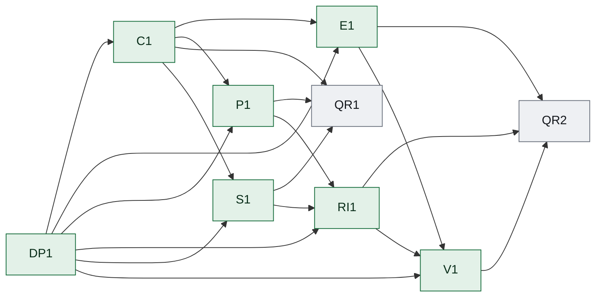

### Dependency edge table

| From | To | Dependency type | Dependency scope | Required upstream state | Assumption IDs | Invalidation keys | Transferred input | Gate/evidence |
|---|---|---|---|---|---|---|---|---|
| C1 | E1 | hard | specific-output | ACCEPTED | none | requirement.c1 | 执行 Draft 2020-12 schema，并让正式 execution 对象和真实完成证据从输入贯通到节点、worker 台账与运行器记录。 | acceptance contract evidence |
| C1 | P1 | hard | specific-output | ACCEPTED | none | requirement.c1 | 执行 Draft 2020-12 schema，并让正式 execution 对象和真实完成证据从输入贯通到节点、worker 台账与运行器记录。 | acceptance contract evidence |
| C1 | QR1 | hard | specific-output | ACCEPTED | none | requirement.c1 | 执行 Draft 2020-12 schema，并让正式 execution 对象和真实完成证据从输入贯通到节点、worker 台账与运行器记录。 | acceptance contract evidence |
| C1 | S1 | hard | specific-output | ACCEPTED | none | requirement.c1 | 执行 Draft 2020-12 schema，并让正式 execution 对象和真实完成证据从输入贯通到节点、worker 台账与运行器记录。 | acceptance contract evidence |
| DP1 | C1 | hard | specific-output | ACCEPTED | none | decision.execution-plane.scope.v1 | 用户确认本轮 Harness 改造与 MathArc/Harness 主线收口的工程执行范围。 | acceptance contract evidence |
| DP1 | E1 | hard | specific-output | ACCEPTED | none | decision.execution-plane.scope.v1 | 用户确认本轮 Harness 改造与 MathArc/Harness 主线收口的工程执行范围。 | acceptance contract evidence |
| DP1 | P1 | hard | specific-output | ACCEPTED | none | decision.execution-plane.scope.v1 | 用户确认本轮 Harness 改造与 MathArc/Harness 主线收口的工程执行范围。 | acceptance contract evidence |
| DP1 | RI1 | hard | specific-output | ACCEPTED | none | decision.execution-plane.scope.v1 | 用户确认本轮 Harness 改造与 MathArc/Harness 主线收口的工程执行范围。 | acceptance contract evidence |
| DP1 | S1 | hard | specific-output | ACCEPTED | none | decision.execution-plane.scope.v1 | 用户确认本轮 Harness 改造与 MathArc/Harness 主线收口的工程执行范围。 | acceptance contract evidence |
| DP1 | V1 | hard | specific-output | ACCEPTED | none | decision.execution-plane.scope.v1 | 用户确认本轮 Harness 改造与 MathArc/Harness 主线收口的工程执行范围。 | acceptance contract evidence |
| E1 | QR2 | hard | specific-output | ACCEPTED | none | requirement.e1 | 用可解析的证据 lane registry 绑定真实采集器，并按正文实际引用启用 Facts Registry 类别。 | acceptance contract evidence |
| E1 | V1 | hard | specific-output | ACCEPTED | none | requirement.e1 | 用可解析的证据 lane registry 绑定真实采集器，并按正文实际引用启用 Facts Registry 类别。 | acceptance contract evidence |
| P1 | QR1 | hard | specific-output | ACCEPTED | none | requirement.p1 | 推送时重新计算并核对 validation report 的完整绑定，同时从 manifest 和磁盘实际产物复算复杂度。 | acceptance contract evidence |
| P1 | RI1 | hard | specific-output | ACCEPTED | none | requirement.p1 | 推送时重新计算并核对 validation report 的完整绑定，同时从 manifest 和磁盘实际产物复算复杂度。 | acceptance contract evidence |
| RI1 | QR2 | hard | specific-output | ACCEPTED | none | requirement.ri1 | 让规则索引双向守恒，补齐版本矩阵并以触发式阅读图限制基础上下文。 | acceptance contract evidence |
| RI1 | V1 | hard | specific-output | ACCEPTED | none | requirement.ri1 | 让规则索引双向守恒，补齐版本矩阵并以触发式阅读图限制基础上下文。 | acceptance contract evidence |
| S1 | QR1 | hard | specific-output | ACCEPTED | none | requirement.s1 | 建立唯一节点状态转换模型，并让 L1 由当前编排者在零 worker 工件条件下推进到 ACCEPTED。 | acceptance contract evidence |
| S1 | RI1 | hard | specific-output | ACCEPTED | none | requirement.s1 | 建立唯一节点状态转换模型，并让 L1 由当前编排者在零 worker 工件条件下推进到 ACCEPTED。 | acceptance contract evidence |
| V1 | QR2 | hard | specific-output | ACCEPTED | none | requirement.v1 | 在同一源码身份上运行附件规定的 12 个端到端反例和 Harness 全量本地 CI，并记录 GitHub 主线读回与清理结果。 | acceptance contract evidence |

### ASCII topology graph

```text
Layer 0: DP1
Layer 1: C1
Layer 2: E1, P1, S1
Layer 3: QR1, RI1
Layer 4: V1
Layer 5: QR2
Edges:
  C1 -> E1
  C1 -> P1
  C1 -> QR1
  C1 -> S1
  DP1 -> C1
  DP1 -> E1
  DP1 -> P1
  DP1 -> RI1
  DP1 -> S1
  DP1 -> V1
  E1 -> QR2
  E1 -> V1
  P1 -> QR1
  P1 -> RI1
  RI1 -> QR2
  RI1 -> V1
  S1 -> QR1
  S1 -> RI1
  V1 -> QR2
```

### Dependency graph (mermaid)



### State ledger

| Task ID | Stage | State |
|---|---|---|
| C1 | R1 | ACCEPTED |
| DP1 | R1 | ACCEPTED |
| E1 | R2 | ACCEPTED |
| P1 | R1 | ACCEPTED |
| QR1 | R1 | READY |
| QR2 | R2 | READY |
| RI1 | R2 | ACCEPTED |
| S1 | R1 | ACCEPTED |
| V1 | R2 | ACCEPTED |

### Semantic node registry

| Task ID | Semantic key | Execution state |
|---|---|---|
| C1 | requirement.c1 | ACCEPTED |
| DP1 | decision.execution-plane.scope | ACCEPTED |
| E1 | requirement.e1 | ACCEPTED |
| P1 | requirement.p1 | ACCEPTED |
| QR1 | acceptance.release.r1 | READY |
| QR2 | acceptance.release.r2 | READY |
| RI1 | requirement.ri1 | ACCEPTED |
| S1 | requirement.s1 | ACCEPTED |
| V1 | requirement.v1 | ACCEPTED |

### Ready frontier

| Task ID | Eligibility |
|---|---|
| C1 | not-ready |
| DP1 | not-ready |
| E1 | not-ready |
| P1 | not-ready |
| QR1 | ready |
| QR2 | ready |
| RI1 | not-ready |
| S1 | not-ready |
| V1 | not-ready |
