# 任务（matharc-research-runtime-v04）开发 SSOT

## 业务结论与范围

建立数学研究平台（MathArc）原生、可并行、可恢复、可验证、可进行邀请制测试的自主研究运行时，并保持执行状态、候选结果与数学结论权威相互隔离。

## 需要拍板的问题

尚无待拍板问题时在此写明当前没有；有则写入问题记录文件（openproblem.md）并在此引用。

## 发布切片

| Release ID | 用户价值 | 独立失败边界 |
| --- | --- | --- |
| RTRZ | MathArc 自己拥有执行权威、数据合同和运行边界。 | 不启动真实研究；后续运行时切片保持未接受。 |
| RTR1 | 一个数学任务可以从验证、运行到候选回传形成闭环。 | 单任务失败不改变数学工作区，也不产生正式证据。 |
| RTR2 | 单任务运行可以可靠保存、停止、恢复和幂等导入。 | 不确定状态不得猜测完成、重复计费或跳过代际。 |
| RTR3 | 不同研究路线可以在隔离工作区中真实并行执行。 | 单成员失败不破坏整轮，且不得伪造并行证据。 |
| RTR4 | 上一代的失败和研究经历可以改变下一代议程。 | 蒸馏失败或缺少出处时，下一代保持未启动。 |
| RTR5 | 候选结果可以经过独立验证后受控转换为正式证据。 | 运行成功、模型自报或篡改候选都不能成为证明。 |
| RTR6 | 受邀用户可以在有持久运维保障的环境中查看并受控操作研究运行。 | 浏览器不能执行任意命令、目录、环境变量或未登记后端；运维缺口阻断试点。 |
| RTR7 | 真实两代研究和邀请制试点具备可复核发布证据。 | 任一错误晋升、越权动作或不可重放结果阻断试点发布. |

## 节点清单

| Node ID | Goal | Dependencies | Acceptance | Owner |
| --- | --- | --- | --- | --- |
| DOG1 | 固定首个真实任务、评价器、范围、预算和可重放的单成员基线。 | F, DP1, S5, S74, RUN5 | 合同与所需 lane 证据全部接受 | 试点任务负责人 |
| DOG2 | 在运维闭环完成后执行两代真实并行研究并证明第二代消费第一代事实。 | F, DP1, S8, S75, PAR5, SYN5, VER6, DOG1, OPS3 | 合同与所需 lane 证据全部接受 | 真实研究试点负责人 |
| DOG3 | 执行崩溃、篡改、虚假反例、重复导入和权限攻击演练并验证安全恢复。 | F, DP1, S40, S42, DOG2, DUR5, UX6 | 合同与所需 lane 证据全部接受 | 试点攻击演练负责人 |
| DOG4 | 汇编邀请试点的人类验收与发布证据，作出独立发布决策。 | F, DP1, S2, S4, DOG3 | 合同与所需 lane 证据全部接受 | 试点发布负责人 |
| DP1 | MathArc 原生运行时拥有执行状态和数学权威；GitHub Harness 只提供治理工具链。 | F | 合同与所需 lane 证据全部接受 | decision owner |
| DUR1 | 定义冻结输入、代际提交、GenerationReducer 和 GenerationClosePolicy 的持久边界。 | F, DP1, S18, S21, S38, S39, RUN5 | 合同与所需 lane 证据全部接受 | 代际提交负责人 |
| DUR2 | 以带来源身份的幂等账本保存候选、费用和执行回执，拒绝来源漂移。 | F, DP1, S14, S22, S58, DUR1 | 合同与所需 lane 证据全部接受 | 幂等账本负责人 |
| DUR3 | 实现停止、排空、暂停、继续和取消的显式运行状态协议。 | F, DP1, S25, S61, DUR1 | 合同与所需 lane 证据全部接受 | 运行控制负责人 |
| DUR4 | 从最后一个完整 GenerationCommit 生成可重放的崩溃恢复计划。 | F, DP1, S20, S76, DUR2, DUR3 | 合同与所需 lane 证据全部接受 | 恢复负责人 |
| DUR5 | 独立验收冷启动恢复、幂等恢复和不跳代不重复规则。 | F, DP1, S54, S64, DUR4 | 合同与所需 lane 证据全部接受 | 恢复验收负责人 |
| F | Freeze the readable identity of every normative source artifact. | none | 合同与所需 lane 证据全部接受 | orchestrator |
| FND1 | 建立 MathArc 原生运行时所有权与依赖允许清单，阻断治理工具链进入产品运行路径。 | F, DP1, S30, S31, S55, S70 | 合同与所需 lane 证据全部接受 | MathArc 运行时架构负责人 |
| FND2 | 保留 ResearchTrace 的数学结论晋升权威，并证明运行状态不能直接变成正式证明。 | F, DP1, S43, FND1 | 合同与所需 lane 证据全部接受 | MathArc 研究协议负责人 |
| OPS1 | 固定试点部署配置、持久目录、密钥来源和进程守护方式。 | F, DP1, S6, S7, S67, UX6 | 合同与所需 lane 证据全部接受 | 试点部署负责人 |
| OPS2 | 建立健康检查、日志、配额、备份和恢复观测闭环。 | F, DP1, S65, S68, OPS1 | 合同与所需 lane 证据全部接受 | 试点运维观测负责人 |
| OPS3 | 独立验收部署、重启、回滚和试点用户数据清理。 | F, DP1, S3, S66, S69, OPS2 | 合同与所需 lane 证据全部接受 | 试点发布运维负责人 |
| PAR1 | 把研究路线和角色编译为带机制、预算、目标和隔离写入区的运行拓扑。 | F, DP1, S27, S80, RUN1 | 合同与所需 lane 证据全部接受 | 研究拓扑负责人 |
| PAR2 | 接入已批准的动态任务并执行一次性、可审计的任务启动。 | F, DP1, S16, S41, PAR1, RUN4 | 合同与所需 lane 证据全部接受 | 任务审批接线负责人 |
| PAR3 | 在持久化和恢复能力之后实现有界并行、冻结输入和隔离工作区调度。 | F, DP1, S23, S72, PAR2, DUR5 | 合同与所需 lane 证据全部接受 | 并发调度负责人 |
| PAR4 | 按执行回执记录实际资源消耗，并对语义重复实验做确定性去重。 | F, DP1, S16, S77, PAR3 | 合同与所需 lane 证据全部接受 | 资源记账负责人 |
| PAR5 | 独立验收多成员一代归并、冲突、部分失败和迟到结果规则。 | F, DP1, S60, S71, S73, PAR4 | 合同与所需 lane 证据全部接受 | 并行验收负责人 |
| QRTR1 | Accept the RTR1 candidate against its source completion criteria. | RUN1, RUN2, RUN3, RUN4, RUN5 | 合同与所需 lane 证据全部接受 | release decision owner |
| QRTR2 | Accept the RTR2 candidate against its source completion criteria. | DUR1, DUR2, DUR3, DUR4, DUR5 | 合同与所需 lane 证据全部接受 | release decision owner |
| QRTR3 | Accept the RTR3 candidate against its source completion criteria. | PAR1, PAR2, PAR3, PAR4, PAR5 | 合同与所需 lane 证据全部接受 | release decision owner |
| QRTR4 | Accept the RTR4 candidate against its source completion criteria. | SYN1, SYN2, SYN3, SYN4, SYN5 | 合同与所需 lane 证据全部接受 | release decision owner |
| QRTR5 | Accept the RTR5 candidate against its source completion criteria. | VER1, VER2, VER3, VER4, VER5, VER6 | 合同与所需 lane 证据全部接受 | release decision owner |
| QRTR6 | Accept the RTR6 candidate against its source completion criteria. | UX1, UX2, UX3, UX4, UX5, UX6, OPS1, OPS2, OPS3 | 合同与所需 lane 证据全部接受 | release decision owner |
| QRTR7 | Accept the RTR7 candidate against its source completion criteria. | DOG1, DOG2, DOG3, DOG4 | 合同与所需 lane 证据全部接受 | release decision owner |
| QRTRZ | Accept the RTRZ candidate against its source completion criteria. | FND1, FND2 | 合同与所需 lane 证据全部接受 | release decision owner |
| RUN1 | 定义可版本化的研究运行合同、身份层级、候选包和运行动作回执。 | F, DP1, S15, S19, S52, S59, FND2 | 合同与所需 lane 证据全部接受 | 运行合同负责人 |
| RUN2 | 建立可重放的运行存储，使事件、快照和候选导入在进程重启后保持一致。 | F, DP1, S22, S79, RUN1 | 合同与所需 lane 证据全部接受 | 运行存储负责人 |
| RUN3 | 建立有预算、种子和最小试跑门槛的评价器合同，失败时不启动完整研究。 | F, DP1, S17, S56, RUN1 | 合同与所需 lane 证据全部接受 | 评价器负责人 |
| RUN4 | 将各类执行后端统一为 MathArc 请求，只返回不可变 WorkerExecutionResult 并由协调器组装候选包。 | F, DP1, S9, S10, S11, S12, S13, S16, S44, RUN2, RUN3 | 合同与所需 lane 证据全部接受 | 第一方后端负责人 |
| RUN5 | 独立验证单任务从试跑、执行到候选回传的闭环，并阻断候选越级晋升。 | F, DP1, S35, S78, RUN4 | 合同与所需 lane 证据全部接受 | 单任务验收负责人 |
| S1 | 建立写入区域 acceptance/human/runtime-console/desktop-checklist.md | none | 合同与所需 lane 证据全部接受 | 浏览器产品验收负责人 |
| S10 | 建立写入区域 matharc/v02/runtime/backends/claude_code.py | none | 合同与所需 lane 证据全部接受 | 第一方后端负责人 |
| S11 | 建立写入区域 matharc/v02/runtime/backends/codex.py | none | 合同与所需 lane 证据全部接受 | 第一方后端负责人 |
| S12 | 建立写入区域 matharc/v02/runtime/backends/local_process.py | none | 合同与所需 lane 证据全部接受 | 第一方后端负责人 |
| S13 | 建立写入区域 matharc/v02/runtime/backends/model_api.py | none | 合同与所需 lane 证据全部接受 | 第一方后端负责人 |
| S14 | 建立写入区域 matharc/v02/runtime/candidate.py | none | 合同与所需 lane 证据全部接受 | 幂等账本负责人 |
| S15 | 建立写入区域 matharc/v02/runtime/contracts.py | none | 合同与所需 lane 证据全部接受 | 运行合同负责人 |
| S16 | 建立写入区域 matharc/v02/runtime/coordinator.py | none | 合同与所需 lane 证据全部接受 | 第一方后端负责人 |
| S17 | 建立写入区域 matharc/v02/runtime/evaluator.py | none | 合同与所需 lane 证据全部接受 | 评价器负责人 |
| S18 | 建立写入区域 matharc/v02/runtime/generation.py | none | 合同与所需 lane 证据全部接受 | 代际提交负责人 |
| S19 | 建立写入区域 matharc/v02/runtime/identity.py | none | 合同与所需 lane 证据全部接受 | 运行合同负责人 |
| S2 | 建立写入区域 acceptance/human/runtime-pilot/release-checklist.md | none | 合同与所需 lane 证据全部接受 | 试点发布负责人 |
| S20 | 建立写入区域 matharc/v02/runtime/recovery.py | none | 合同与所需 lane 证据全部接受 | 恢复负责人 |
| S21 | 建立写入区域 matharc/v02/runtime/reducer.py | none | 合同与所需 lane 证据全部接受 | 代际提交负责人 |
| S22 | 建立写入区域 matharc/v02/runtime/run_store.py | none | 合同与所需 lane 证据全部接受 | 运行存储负责人 |
| S23 | 建立写入区域 matharc/v02/runtime/scheduler.py | none | 合同与所需 lane 证据全部接受 | 并发调度负责人 |
| S24 | 建立写入区域 matharc/v02/runtime/service.py | none | 合同与所需 lane 证据全部接受 | 邀请权限负责人 |
| S25 | 建立写入区域 matharc/v02/runtime/state_machine.py | none | 合同与所需 lane 证据全部接受 | 运行控制负责人 |
| S26 | 建立写入区域 matharc/v02/runtime/synthesis.py | none | 合同与所需 lane 证据全部接受 | 探索结果接线负责人 |
| S27 | 建立写入区域 matharc/v02/runtime/topology.py | none | 合同与所需 lane 证据全部接受 | 研究拓扑负责人 |
| S28 | 建立写入区域 matharc/v02/runtime/verification.py | none | 合同与所需 lane 证据全部接受 | 候选身份负责人 |
| S29 | 建立写入区域 matharc/v02/runtime/view_model.py | none | 合同与所需 lane 证据全部接受 | 控制台投影负责人 |
| S3 | 建立写入区域 acceptance/runtime-pilot/ops-checklist.md | none | 合同与所需 lane 证据全部接受 | 试点发布运维负责人 |
| S30 | 建立写入区域 scripts/check_runtime_dependency_allowlist.py | none | 合同与所需 lane 证据全部接受 | MathArc 运行时架构负责人 |
| S31 | 建立写入区域 scripts/check_runtime_ownership.py | none | 合同与所需 lane 证据全部接受 | MathArc 运行时架构负责人 |
| S32 | 建立写入区域 tests/test_candidate_evidence_conversion.py | none | 合同与所需 lane 证据全部接受 | 证据转换负责人 |
| S33 | 建立写入区域 tests/test_candidate_identity.py | none | 合同与所需 lane 证据全部接受 | 候选身份负责人 |
| S34 | 建立写入区域 tests/test_candidate_independent_replay.py | none | 合同与所需 lane 证据全部接受 | 独立重放负责人 |
| S35 | 建立写入区域 tests/test_candidate_promotion_boundary.py | none | 合同与所需 lane 证据全部接受 | 单任务验收负责人 |
| S36 | 建立写入区域 tests/test_candidate_scope_binding.py | none | 合同与所需 lane 证据全部接受 | 命题范围负责人 |
| S37 | 建立写入区域 tests/test_evidence_invalidation.py | none | 合同与所需 lane 证据全部接受 | 证据失效负责人 |
| S38 | 建立写入区域 tests/test_generation_commit.py | none | 合同与所需 lane 证据全部接受 | 代际提交负责人 |
| S39 | 建立写入区域 tests/test_generation_input_snapshot.py | none | 合同与所需 lane 证据全部接受 | 代际提交负责人 |
| S4 | 建立写入区域 acceptance/runtime-pilot/release-evidence.json | none | 合同与所需 lane 证据全部接受 | 试点发布负责人 |
| S40 | 建立写入区域 tests/test_runtime_adversarial_drills.py | none | 合同与所需 lane 证据全部接受 | 试点攻击演练负责人 |
| S41 | 建立写入区域 tests/test_runtime_approved_task_ingestion.py | none | 合同与所需 lane 证据全部接受 | 任务审批接线负责人 |
| S42 | 建立写入区域 tests/test_runtime_attack_recovery.py | none | 合同与所需 lane 证据全部接受 | 试点攻击演练负责人 |
| S43 | 建立写入区域 tests/test_runtime_authority_boundaries.py | none | 合同与所需 lane 证据全部接受 | MathArc 研究协议负责人 |
| S44 | 建立写入区域 tests/test_runtime_backend_contract.py | none | 合同与所需 lane 证据全部接受 | 第一方后端负责人 |
| S45 | 建立写入区域 tests/test_runtime_candidate_synthesis.py | none | 合同与所需 lane 证据全部接受 | 探索结果接线负责人 |
| S46 | 建立写入区域 tests/test_runtime_command_surface.py | none | 合同与所需 lane 证据全部接受 | 运行动作 API 负责人 |
| S47 | 建立写入区域 tests/test_runtime_console_mobile.py | none | 合同与所需 lane 证据全部接受 | 浏览器产品验收负责人 |
| S48 | 建立写入区域 tests/test_runtime_console_permissions.py | none | 合同与所需 lane 证据全部接受 | 邀请权限负责人 |
| S49 | 建立写入区域 tests/test_runtime_console_projection.py | none | 合同与所需 lane 证据全部接受 | 控制台投影负责人 |
| S5 | 建立写入区域 benchmarks/runtime-pilot-plan.json | none | 合同与所需 lane 证据全部接受 | 试点任务负责人 |
| S50 | 建立写入区域 tests/test_runtime_console_reconnect.py | none | 合同与所需 lane 证据全部接受 | 实时控制台负责人 |
| S51 | 建立写入区域 tests/test_runtime_console_redaction.py | none | 合同与所需 lane 证据全部接受 | 控制台安全视图负责人 |
| S52 | 建立写入区域 tests/test_runtime_contracts.py | none | 合同与所需 lane 证据全部接受 | 运行合同负责人 |
| S53 | 建立写入区域 tests/test_runtime_counterexample_review.py | none | 合同与所需 lane 证据全部接受 | 反例复核负责人 |
| S54 | 建立写入区域 tests/test_runtime_crash_recovery.py | none | 合同与所需 lane 证据全部接受 | 恢复验收负责人 |
| S55 | 建立写入区域 tests/test_runtime_dependency_allowlist.py | none | 合同与所需 lane 证据全部接受 | MathArc 运行时架构负责人 |
| S56 | 建立写入区域 tests/test_runtime_evaluator.py | none | 合同与所需 lane 证据全部接受 | 评价器负责人 |
| S57 | 建立写入区域 tests/test_runtime_generation_delta.py | none | 合同与所需 lane 证据全部接受 | 连续代际验收负责人 |
| S58 | 建立写入区域 tests/test_runtime_idempotent_import.py | none | 合同与所需 lane 证据全部接受 | 幂等账本负责人 |
| S59 | 建立写入区域 tests/test_runtime_identity.py | none | 合同与所需 lane 证据全部接受 | 运行合同负责人 |
| S6 | 建立写入区域 deploy/matharc-research.env.example | none | 合同与所需 lane 证据全部接受 | 试点部署负责人 |
| S60 | 建立写入区域 tests/test_runtime_late_result_policy.py | none | 合同与所需 lane 证据全部接受 | 并行验收负责人 |
| S61 | 建立写入区域 tests/test_runtime_lifecycle_control.py | none | 合同与所需 lane 证据全部接受 | 运行控制负责人 |
| S62 | 建立写入区域 tests/test_runtime_memory_provenance.py | none | 合同与所需 lane 证据全部接受 | 研究记忆负责人 |
| S63 | 建立写入区域 tests/test_runtime_next_generation_agenda.py | none | 合同与所需 lane 证据全部接受 | 代际议程负责人 |
| S64 | 建立写入区域 tests/test_runtime_no_duplicate_recovery.py | none | 合同与所需 lane 证据全部接受 | 恢复验收负责人 |
| S65 | 建立写入区域 tests/test_runtime_ops_backup.py | none | 合同与所需 lane 证据全部接受 | 试点运维观测负责人 |
| S66 | 建立写入区域 tests/test_runtime_ops_cleanup.py | none | 合同与所需 lane 证据全部接受 | 试点发布运维负责人 |
| S67 | 建立写入区域 tests/test_runtime_ops_deployment.py | none | 合同与所需 lane 证据全部接受 | 试点部署负责人 |
| S68 | 建立写入区域 tests/test_runtime_ops_observability.py | none | 合同与所需 lane 证据全部接受 | 试点运维观测负责人 |
| S69 | 建立写入区域 tests/test_runtime_ops_release.py | none | 合同与所需 lane 证据全部接受 | 试点发布运维负责人 |
| S7 | 建立写入区域 deploy/matharc-research.service | none | 合同与所需 lane 证据全部接受 | 试点部署负责人 |
| S70 | 建立写入区域 tests/test_runtime_ownership.py | none | 合同与所需 lane 证据全部接受 | MathArc 运行时架构负责人 |
| S71 | 建立写入区域 tests/test_runtime_parallel_generation.py | none | 合同与所需 lane 证据全部接受 | 并行验收负责人 |
| S72 | 建立写入区域 tests/test_runtime_parallelism.py | none | 合同与所需 lane 证据全部接受 | 并发调度负责人 |
| S73 | 建立写入区域 tests/test_runtime_partial_failure.py | none | 合同与所需 lane 证据全部接受 | 并行验收负责人 |
| S74 | 建立写入区域 tests/test_runtime_pilot_baseline.py | none | 合同与所需 lane 证据全部接受 | 试点任务负责人 |
| S75 | 建立写入区域 tests/test_runtime_pilot_generation_consumption.py | none | 合同与所需 lane 证据全部接受 | 真实研究试点负责人 |
| S76 | 建立写入区域 tests/test_runtime_recovery_plan.py | none | 合同与所需 lane 证据全部接受 | 恢复负责人 |
| S77 | 建立写入区域 tests/test_runtime_semantic_deduplication.py | none | 合同与所需 lane 证据全部接受 | 资源记账负责人 |
| S78 | 建立写入区域 tests/test_runtime_single_run.py | none | 合同与所需 lane 证据全部接受 | 单任务验收负责人 |
| S79 | 建立写入区域 tests/test_runtime_store_replay.py | none | 合同与所需 lane 证据全部接受 | 运行存储负责人 |
| S8 | 建立写入区域 experiments/runtime-pilot/two-generation-report.md | none | 合同与所需 lane 证据全部接受 | 真实研究试点负责人 |
| S80 | 建立写入区域 tests/test_runtime_topology.py | none | 合同与所需 lane 证据全部接受 | 研究拓扑负责人 |
| S81 | 建立写入区域 tests/test_runtime_two_generation_synthesis.py | none | 合同与所需 lane 证据全部接受 | 连续代际验收负责人 |
| S82 | 建立写入区域 tests/test_verification_convergence.py | none | 合同与所需 lane 证据全部接受 | 验证汇合负责人 |
| S83 | 建立写入区域 tests/test_verification_negative_paths.py | none | 合同与所需 lane 证据全部接受 | 验证汇合负责人 |
| S9 | 建立写入区域 matharc/v02/runtime/backends/base.py | none | 合同与所需 lane 证据全部接受 | 第一方后端负责人 |
| SYN1 | 把普通执行输出标准化为带完整出处的探索候选，隔离于正式证据。 | F, DP1, S14, S26, S45, RUN5, DUR2 | 合同与所需 lane 证据全部接受 | 探索结果接线负责人 |
| SYN2 | 将疑似反例送入独立复核队列，未复核前不改变研究路线或结论。 | F, DP1, S26, S53, SYN1 | 合同与所需 lane 证据全部接受 | 反例复核负责人 |
| SYN3 | 从真实运行蒸馏带身份和候选出处的研究记忆。 | F, DP1, S21, S62, SYN1 | 合同与所需 lane 证据全部接受 | 研究记忆负责人 |
| SYN4 | 把失败、经历和评审缺口编译为明确消费上一代事实的下一代议程。 | F, DP1, S18, S63, SYN2, SYN3 | 合同与所需 lane 证据全部接受 | 代际议程负责人 |
| SYN5 | 独立验收连续两代提交、路线变化和上一代事实消费。 | F, DP1, S57, S81, SYN4, DUR5, PAR5 | 合同与所需 lane 证据全部接受 | 连续代际验收负责人 |
| UX1 | 把 RuntimeStore 状态投影到现有控制台数据合同，保持单一真相源。 | F, DP1, S29, S49, DUR2 | 合同与所需 lane 证据全部接受 | 控制台投影负责人 |
| UX2 | 复用邀请制 Cookie 会话和权限边界，阻断无权用户的运行动作。 | F, DP1, S24, S48, FND2 | 合同与所需 lane 证据全部接受 | 邀请权限负责人 |
| UX3 | 提供登记动作的幂等运行控制服务，拒绝任意命令、目录、环境和参数。 | F, DP1, S24, S46, UX2, DUR5 | 合同与所需 lane 证据全部接受 | 运行动作 API 负责人 |
| UX4 | 建立统一中文运行视图并递归脱敏密钥、路径、命令、环境变量和堆栈。 | F, DP1, S29, S51, UX1, UX2 | 合同与所需 lane 证据全部接受 | 控制台安全视图负责人 |
| UX5 | 实现断线重连后从服务端快照恢复的实时研究控制台。 | F, DP1, S24, S29, S50, UX3, UX4, VER6 | 合同与所需 lane 证据全部接受 | 实时控制台负责人 |
| UX6 | 独立完成人类浏览器验收，覆盖桌面、移动端、权限负路径和完整操作流。 | F, DP1, S1, S47, UX5 | 合同与所需 lane 证据全部接受 | 浏览器产品验收负责人 |
| VER1 | 定义候选进入验证阶段所需的身份约束和 VerifierReceipt，而非重新定义候选包。 | F, DP1, S14, S28, S33, RUN1, DUR2 | 合同与所需 lane 证据全部接受 | 候选身份负责人 |
| VER2 | 把候选绑定到具体命题、量词、对象和范围，拒绝范围扩大与对象错配。 | F, DP1, S28, S36, VER1 | 合同与所需 lane 证据全部接受 | 命题范围负责人 |
| VER3 | 为候选生成干净环境的独立重放计划，排除同实现自证。 | F, DP1, S28, S34, VER2 | 合同与所需 lane 证据全部接受 | 独立重放负责人 |
| VER4 | 仅将通过 VerifierReceipt 的候选转换为带出处的 EvidenceRecord。 | F, DP1, S28, S32, VER3 | 合同与所需 lane 证据全部接受 | 证据转换负责人 |
| VER5 | 记录命题、源码、评价器或候选身份变化导致的证据失效。 | F, DP1, S28, S37, VER4 | 合同与所需 lane 证据全部接受 | 证据失效负责人 |
| VER6 | 独立验收验证汇合、篡改检测、越界阻断和非独立结果拒绝。 | F, DP1, S82, S83, VER5 | 合同与所需 lane 证据全部接受 | 验证汇合负责人 |

拓扑、逐节点合同与来源登记的投影见伴随视图，不在本文件重复。

## 伴随视图

- 拓扑视图（`generated-views/topology.md`）：依赖边表、文本拓扑图与流程图，以及状态台账、语义节点登记、就绪前沿（跨全部发布切片的全量机器投影）。
- 节点视图（`generated-views/nodes-<release>.md`）：各发布切片的节点合同与状态台账。
- 来源登记视图（`generated-views/source-requirements.md`）：来源覆盖、视觉令牌、锚点与接线（严格来源模式）。

## 工程附录

本节是结构检查器与事实检查器要求的机器投影，字段名与标识符按英文原样登记。

### 事实登记表（Facts Registry）

| 事实类别 | 事实键 | 登记值 |
| --- | --- | --- |
| path | machine-root | `.ssot/` |
| layout | bundle-root | `agents-results/<date>/<slug>/` |
| path | authority-roots | `acceptance/human/runtime-console/desktop-checklist.md`, `acceptance/human/runtime-pilot/release-checklist.md`, `acceptance/runtime-pilot/ops-checklist.md`, `acceptance/runtime-pilot/release-evidence.json`, `benchmarks/runtime-pilot-plan.json`, `deploy/matharc-research.env.example`, `deploy/matharc-research.service`, `experiments/runtime-pilot/two-generation-report.md`, `matharc/v02/runtime/backends/base.py`, `matharc/v02/runtime/backends/claude_code.py`, `matharc/v02/runtime/backends/codex.py`, `matharc/v02/runtime/backends/local_process.py`, `matharc/v02/runtime/backends/model_api.py`, `matharc/v02/runtime/candidate.py`, `matharc/v02/runtime/contracts.py`, `matharc/v02/runtime/coordinator.py`, `matharc/v02/runtime/evaluator.py`, `matharc/v02/runtime/generation.py`, `matharc/v02/runtime/identity.py`, `matharc/v02/runtime/recovery.py`, `matharc/v02/runtime/reducer.py`, `matharc/v02/runtime/run_store.py`, `matharc/v02/runtime/scheduler.py`, `matharc/v02/runtime/service.py`, `matharc/v02/runtime/state_machine.py`, `matharc/v02/runtime/synthesis.py`, `matharc/v02/runtime/topology.py`, `matharc/v02/runtime/verification.py`, `matharc/v02/runtime/view_model.py`, `matharc/v02/trace.py`, `scripts/check_runtime_dependency_allowlist.py`, `scripts/check_runtime_ownership.py`, `tests/test_candidate_evidence_conversion.py`, `tests/test_candidate_identity.py`, `tests/test_candidate_independent_replay.py`, `tests/test_candidate_promotion_boundary.py`, `tests/test_candidate_scope_binding.py`, `tests/test_evidence_invalidation.py`, `tests/test_generation_commit.py`, `tests/test_generation_input_snapshot.py`, `tests/test_runtime_adversarial_drills.py`, `tests/test_runtime_approved_task_ingestion.py`, `tests/test_runtime_attack_recovery.py`, `tests/test_runtime_authority_boundaries.py`, `tests/test_runtime_backend_contract.py`, `tests/test_runtime_candidate_synthesis.py`, `tests/test_runtime_command_surface.py`, `tests/test_runtime_console_mobile.py`, `tests/test_runtime_console_permissions.py`, `tests/test_runtime_console_projection.py`, `tests/test_runtime_console_reconnect.py`, `tests/test_runtime_console_redaction.py`, `tests/test_runtime_contracts.py`, `tests/test_runtime_counterexample_review.py`, `tests/test_runtime_crash_recovery.py`, `tests/test_runtime_dependency_allowlist.py`, `tests/test_runtime_evaluator.py`, `tests/test_runtime_generation_delta.py`, `tests/test_runtime_idempotent_import.py`, `tests/test_runtime_identity.py`, `tests/test_runtime_late_result_policy.py`, `tests/test_runtime_lifecycle_control.py`, `tests/test_runtime_memory_provenance.py`, `tests/test_runtime_next_generation_agenda.py`, `tests/test_runtime_no_duplicate_recovery.py`, `tests/test_runtime_ops_backup.py`, `tests/test_runtime_ops_cleanup.py`, `tests/test_runtime_ops_deployment.py`, `tests/test_runtime_ops_observability.py`, `tests/test_runtime_ops_release.py`, `tests/test_runtime_ownership.py`, `tests/test_runtime_parallel_generation.py`, `tests/test_runtime_parallelism.py`, `tests/test_runtime_partial_failure.py`, `tests/test_runtime_pilot_baseline.py`, `tests/test_runtime_pilot_generation_consumption.py`, `tests/test_runtime_recovery_plan.py`, `tests/test_runtime_semantic_deduplication.py`, `tests/test_runtime_single_run.py`, `tests/test_runtime_store_replay.py`, `tests/test_runtime_topology.py`, `tests/test_runtime_two_generation_synthesis.py`, `tests/test_verification_convergence.py`, `tests/test_verification_negative_paths.py` |

### 拓扑（Topology）

ASCII 拓扑图与 Mermaid 依赖图，供人工复核；权威投影见 topology 伴随视图。

```text
Layer 0: F, S1, S10, S11, S12, S13, S14, S15, S16, S17, S18, S19, S2, S20, S21, S22, S23, S24, S25, S26, S27, S28, S29, S3, S30, S31, S32, S33, S34, S35, S36, S37, S38, S39, S4, S40, S41, S42, S43, S44, S45, S46, S47, S48, S49, S5, S50, S51, S52, S53, S54, S55, S56, S57, S58, S59, S6, S60, S61, S62, S63, S64, S65, S66, S67, S68, S69, S7, S70, S71, S72, S73, S74, S75, S76, S77, S78, S79, S8, S80, S81, S82, S83, S9
Layer 1: DOG1, DP1
Layer 2: DOG2, DUR1, FND1
Layer 3: DOG3, DUR2, DUR3, FND2
Layer 4: DOG4, DUR4, PAR1, QRTR1, QRTR5, QRTRZ, RUN1, UX2
Layer 5: DUR5, PAR2, RUN2, RUN3
Layer 6: OPS1, PAR3, QRTR2, RUN4
Layer 7: OPS2, PAR4, RUN5
Layer 8: OPS3, PAR5, SYN1, UX1, UX3, VER1
Layer 9: QRTR3, QRTR4, QRTR6, QRTR7, SYN2, SYN3, UX4, VER2
Layer 10: SYN4, UX5, VER3
Layer 11: SYN5, UX6, VER4
Layer 12: VER5
Layer 13: VER6
Edges:
  DOG1 -> DOG2
  DOG1 -> QRTR7
  DOG2 -> DOG3
  DOG2 -> QRTR7
  DOG3 -> DOG4
  DOG3 -> QRTR7
  DOG4 -> QRTR7
  DP1 -> DOG1
  DP1 -> DOG2
  DP1 -> DOG3
  DP1 -> DOG4
  DP1 -> DUR1
  DP1 -> DUR2
  DP1 -> DUR3
  DP1 -> DUR4
  DP1 -> DUR5
  DP1 -> FND1
  DP1 -> FND2
  DP1 -> OPS1
  DP1 -> OPS2
  DP1 -> OPS3
  DP1 -> PAR1
  DP1 -> PAR2
  DP1 -> PAR3
  DP1 -> PAR4
  DP1 -> PAR5
  DP1 -> RUN1
  DP1 -> RUN2
  DP1 -> RUN3
  DP1 -> RUN4
  DP1 -> RUN5
  DP1 -> SYN1
  DP1 -> SYN2
  DP1 -> SYN3
  DP1 -> SYN4
  DP1 -> SYN5
  DP1 -> UX1
  DP1 -> UX2
  DP1 -> UX3
  DP1 -> UX4
  DP1 -> UX5
  DP1 -> UX6
  DP1 -> VER1
  DP1 -> VER2
  DP1 -> VER3
  DP1 -> VER4
  DP1 -> VER5
  DP1 -> VER6
  DUR1 -> DUR2
  DUR1 -> DUR3
  DUR1 -> QRTR2
  DUR2 -> DUR4
  DUR2 -> QRTR2
  DUR2 -> SYN1
  DUR2 -> UX1
  DUR2 -> VER1
  DUR3 -> DUR4
  DUR3 -> QRTR2
  DUR4 -> DUR5
  DUR4 -> QRTR2
  DUR5 -> DOG3
  DUR5 -> PAR3
  DUR5 -> QRTR2
  DUR5 -> SYN5
  DUR5 -> UX3
  F -> DOG1
  F -> DOG2
  F -> DOG3
  F -> DOG4
  F -> DP1
  F -> DUR1
  F -> DUR2
  F -> DUR3
  F -> DUR4
  F -> DUR5
  F -> FND1
  F -> FND2
  F -> OPS1
  F -> OPS2
  F -> OPS3
  F -> PAR1
  F -> PAR2
  F -> PAR3
  F -> PAR4
  F -> PAR5
  F -> RUN1
  F -> RUN2
  F -> RUN3
  F -> RUN4
  F -> RUN5
  F -> SYN1
  F -> SYN2
  F -> SYN3
  F -> SYN4
  F -> SYN5
  F -> UX1
  F -> UX2
  F -> UX3
  F -> UX4
  F -> UX5
  F -> UX6
  F -> VER1
  F -> VER2
  F -> VER3
  F -> VER4
  F -> VER5
  F -> VER6
  FND1 -> FND2
  FND1 -> QRTRZ
  FND2 -> QRTRZ
  FND2 -> RUN1
  FND2 -> UX2
  OPS1 -> OPS2
  OPS1 -> QRTR6
  OPS2 -> OPS3
  OPS2 -> QRTR6
  OPS3 -> DOG2
  OPS3 -> QRTR6
  PAR1 -> PAR2
  PAR1 -> QRTR3
  PAR2 -> PAR3
  PAR2 -> QRTR3
  PAR3 -> PAR4
  PAR3 -> QRTR3
  PAR4 -> PAR5
  PAR4 -> QRTR3
  PAR5 -> DOG2
  PAR5 -> QRTR3
  PAR5 -> SYN5
  RUN1 -> PAR1
  RUN1 -> QRTR1
  RUN1 -> RUN2
  RUN1 -> RUN3
  RUN1 -> VER1
  RUN2 -> QRTR1
  RUN2 -> RUN4
  RUN3 -> QRTR1
  RUN3 -> RUN4
  RUN4 -> PAR2
  RUN4 -> QRTR1
  RUN4 -> RUN5
  RUN5 -> DOG1
  RUN5 -> DUR1
  RUN5 -> QRTR1
  RUN5 -> SYN1
  S1 -> UX6
  S10 -> RUN4
  S11 -> RUN4
  S12 -> RUN4
  S13 -> RUN4
  S14 -> DUR2
  S14 -> SYN1
  S14 -> VER1
  S15 -> RUN1
  S16 -> PAR2
  S16 -> PAR4
  S16 -> RUN4
  S17 -> RUN3
  S18 -> DUR1
  S18 -> SYN4
  S19 -> RUN1
  S2 -> DOG4
  S20 -> DUR4
  S21 -> DUR1
  S21 -> SYN3
  S22 -> DUR2
  S22 -> RUN2
  S23 -> PAR3
  S24 -> UX2
  S24 -> UX3
  S24 -> UX5
  S25 -> DUR3
  S26 -> SYN1
  S26 -> SYN2
  S27 -> PAR1
  S28 -> VER1
  S28 -> VER2
  S28 -> VER3
  S28 -> VER4
  S28 -> VER5
  S29 -> UX1
  S29 -> UX4
  S29 -> UX5
  S3 -> OPS3
  S30 -> FND1
  S31 -> FND1
  S32 -> VER4
  S33 -> VER1
  S34 -> VER3
  S35 -> RUN5
  S36 -> VER2
  S37 -> VER5
  S38 -> DUR1
  S39 -> DUR1
  S4 -> DOG4
  S40 -> DOG3
  S41 -> PAR2
  S42 -> DOG3
  S43 -> FND2
  S44 -> RUN4
  S45 -> SYN1
  S46 -> UX3
  S47 -> UX6
  S48 -> UX2
  S49 -> UX1
  S5 -> DOG1
  S50 -> UX5
  S51 -> UX4
  S52 -> RUN1
  S53 -> SYN2
  S54 -> DUR5
  S55 -> FND1
  S56 -> RUN3
  S57 -> SYN5
  S58 -> DUR2
  S59 -> RUN1
  S6 -> OPS1
  S60 -> PAR5
  S61 -> DUR3
  S62 -> SYN3
  S63 -> SYN4
  S64 -> DUR5
  S65 -> OPS2
  S66 -> OPS3
  S67 -> OPS1
  S68 -> OPS2
  S69 -> OPS3
  S7 -> OPS1
  S70 -> FND1
  S71 -> PAR5
  S72 -> PAR3
  S73 -> PAR5
  S74 -> DOG1
  S75 -> DOG2
  S76 -> DUR4
  S77 -> PAR4
  S78 -> RUN5
  S79 -> RUN2
  S8 -> DOG2
  S80 -> PAR1
  S81 -> SYN5
  S82 -> VER6
  S83 -> VER6
  S9 -> RUN4
  SYN1 -> QRTR4
  SYN1 -> SYN2
  SYN1 -> SYN3
  SYN2 -> QRTR4
  SYN2 -> SYN4
  SYN3 -> QRTR4
  SYN3 -> SYN4
  SYN4 -> QRTR4
  SYN4 -> SYN5
  SYN5 -> DOG2
  SYN5 -> QRTR4
  UX1 -> QRTR6
  UX1 -> UX4
  UX2 -> QRTR6
  UX2 -> UX3
  UX2 -> UX4
  UX3 -> QRTR6
  UX3 -> UX5
  UX4 -> QRTR6
  UX4 -> UX5
  UX5 -> QRTR6
  UX5 -> UX6
  UX6 -> DOG3
  UX6 -> OPS1
  UX6 -> QRTR6
  VER1 -> QRTR5
  VER1 -> VER2
  VER2 -> QRTR5
  VER2 -> VER3
  VER3 -> QRTR5
  VER3 -> VER4
  VER4 -> QRTR5
  VER4 -> VER5
  VER5 -> QRTR5
  VER5 -> VER6
  VER6 -> DOG2
  VER6 -> QRTR5
  VER6 -> UX5
```

```mermaid
flowchart LR
  DOG1["DOG1"]
  DOG2["DOG2"]
  DOG3["DOG3"]
  DOG4["DOG4"]
  DP1["DP1"]
  DUR1["DUR1"]
  DUR2["DUR2"]
  DUR3["DUR3"]
  DUR4["DUR4"]
  DUR5["DUR5"]
  F["F"]
  FND1["FND1"]
  FND2["FND2"]
  OPS1["OPS1"]
  OPS2["OPS2"]
  OPS3["OPS3"]
  PAR1["PAR1"]
  PAR2["PAR2"]
  PAR3["PAR3"]
  PAR4["PAR4"]
  PAR5["PAR5"]
  QRTR1["QRTR1"]
  QRTR2["QRTR2"]
  QRTR3["QRTR3"]
  QRTR4["QRTR4"]
  QRTR5["QRTR5"]
  QRTR6["QRTR6"]
  QRTR7["QRTR7"]
  QRTRZ["QRTRZ"]
  RUN1["RUN1"]
  RUN2["RUN2"]
  RUN3["RUN3"]
  RUN4["RUN4"]
  RUN5["RUN5"]
  S1["S1"]
  S10["S10"]
  S11["S11"]
  S12["S12"]
  S13["S13"]
  S14["S14"]
  S15["S15"]
  S16["S16"]
  S17["S17"]
  S18["S18"]
  S19["S19"]
  S2["S2"]
  S20["S20"]
  S21["S21"]
  S22["S22"]
  S23["S23"]
  S24["S24"]
  S25["S25"]
  S26["S26"]
  S27["S27"]
  S28["S28"]
  S29["S29"]
  S3["S3"]
  S30["S30"]
  S31["S31"]
  S32["S32"]
  S33["S33"]
  S34["S34"]
  S35["S35"]
  S36["S36"]
  S37["S37"]
  S38["S38"]
  S39["S39"]
  S4["S4"]
  S40["S40"]
  S41["S41"]
  S42["S42"]
  S43["S43"]
  S44["S44"]
  S45["S45"]
  S46["S46"]
  S47["S47"]
  S48["S48"]
  S49["S49"]
  S5["S5"]
  S50["S50"]
  S51["S51"]
  S52["S52"]
  S53["S53"]
  S54["S54"]
  S55["S55"]
  S56["S56"]
  S57["S57"]
  S58["S58"]
  S59["S59"]
  S6["S6"]
  S60["S60"]
  S61["S61"]
  S62["S62"]
  S63["S63"]
  S64["S64"]
  S65["S65"]
  S66["S66"]
  S67["S67"]
  S68["S68"]
  S69["S69"]
  S7["S7"]
  S70["S70"]
  S71["S71"]
  S72["S72"]
  S73["S73"]
  S74["S74"]
  S75["S75"]
  S76["S76"]
  S77["S77"]
  S78["S78"]
  S79["S79"]
  S8["S8"]
  S80["S80"]
  S81["S81"]
  S82["S82"]
  S83["S83"]
  S9["S9"]
  SYN1["SYN1"]
  SYN2["SYN2"]
  SYN3["SYN3"]
  SYN4["SYN4"]
  SYN5["SYN5"]
  UX1["UX1"]
  UX2["UX2"]
  UX3["UX3"]
  UX4["UX4"]
  UX5["UX5"]
  UX6["UX6"]
  VER1["VER1"]
  VER2["VER2"]
  VER3["VER3"]
  VER4["VER4"]
  VER5["VER5"]
  VER6["VER6"]
  DOG1 --> DOG2
  DOG1 --> QRTR7
  DOG2 --> DOG3
  DOG2 --> QRTR7
  DOG3 --> DOG4
  DOG3 --> QRTR7
  DOG4 --> QRTR7
  DP1 --> DOG1
  DP1 --> DOG2
  DP1 --> DOG3
  DP1 --> DOG4
  DP1 --> DUR1
  DP1 --> DUR2
  DP1 --> DUR3
  DP1 --> DUR4
  DP1 --> DUR5
  DP1 --> FND1
  DP1 --> FND2
  DP1 --> OPS1
  DP1 --> OPS2
  DP1 --> OPS3
  DP1 --> PAR1
  DP1 --> PAR2
  DP1 --> PAR3
  DP1 --> PAR4
  DP1 --> PAR5
  DP1 --> RUN1
  DP1 --> RUN2
  DP1 --> RUN3
  DP1 --> RUN4
  DP1 --> RUN5
  DP1 --> SYN1
  DP1 --> SYN2
  DP1 --> SYN3
  DP1 --> SYN4
  DP1 --> SYN5
  DP1 --> UX1
  DP1 --> UX2
  DP1 --> UX3
  DP1 --> UX4
  DP1 --> UX5
  DP1 --> UX6
  DP1 --> VER1
  DP1 --> VER2
  DP1 --> VER3
  DP1 --> VER4
  DP1 --> VER5
  DP1 --> VER6
  DUR1 --> DUR2
  DUR1 --> DUR3
  DUR1 --> QRTR2
  DUR2 --> DUR4
  DUR2 --> QRTR2
  DUR2 --> SYN1
  DUR2 --> UX1
  DUR2 --> VER1
  DUR3 --> DUR4
  DUR3 --> QRTR2
  DUR4 --> DUR5
  DUR4 --> QRTR2
  DUR5 --> DOG3
  DUR5 --> PAR3
  DUR5 --> QRTR2
  DUR5 --> SYN5
  DUR5 --> UX3
  F --> DOG1
  F --> DOG2
  F --> DOG3
  F --> DOG4
  F --> DP1
  F --> DUR1
  F --> DUR2
  F --> DUR3
  F --> DUR4
  F --> DUR5
  F --> FND1
  F --> FND2
  F --> OPS1
  F --> OPS2
  F --> OPS3
  F --> PAR1
  F --> PAR2
  F --> PAR3
  F --> PAR4
  F --> PAR5
  F --> RUN1
  F --> RUN2
  F --> RUN3
  F --> RUN4
  F --> RUN5
  F --> SYN1
  F --> SYN2
  F --> SYN3
  F --> SYN4
  F --> SYN5
  F --> UX1
  F --> UX2
  F --> UX3
  F --> UX4
  F --> UX5
  F --> UX6
  F --> VER1
  F --> VER2
  F --> VER3
  F --> VER4
  F --> VER5
  F --> VER6
  FND1 --> FND2
  FND1 --> QRTRZ
  FND2 --> QRTRZ
  FND2 --> RUN1
  FND2 --> UX2
  OPS1 --> OPS2
  OPS1 --> QRTR6
  OPS2 --> OPS3
  OPS2 --> QRTR6
  OPS3 --> DOG2
  OPS3 --> QRTR6
  PAR1 --> PAR2
  PAR1 --> QRTR3
  PAR2 --> PAR3
  PAR2 --> QRTR3
  PAR3 --> PAR4
  PAR3 --> QRTR3
  PAR4 --> PAR5
  PAR4 --> QRTR3
  PAR5 --> DOG2
  PAR5 --> QRTR3
  PAR5 --> SYN5
  RUN1 --> PAR1
  RUN1 --> QRTR1
  RUN1 --> RUN2
  RUN1 --> RUN3
  RUN1 --> VER1
  RUN2 --> QRTR1
  RUN2 --> RUN4
  RUN3 --> QRTR1
  RUN3 --> RUN4
  RUN4 --> PAR2
  RUN4 --> QRTR1
  RUN4 --> RUN5
  RUN5 --> DOG1
  RUN5 --> DUR1
  RUN5 --> QRTR1
  RUN5 --> SYN1
  S1 --> UX6
  S10 --> RUN4
  S11 --> RUN4
  S12 --> RUN4
  S13 --> RUN4
  S14 --> DUR2
  S14 --> SYN1
  S14 --> VER1
  S15 --> RUN1
  S16 --> PAR2
  S16 --> PAR4
  S16 --> RUN4
  S17 --> RUN3
  S18 --> DUR1
  S18 --> SYN4
  S19 --> RUN1
  S2 --> DOG4
  S20 --> DUR4
  S21 --> DUR1
  S21 --> SYN3
  S22 --> DUR2
  S22 --> RUN2
  S23 --> PAR3
  S24 --> UX2
  S24 --> UX3
  S24 --> UX5
  S25 --> DUR3
  S26 --> SYN1
  S26 --> SYN2
  S27 --> PAR1
  S28 --> VER1
  S28 --> VER2
  S28 --> VER3
  S28 --> VER4
  S28 --> VER5
  S29 --> UX1
  S29 --> UX4
  S29 --> UX5
  S3 --> OPS3
  S30 --> FND1
  S31 --> FND1
  S32 --> VER4
  S33 --> VER1
  S34 --> VER3
  S35 --> RUN5
  S36 --> VER2
  S37 --> VER5
  S38 --> DUR1
  S39 --> DUR1
  S4 --> DOG4
  S40 --> DOG3
  S41 --> PAR2
  S42 --> DOG3
  S43 --> FND2
  S44 --> RUN4
  S45 --> SYN1
  S46 --> UX3
  S47 --> UX6
  S48 --> UX2
  S49 --> UX1
  S5 --> DOG1
  S50 --> UX5
  S51 --> UX4
  S52 --> RUN1
  S53 --> SYN2
  S54 --> DUR5
  S55 --> FND1
  S56 --> RUN3
  S57 --> SYN5
  S58 --> DUR2
  S59 --> RUN1
  S6 --> OPS1
  S60 --> PAR5
  S61 --> DUR3
  S62 --> SYN3
  S63 --> SYN4
  S64 --> DUR5
  S65 --> OPS2
  S66 --> OPS3
  S67 --> OPS1
  S68 --> OPS2
  S69 --> OPS3
  S7 --> OPS1
  S70 --> FND1
  S71 --> PAR5
  S72 --> PAR3
  S73 --> PAR5
  S74 --> DOG1
  S75 --> DOG2
  S76 --> DUR4
  S77 --> PAR4
  S78 --> RUN5
  S79 --> RUN2
  S8 --> DOG2
  S80 --> PAR1
  S81 --> SYN5
  S82 --> VER6
  S83 --> VER6
  S9 --> RUN4
  SYN1 --> QRTR4
  SYN1 --> SYN2
  SYN1 --> SYN3
  SYN2 --> QRTR4
  SYN2 --> SYN4
  SYN3 --> QRTR4
  SYN3 --> SYN4
  SYN4 --> QRTR4
  SYN4 --> SYN5
  SYN5 --> DOG2
  SYN5 --> QRTR4
  UX1 --> QRTR6
  UX1 --> UX4
  UX2 --> QRTR6
  UX2 --> UX3
  UX2 --> UX4
  UX3 --> QRTR6
  UX3 --> UX5
  UX4 --> QRTR6
  UX4 --> UX5
  UX5 --> QRTR6
  UX5 --> UX6
  UX6 --> DOG3
  UX6 --> OPS1
  UX6 --> QRTR6
  VER1 --> QRTR5
  VER1 --> VER2
  VER2 --> QRTR5
  VER2 --> VER3
  VER3 --> QRTR5
  VER3 --> VER4
  VER4 --> QRTR5
  VER4 --> VER5
  VER5 --> QRTR5
  VER5 --> VER6
  VER6 --> DOG2
  VER6 --> QRTR5
  VER6 --> UX5
  classDef default fill:#EEF0F3,stroke:#69707C,color:#14171C;
```



### 状态台账（State ledger）

机器节点数达到 134 个，超过投影阈值（30），逐节点全量记录改在伴随视图登记，见 `generated-views/topology.md` 的 State ledger 表。

### 依赖边表（Dependency edge table）

机器边数达到 282 条，超过投影阈值（30），逐边全量记录改在伴随视图登记，见 `generated-views/topology.md` 的 Dependency edge table 表。

### 语义节点登记（Semantic node registry）

机器节点数达到 134 个，超过投影阈值（30），逐节点全量记录改在伴随视图登记，见 `generated-views/topology.md` 的 Semantic node registry 表。

### 就绪前沿（Ready frontier）

机器节点数达到 134 个，超过投影阈值（30），逐节点全量记录改在伴随视图登记，见 `generated-views/topology.md` 的 Ready frontier 表。

### 叶子交付物清单（Leaf deliverable inventory）

本次编译没有节点声明独立可并行的叶子交付物（每个节点的 deliverable_ids 均为空）。

| Deliverable ID | Owning node | Parallel batch |
| --- | --- | --- |

### 并行宽度表（Parallel width table）

| Parallel batch | Leaf deliverables |
| --- | --- |
