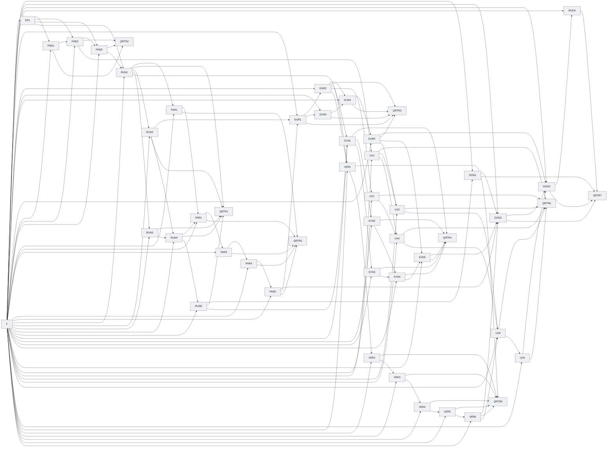

# 任务（matharc-research-runtime-v04）开发 SSOT

## 业务结论与范围

建立数学研究平台（MathArc）原生、可并行、可恢复、可验证、可进行邀请制测试的自主研究运行时，并保持执行状态、候选结果与数学结论权威相互隔离。

## 需要拍板的问题

尚无待拍板问题时在此写明当前没有；有则写入问题记录文件（openproblem.md）并在此引用。

## 发布切片

| Release ID | 用户价值 | 独立失败边界 |
| --- | --- | --- |
| RTRZ | MathArc 自己拥有执行权威、数据合同和运行边界。 | 不启动真实研究；后续运行时切片保持未接受。 |
| RTR1 | 一个数学任务可以从验证、运行到候选回传形成闭环。 | 单任务失败不改变数学工作区，也不产生正式证据。 |
| RTR2 | 不同研究路线可以在隔离工作区中真实并行执行。 | 单成员失败不破坏整轮，且不得伪造并行证据。 |
| RTR3 | 中断后可以从明确的代际边界继续运行。 | 不确定状态不得猜测完成、重复计费或跳过代际。 |
| RTR4 | 上一代的失败和研究经历可以改变下一代议程。 | 蒸馏失败或缺少出处时，下一代保持未启动。 |
| RTR5 | 候选结果可以经过独立验证后受控转换为正式证据。 | 运行成功、模型自报或篡改候选都不能成为证明。 |
| RTR6 | 受邀用户可以查看并受控操作研究运行。 | 浏览器不能执行任意命令、目录、环境变量或未登记后端。 |
| RTR7 | 真实两代研究和邀请制试点具备可复核发布证据。 | 任一错误晋升、越权动作或不可重放结果阻断试点发布。 |

## 节点清单

| Node ID | Goal | Dependencies | Acceptance | Owner |
| --- | --- | --- | --- | --- |
| DOG1 | Deliver source requirement DOG1. | F, RUN5 | 合同与所需 lane 证据全部接受 | 试点任务负责人 |
| DOG2 | Deliver source requirement DOG2. | F, PAR5, SYN5, VER6, DOG1 | 合同与所需 lane 证据全部接受 | 真实研究试点负责人 |
| DOG3 | Deliver source requirement DOG3. | F, DOG2, DUR5, UX6 | 合同与所需 lane 证据全部接受 | 试点攻击演练负责人 |
| DOG4 | Deliver source requirement DOG4. | F, DOG3 | 合同与所需 lane 证据全部接受 | 试点发布负责人 |
| DP1 | MathArc 原生运行时拥有执行状态和数学权威；GitHub Harness 只提供治理工具链。 | F | 合同与所需 lane 证据全部接受 | decision owner |
| DUR1 | Deliver source requirement DUR1. | F, PAR5, RUN2 | 合同与所需 lane 证据全部接受 | 代际提交负责人 |
| DUR2 | Deliver source requirement DUR2. | F, DUR1 | 合同与所需 lane 证据全部接受 | 幂等账本负责人 |
| DUR3 | Deliver source requirement DUR3. | F, DUR1 | 合同与所需 lane 证据全部接受 | 运行控制负责人 |
| DUR4 | Deliver source requirement DUR4. | F, DUR2, DUR3 | 合同与所需 lane 证据全部接受 | 恢复负责人 |
| DUR5 | Deliver source requirement DUR5. | F, DUR4 | 合同与所需 lane 证据全部接受 | 恢复验收负责人 |
| F | Freeze the readable identity of every normative source artifact. | none | 合同与所需 lane 证据全部接受 | orchestrator |
| FND1 | Deliver source requirement FND1. | F, DP1 | 合同与所需 lane 证据全部接受 | MathArc 运行时架构负责人 |
| FND2 | Deliver source requirement FND2. | F, DP1, FND1 | 合同与所需 lane 证据全部接受 | MathArc 研究协议负责人 |
| FND3 | Deliver source requirement FND3. | F, DP1, FND2 | 合同与所需 lane 证据全部接受 | MathArc 运行时架构负责人 |
| PAR1 | Deliver source requirement PAR1. | F, RUN1 | 合同与所需 lane 证据全部接受 | 研究拓扑负责人 |
| PAR2 | Deliver source requirement PAR2. | F, PAR1, RUN4 | 合同与所需 lane 证据全部接受 | 任务审批接线负责人 |
| PAR3 | Deliver source requirement PAR3. | F, PAR2 | 合同与所需 lane 证据全部接受 | 并发调度负责人 |
| PAR4 | Deliver source requirement PAR4. | F, PAR3 | 合同与所需 lane 证据全部接受 | 资源记账负责人 |
| PAR5 | Deliver source requirement PAR5. | F, PAR4 | 合同与所需 lane 证据全部接受 | 并行验收负责人 |
| QRTR1 | Accept the RTR1 candidate against its source completion criteria. | RUN1, RUN2, RUN3, RUN4, RUN5 | 合同与所需 lane 证据全部接受 | release decision owner |
| QRTR2 | Accept the RTR2 candidate against its source completion criteria. | PAR1, PAR2, PAR3, PAR4, PAR5 | 合同与所需 lane 证据全部接受 | release decision owner |
| QRTR3 | Accept the RTR3 candidate against its source completion criteria. | DUR1, DUR2, DUR3, DUR4, DUR5 | 合同与所需 lane 证据全部接受 | release decision owner |
| QRTR4 | Accept the RTR4 candidate against its source completion criteria. | SYN1, SYN2, SYN3, SYN4, SYN5 | 合同与所需 lane 证据全部接受 | release decision owner |
| QRTR5 | Accept the RTR5 candidate against its source completion criteria. | VER1, VER2, VER3, VER4, VER5, VER6 | 合同与所需 lane 证据全部接受 | release decision owner |
| QRTR6 | Accept the RTR6 candidate against its source completion criteria. | UX1, UX2, UX3, UX4, UX5, UX6 | 合同与所需 lane 证据全部接受 | release decision owner |
| QRTR7 | Accept the RTR7 candidate against its source completion criteria. | DOG1, DOG2, DOG3, DOG4 | 合同与所需 lane 证据全部接受 | release decision owner |
| QRTRZ | Accept the RTRZ candidate against its source completion criteria. | FND1, FND2, FND3 | 合同与所需 lane 证据全部接受 | release decision owner |
| RUN1 | Deliver source requirement RUN1. | F, DP1, FND3 | 合同与所需 lane 证据全部接受 | 运行合同负责人 |
| RUN2 | Deliver source requirement RUN2. | F, RUN1 | 合同与所需 lane 证据全部接受 | 运行存储负责人 |
| RUN3 | Deliver source requirement RUN3. | F, RUN1 | 合同与所需 lane 证据全部接受 | 评价器负责人 |
| RUN4 | Deliver source requirement RUN4. | F, RUN2, RUN3 | 合同与所需 lane 证据全部接受 | 第一方后端负责人 |
| RUN5 | Deliver source requirement RUN5. | F, RUN4 | 合同与所需 lane 证据全部接受 | 单任务验收负责人 |
| SYN1 | Deliver source requirement SYN1. | F, RUN5, DUR2 | 合同与所需 lane 证据全部接受 | 探索结果接线负责人 |
| SYN2 | Deliver source requirement SYN2. | F, SYN1 | 合同与所需 lane 证据全部接受 | 反例复核负责人 |
| SYN3 | Deliver source requirement SYN3. | F, SYN1 | 合同与所需 lane 证据全部接受 | 研究记忆负责人 |
| SYN4 | Deliver source requirement SYN4. | F, SYN2, SYN3 | 合同与所需 lane 证据全部接受 | 代际议程负责人 |
| SYN5 | Deliver source requirement SYN5. | F, SYN4, DUR5 | 合同与所需 lane 证据全部接受 | 连续代际验收负责人 |
| UX1 | Deliver source requirement UX1. | F, DUR2 | 合同与所需 lane 证据全部接受 | 控制台投影负责人 |
| UX2 | Deliver source requirement UX2. | F, FND2 | 合同与所需 lane 证据全部接受 | 邀请权限负责人 |
| UX3 | Deliver source requirement UX3. | F, UX2, DUR5 | 合同与所需 lane 证据全部接受 | 运行动作 API 负责人 |
| UX4 | Deliver source requirement UX4. | F, UX1, UX2 | 合同与所需 lane 证据全部接受 | 控制台安全视图负责人 |
| UX5 | Deliver source requirement UX5. | F, UX3, UX4, VER6 | 合同与所需 lane 证据全部接受 | 实时控制台负责人 |
| UX6 | Deliver source requirement UX6. | F, UX5 | 合同与所需 lane 证据全部接受 | 浏览器产品验收负责人 |
| VER1 | Deliver source requirement VER1. | F, RUN1, DUR2 | 合同与所需 lane 证据全部接受 | 候选身份负责人 |
| VER2 | Deliver source requirement VER2. | F, VER1 | 合同与所需 lane 证据全部接受 | 命题范围负责人 |
| VER3 | Deliver source requirement VER3. | F, VER2 | 合同与所需 lane 证据全部接受 | 独立重放负责人 |
| VER4 | Deliver source requirement VER4. | F, VER3 | 合同与所需 lane 证据全部接受 | 证据转换负责人 |
| VER5 | Deliver source requirement VER5. | F, VER4 | 合同与所需 lane 证据全部接受 | 证据失效负责人 |
| VER6 | Deliver source requirement VER6. | F, VER5 | 合同与所需 lane 证据全部接受 | 验证汇合负责人 |

拓扑、逐节点合同与来源登记的投影见伴随视图，不在本文件重复。

## 伴随视图

- 拓扑视图（`generated-views/topology.md`）：依赖边表、文本拓扑图与流程图，以及状态台账、语义节点登记、就绪前沿（跨全部发布切片的全量机器投影）。
- 节点视图（`generated-views/nodes-<release>.md`）：各发布切片的节点合同与状态台账。
- 来源登记视图（`generated-views/source-requirements.md`）：来源覆盖、视觉令牌、锚点与接线（严格来源模式）。

## 工程附录

本节是结构检查器与事实检查器要求的机器投影，字段名与标识符按英文原样登记。

### 事实登记表（Facts Registry）

| 事实类别 | 事实键 | 登记值 |
| --- | --- | --- |
| path | machine-root | `.ssot/` |
| layout | bundle-root | `agents-results/<date>/<slug>/` |
| path | authority-roots | `acceptance`, `benchmarks`, `docs/prototypes`, `experiments`, `matharc/v02`, `matharc/v02/access.py`, `matharc/v02/access_server.py`, `matharc/v02/artifact_store.py`, `matharc/v02/audit.py`, `matharc/v02/benchmark.py`, `matharc/v02/benchmark_runner.py`, `matharc/v02/budget.py`, `matharc/v02/claude_code_runtime.py`, `matharc/v02/console_export.py`, `matharc/v02/console_topic.py`, `matharc/v02/episode_memory.py`, `matharc/v02/event_log.py`, `matharc/v02/exploration_session.py`, `matharc/v02/falsification.py`, `matharc/v02/local_store.py`, `matharc/v02/orchestrator.py`, `matharc/v02/research_director`, `matharc/v02/schema.py`, `matharc/v02/trace.py`, `matharc/v02/workspace`, `matharc/v02/workspace_bundle.py`, `matharc/v02/workspace_server`, `scripts`, `tests` |

### 拓扑（Topology）

ASCII 拓扑图与 Mermaid 依赖图，供人工复核；权威投影见 topology 伴随视图。

```text
Layer 0: F
Layer 1: DOG1, DP1
Layer 2: DOG2, DUR1, FND1
Layer 3: DOG3, DUR2, DUR3, FND2
Layer 4: DOG4, DUR4, FND3, UX2
Layer 5: DUR5, PAR1, QRTR1, QRTRZ, RUN1
Layer 6: PAR2, RUN2, RUN3
Layer 7: PAR3, RUN4
Layer 8: PAR4, RUN5
Layer 9: PAR5
Layer 10: QRTR2, QRTR3, QRTR4, QRTR5, QRTR6, QRTR7, SYN1, UX1, UX3, VER1
Layer 11: SYN2, SYN3, UX4, VER2
Layer 12: SYN4, UX5, VER3
Layer 13: SYN5, UX6, VER4
Layer 14: VER5
Layer 15: VER6
Edges:
  DOG1 -> DOG2
  DOG1 -> QRTR7
  DOG2 -> DOG3
  DOG2 -> QRTR7
  DOG3 -> DOG4
  DOG3 -> QRTR7
  DOG4 -> QRTR7
  DP1 -> FND1
  DP1 -> FND2
  DP1 -> FND3
  DP1 -> RUN1
  DUR1 -> DUR2
  DUR1 -> DUR3
  DUR1 -> QRTR3
  DUR2 -> DUR4
  DUR2 -> QRTR3
  DUR2 -> SYN1
  DUR2 -> UX1
  DUR2 -> VER1
  DUR3 -> DUR4
  DUR3 -> QRTR3
  DUR4 -> DUR5
  DUR4 -> QRTR3
  DUR5 -> DOG3
  DUR5 -> QRTR3
  DUR5 -> SYN5
  DUR5 -> UX3
  F -> DOG1
  F -> DOG2
  F -> DOG3
  F -> DOG4
  F -> DP1
  F -> DUR1
  F -> DUR2
  F -> DUR3
  F -> DUR4
  F -> DUR5
  F -> FND1
  F -> FND2
  F -> FND3
  F -> PAR1
  F -> PAR2
  F -> PAR3
  F -> PAR4
  F -> PAR5
  F -> RUN1
  F -> RUN2
  F -> RUN3
  F -> RUN4
  F -> RUN5
  F -> SYN1
  F -> SYN2
  F -> SYN3
  F -> SYN4
  F -> SYN5
  F -> UX1
  F -> UX2
  F -> UX3
  F -> UX4
  F -> UX5
  F -> UX6
  F -> VER1
  F -> VER2
  F -> VER3
  F -> VER4
  F -> VER5
  F -> VER6
  FND1 -> FND2
  FND1 -> QRTRZ
  FND2 -> FND3
  FND2 -> QRTRZ
  FND2 -> UX2
  FND3 -> QRTRZ
  FND3 -> RUN1
  PAR1 -> PAR2
  PAR1 -> QRTR2
  PAR2 -> PAR3
  PAR2 -> QRTR2
  PAR3 -> PAR4
  PAR3 -> QRTR2
  PAR4 -> PAR5
  PAR4 -> QRTR2
  PAR5 -> DOG2
  PAR5 -> DUR1
  PAR5 -> QRTR2
  RUN1 -> PAR1
  RUN1 -> QRTR1
  RUN1 -> RUN2
  RUN1 -> RUN3
  RUN1 -> VER1
  RUN2 -> DUR1
  RUN2 -> QRTR1
  RUN2 -> RUN4
  RUN3 -> QRTR1
  RUN3 -> RUN4
  RUN4 -> PAR2
  RUN4 -> QRTR1
  RUN4 -> RUN5
  RUN5 -> DOG1
  RUN5 -> QRTR1
  RUN5 -> SYN1
  SYN1 -> QRTR4
  SYN1 -> SYN2
  SYN1 -> SYN3
  SYN2 -> QRTR4
  SYN2 -> SYN4
  SYN3 -> QRTR4
  SYN3 -> SYN4
  SYN4 -> QRTR4
  SYN4 -> SYN5
  SYN5 -> DOG2
  SYN5 -> QRTR4
  UX1 -> QRTR6
  UX1 -> UX4
  UX2 -> QRTR6
  UX2 -> UX3
  UX2 -> UX4
  UX3 -> QRTR6
  UX3 -> UX5
  UX4 -> QRTR6
  UX4 -> UX5
  UX5 -> QRTR6
  UX5 -> UX6
  UX6 -> DOG3
  UX6 -> QRTR6
  VER1 -> QRTR5
  VER1 -> VER2
  VER2 -> QRTR5
  VER2 -> VER3
  VER3 -> QRTR5
  VER3 -> VER4
  VER4 -> QRTR5
  VER4 -> VER5
  VER5 -> QRTR5
  VER5 -> VER6
  VER6 -> DOG2
  VER6 -> QRTR5
  VER6 -> UX5
```



### 状态台账（State ledger）

机器节点数达到 49 个，超过投影阈值（30），逐节点全量记录改在伴随视图登记，见 `generated-views/topology.md` 的 State ledger 表。

### 依赖边表（Dependency edge table）

机器边数达到 138 条，超过投影阈值（30），逐边全量记录改在伴随视图登记，见 `generated-views/topology.md` 的 Dependency edge table 表。

### 语义节点登记（Semantic node registry）

机器节点数达到 49 个，超过投影阈值（30），逐节点全量记录改在伴随视图登记，见 `generated-views/topology.md` 的 Semantic node registry 表。

### 就绪前沿（Ready frontier）

机器节点数达到 49 个，超过投影阈值（30），逐节点全量记录改在伴随视图登记，见 `generated-views/topology.md` 的 Ready frontier 表。

### 叶子交付物清单（Leaf deliverable inventory）

本次编译没有节点声明独立可并行的叶子交付物（每个节点的 deliverable_ids 均为空）。

| Deliverable ID | Owning node | Parallel batch |
| --- | --- | --- |

### 并行宽度表（Parallel width table）

| Parallel batch | Leaf deliverables |
| --- | --- |
