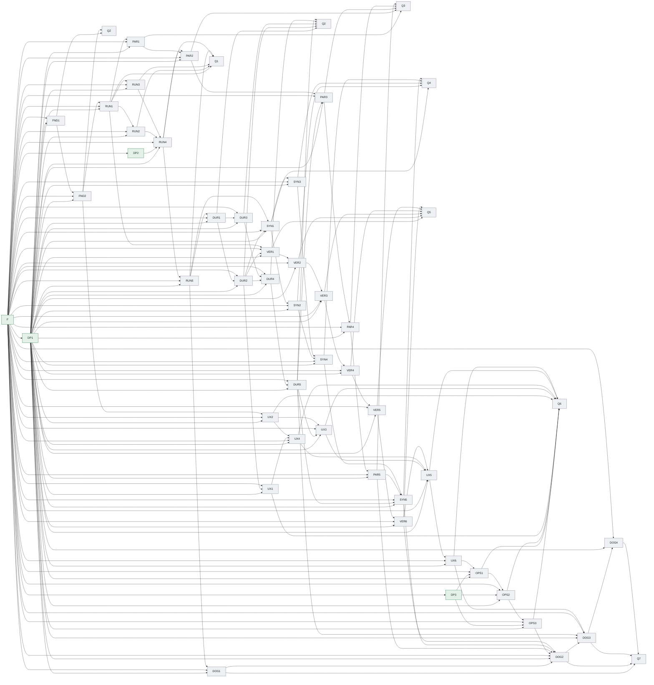

### Dependency edge table

| From | To | Dependency type | Dependency scope | Required upstream state | Assumption IDs | Invalidation keys | Transferred input | Gate/evidence |
|---|---|---|---|---|---|---|---|---|
| DOG1 | DOG2 | hard | specific-output | ACCEPTED | none | requirement.dog1 | 固定首个真实任务、评价器、范围、预算和可重放的单成员基线。 | acceptance contract evidence |
| DOG1 | Q7 | hard | specific-output | ACCEPTED | none | requirement.dog1 | 固定首个真实任务、评价器、范围、预算和可重放的单成员基线。 | acceptance contract evidence |
| DOG2 | DOG3 | hard | specific-output | ACCEPTED | none | requirement.dog2 | 在运维闭环完成后执行两代真实并行研究并证明第二代消费第一代事实。 | acceptance contract evidence |
| DOG2 | Q7 | hard | specific-output | ACCEPTED | none | requirement.dog2 | 在运维闭环完成后执行两代真实并行研究并证明第二代消费第一代事实。 | acceptance contract evidence |
| DOG3 | DOG4 | hard | specific-output | ACCEPTED | none | requirement.dog3 | 执行崩溃、篡改、虚假反例、重复导入和权限攻击演练并验证安全恢复。 | acceptance contract evidence |
| DOG3 | Q7 | hard | specific-output | ACCEPTED | none | requirement.dog3 | 执行崩溃、篡改、虚假反例、重复导入和权限攻击演练并验证安全恢复。 | acceptance contract evidence |
| DOG4 | Q7 | hard | specific-output | ACCEPTED | none | requirement.dog4 | 汇编邀请试点的人类验收与发布证据，作出独立发布决策。 | acceptance contract evidence |
| DP1 | DOG1 | hard | specific-output | ACCEPTED | none | decision.matharc-native-runtime.v1 | MathArc 原生运行时拥有执行状态和数学权威；GitHub Harness 只提供治理工具链。 | acceptance contract evidence |
| DP1 | DOG2 | hard | specific-output | ACCEPTED | none | decision.matharc-native-runtime.v1 | MathArc 原生运行时拥有执行状态和数学权威；GitHub Harness 只提供治理工具链。 | acceptance contract evidence |
| DP1 | DOG3 | hard | specific-output | ACCEPTED | none | decision.matharc-native-runtime.v1 | MathArc 原生运行时拥有执行状态和数学权威；GitHub Harness 只提供治理工具链。 | acceptance contract evidence |
| DP1 | DOG4 | hard | specific-output | ACCEPTED | none | decision.matharc-native-runtime.v1 | MathArc 原生运行时拥有执行状态和数学权威；GitHub Harness 只提供治理工具链。 | acceptance contract evidence |
| DP1 | DUR1 | hard | specific-output | ACCEPTED | none | decision.matharc-native-runtime.v1 | MathArc 原生运行时拥有执行状态和数学权威；GitHub Harness 只提供治理工具链。 | acceptance contract evidence |
| DP1 | DUR2 | hard | specific-output | ACCEPTED | none | decision.matharc-native-runtime.v1 | MathArc 原生运行时拥有执行状态和数学权威；GitHub Harness 只提供治理工具链。 | acceptance contract evidence |
| DP1 | DUR3 | hard | specific-output | ACCEPTED | none | decision.matharc-native-runtime.v1 | MathArc 原生运行时拥有执行状态和数学权威；GitHub Harness 只提供治理工具链。 | acceptance contract evidence |
| DP1 | DUR4 | hard | specific-output | ACCEPTED | none | decision.matharc-native-runtime.v1 | MathArc 原生运行时拥有执行状态和数学权威；GitHub Harness 只提供治理工具链。 | acceptance contract evidence |
| DP1 | DUR5 | hard | specific-output | ACCEPTED | none | decision.matharc-native-runtime.v1 | MathArc 原生运行时拥有执行状态和数学权威；GitHub Harness 只提供治理工具链。 | acceptance contract evidence |
| DP1 | FND1 | hard | specific-output | ACCEPTED | none | decision.matharc-native-runtime.v1 | MathArc 原生运行时拥有执行状态和数学权威；GitHub Harness 只提供治理工具链。 | acceptance contract evidence |
| DP1 | FND2 | hard | specific-output | ACCEPTED | none | decision.matharc-native-runtime.v1 | MathArc 原生运行时拥有执行状态和数学权威；GitHub Harness 只提供治理工具链。 | acceptance contract evidence |
| DP1 | OPS1 | hard | specific-output | ACCEPTED | none | decision.matharc-native-runtime.v1 | MathArc 原生运行时拥有执行状态和数学权威；GitHub Harness 只提供治理工具链。 | acceptance contract evidence |
| DP1 | OPS2 | hard | specific-output | ACCEPTED | none | decision.matharc-native-runtime.v1 | MathArc 原生运行时拥有执行状态和数学权威；GitHub Harness 只提供治理工具链。 | acceptance contract evidence |
| DP1 | OPS3 | hard | specific-output | ACCEPTED | none | decision.matharc-native-runtime.v1 | MathArc 原生运行时拥有执行状态和数学权威；GitHub Harness 只提供治理工具链。 | acceptance contract evidence |
| DP1 | PAR1 | hard | specific-output | ACCEPTED | none | decision.matharc-native-runtime.v1 | MathArc 原生运行时拥有执行状态和数学权威；GitHub Harness 只提供治理工具链。 | acceptance contract evidence |
| DP1 | PAR2 | hard | specific-output | ACCEPTED | none | decision.matharc-native-runtime.v1 | MathArc 原生运行时拥有执行状态和数学权威；GitHub Harness 只提供治理工具链。 | acceptance contract evidence |
| DP1 | PAR3 | hard | specific-output | ACCEPTED | none | decision.matharc-native-runtime.v1 | MathArc 原生运行时拥有执行状态和数学权威；GitHub Harness 只提供治理工具链。 | acceptance contract evidence |
| DP1 | PAR4 | hard | specific-output | ACCEPTED | none | decision.matharc-native-runtime.v1 | MathArc 原生运行时拥有执行状态和数学权威；GitHub Harness 只提供治理工具链。 | acceptance contract evidence |
| DP1 | PAR5 | hard | specific-output | ACCEPTED | none | decision.matharc-native-runtime.v1 | MathArc 原生运行时拥有执行状态和数学权威；GitHub Harness 只提供治理工具链。 | acceptance contract evidence |
| DP1 | RUN1 | hard | specific-output | ACCEPTED | none | decision.matharc-native-runtime.v1 | MathArc 原生运行时拥有执行状态和数学权威；GitHub Harness 只提供治理工具链。 | acceptance contract evidence |
| DP1 | RUN2 | hard | specific-output | ACCEPTED | none | decision.matharc-native-runtime.v1 | MathArc 原生运行时拥有执行状态和数学权威；GitHub Harness 只提供治理工具链。 | acceptance contract evidence |
| DP1 | RUN3 | hard | specific-output | ACCEPTED | none | decision.matharc-native-runtime.v1 | MathArc 原生运行时拥有执行状态和数学权威；GitHub Harness 只提供治理工具链。 | acceptance contract evidence |
| DP1 | RUN4 | hard | specific-output | ACCEPTED | none | decision.matharc-native-runtime.v1 | MathArc 原生运行时拥有执行状态和数学权威；GitHub Harness 只提供治理工具链。 | acceptance contract evidence |
| DP1 | RUN5 | hard | specific-output | ACCEPTED | none | decision.matharc-native-runtime.v1 | MathArc 原生运行时拥有执行状态和数学权威；GitHub Harness 只提供治理工具链。 | acceptance contract evidence |
| DP1 | SYN1 | hard | specific-output | ACCEPTED | none | decision.matharc-native-runtime.v1 | MathArc 原生运行时拥有执行状态和数学权威；GitHub Harness 只提供治理工具链。 | acceptance contract evidence |
| DP1 | SYN2 | hard | specific-output | ACCEPTED | none | decision.matharc-native-runtime.v1 | MathArc 原生运行时拥有执行状态和数学权威；GitHub Harness 只提供治理工具链。 | acceptance contract evidence |
| DP1 | SYN3 | hard | specific-output | ACCEPTED | none | decision.matharc-native-runtime.v1 | MathArc 原生运行时拥有执行状态和数学权威；GitHub Harness 只提供治理工具链。 | acceptance contract evidence |
| DP1 | SYN4 | hard | specific-output | ACCEPTED | none | decision.matharc-native-runtime.v1 | MathArc 原生运行时拥有执行状态和数学权威；GitHub Harness 只提供治理工具链。 | acceptance contract evidence |
| DP1 | SYN5 | hard | specific-output | ACCEPTED | none | decision.matharc-native-runtime.v1 | MathArc 原生运行时拥有执行状态和数学权威；GitHub Harness 只提供治理工具链。 | acceptance contract evidence |
| DP1 | UX1 | hard | specific-output | ACCEPTED | none | decision.matharc-native-runtime.v1 | MathArc 原生运行时拥有执行状态和数学权威；GitHub Harness 只提供治理工具链。 | acceptance contract evidence |
| DP1 | UX2 | hard | specific-output | ACCEPTED | none | decision.matharc-native-runtime.v1 | MathArc 原生运行时拥有执行状态和数学权威；GitHub Harness 只提供治理工具链。 | acceptance contract evidence |
| DP1 | UX3 | hard | specific-output | ACCEPTED | none | decision.matharc-native-runtime.v1 | MathArc 原生运行时拥有执行状态和数学权威；GitHub Harness 只提供治理工具链。 | acceptance contract evidence |
| DP1 | UX4 | hard | specific-output | ACCEPTED | none | decision.matharc-native-runtime.v1 | MathArc 原生运行时拥有执行状态和数学权威；GitHub Harness 只提供治理工具链。 | acceptance contract evidence |
| DP1 | UX5 | hard | specific-output | ACCEPTED | none | decision.matharc-native-runtime.v1 | MathArc 原生运行时拥有执行状态和数学权威；GitHub Harness 只提供治理工具链。 | acceptance contract evidence |
| DP1 | UX6 | hard | specific-output | ACCEPTED | none | decision.matharc-native-runtime.v1 | MathArc 原生运行时拥有执行状态和数学权威；GitHub Harness 只提供治理工具链。 | acceptance contract evidence |
| DP1 | VER1 | hard | specific-output | ACCEPTED | none | decision.matharc-native-runtime.v1 | MathArc 原生运行时拥有执行状态和数学权威；GitHub Harness 只提供治理工具链。 | acceptance contract evidence |
| DP1 | VER2 | hard | specific-output | ACCEPTED | none | decision.matharc-native-runtime.v1 | MathArc 原生运行时拥有执行状态和数学权威；GitHub Harness 只提供治理工具链。 | acceptance contract evidence |
| DP1 | VER3 | hard | specific-output | ACCEPTED | none | decision.matharc-native-runtime.v1 | MathArc 原生运行时拥有执行状态和数学权威；GitHub Harness 只提供治理工具链。 | acceptance contract evidence |
| DP1 | VER4 | hard | specific-output | ACCEPTED | none | decision.matharc-native-runtime.v1 | MathArc 原生运行时拥有执行状态和数学权威；GitHub Harness 只提供治理工具链。 | acceptance contract evidence |
| DP1 | VER5 | hard | specific-output | ACCEPTED | none | decision.matharc-native-runtime.v1 | MathArc 原生运行时拥有执行状态和数学权威；GitHub Harness 只提供治理工具链。 | acceptance contract evidence |
| DP1 | VER6 | hard | specific-output | ACCEPTED | none | decision.matharc-native-runtime.v1 | MathArc 原生运行时拥有执行状态和数学权威；GitHub Harness 只提供治理工具链。 | acceptance contract evidence |
| DP2 | RUN4 | hard | specific-output | ACCEPTED | none | decision.matharc-backend-scope.v1 | 首版后端范围固定为 DeterministicTestBackend、CodexBackend 和 LocalExactToolBackend；Claude Code 与通用模型 API 后置，不阻塞首个邀请制试点。 | acceptance contract evidence |
| DP3 | OPS1 | hard | specific-output | ACCEPTED | none | decision.matharc-pilot-deployment.v1 | 首版部署目标为 Linux + systemd，使用持久目录、外部 secret source 和反向代理/TLS 边界；生产身份仍需后续部署证据确认。 | acceptance contract evidence |
| DP3 | OPS2 | hard | specific-output | ACCEPTED | none | decision.matharc-pilot-deployment.v1 | 首版部署目标为 Linux + systemd，使用持久目录、外部 secret source 和反向代理/TLS 边界；生产身份仍需后续部署证据确认。 | acceptance contract evidence |
| DP3 | OPS3 | hard | specific-output | ACCEPTED | none | decision.matharc-pilot-deployment.v1 | 首版部署目标为 Linux + systemd，使用持久目录、外部 secret source 和反向代理/TLS 边界；生产身份仍需后续部署证据确认。 | acceptance contract evidence |
| DUR1 | DUR2 | hard | specific-output | ACCEPTED | none | requirement.dur1 | 定义冻结输入、代际提交、GenerationReducer 和 GenerationClosePolicy 的持久边界。 | acceptance contract evidence |
| DUR1 | DUR3 | hard | specific-output | ACCEPTED | none | requirement.dur1 | 定义冻结输入、代际提交、GenerationReducer 和 GenerationClosePolicy 的持久边界。 | acceptance contract evidence |
| DUR1 | Q2 | hard | specific-output | ACCEPTED | none | requirement.dur1 | 定义冻结输入、代际提交、GenerationReducer 和 GenerationClosePolicy 的持久边界。 | acceptance contract evidence |
| DUR2 | DUR4 | hard | specific-output | ACCEPTED | none | requirement.dur2 | 以带来源身份的幂等账本保存候选、费用和执行回执，拒绝来源漂移。 | acceptance contract evidence |
| DUR2 | Q2 | hard | specific-output | ACCEPTED | none | requirement.dur2 | 以带来源身份的幂等账本保存候选、费用和执行回执，拒绝来源漂移。 | acceptance contract evidence |
| DUR2 | SYN1 | hard | specific-output | ACCEPTED | none | requirement.dur2 | 以带来源身份的幂等账本保存候选、费用和执行回执，拒绝来源漂移。 | acceptance contract evidence |
| DUR2 | UX1 | hard | specific-output | ACCEPTED | none | requirement.dur2 | 以带来源身份的幂等账本保存候选、费用和执行回执，拒绝来源漂移。 | acceptance contract evidence |
| DUR2 | VER1 | hard | specific-output | ACCEPTED | none | requirement.dur2 | 以带来源身份的幂等账本保存候选、费用和执行回执，拒绝来源漂移。 | acceptance contract evidence |
| DUR3 | DUR4 | hard | specific-output | ACCEPTED | none | requirement.dur3 | 实现停止、排空、暂停、继续和取消的显式运行状态协议。 | acceptance contract evidence |
| DUR3 | Q2 | hard | specific-output | ACCEPTED | none | requirement.dur3 | 实现停止、排空、暂停、继续和取消的显式运行状态协议。 | acceptance contract evidence |
| DUR4 | DUR5 | hard | specific-output | ACCEPTED | none | requirement.dur4 | 从最后一个完整 GenerationCommit 生成可重放的崩溃恢复计划。 | acceptance contract evidence |
| DUR4 | Q2 | hard | specific-output | ACCEPTED | none | requirement.dur4 | 从最后一个完整 GenerationCommit 生成可重放的崩溃恢复计划。 | acceptance contract evidence |
| DUR5 | DOG3 | hard | specific-output | ACCEPTED | none | requirement.dur5 | 独立验收冷启动恢复、幂等恢复和不跳代不重复规则。 | acceptance contract evidence |
| DUR5 | PAR3 | hard | specific-output | ACCEPTED | none | requirement.dur5 | 独立验收冷启动恢复、幂等恢复和不跳代不重复规则。 | acceptance contract evidence |
| DUR5 | Q2 | hard | specific-output | ACCEPTED | none | requirement.dur5 | 独立验收冷启动恢复、幂等恢复和不跳代不重复规则。 | acceptance contract evidence |
| DUR5 | SYN5 | hard | specific-output | ACCEPTED | none | requirement.dur5 | 独立验收冷启动恢复、幂等恢复和不跳代不重复规则。 | acceptance contract evidence |
| DUR5 | UX3 | hard | specific-output | ACCEPTED | none | requirement.dur5 | 独立验收冷启动恢复、幂等恢复和不跳代不重复规则。 | acceptance contract evidence |
| F | DOG1 | hard | specific-output | ACCEPTED | none | source.identity | 建立来源身份基线 | acceptance contract evidence |
| F | DOG2 | hard | specific-output | ACCEPTED | none | source.identity | 建立来源身份基线 | acceptance contract evidence |
| F | DOG3 | hard | specific-output | ACCEPTED | none | source.identity | 建立来源身份基线 | acceptance contract evidence |
| F | DOG4 | hard | specific-output | ACCEPTED | none | source.identity | 建立来源身份基线 | acceptance contract evidence |
| F | DP1 | hard | specific-output | ACCEPTED | none | source.identity | 建立来源身份基线 | acceptance contract evidence |
| F | DP2 | hard | specific-output | ACCEPTED | none | source.identity | 建立来源身份基线 | acceptance contract evidence |
| F | DP3 | hard | specific-output | ACCEPTED | none | source.identity | 建立来源身份基线 | acceptance contract evidence |
| F | DUR1 | hard | specific-output | ACCEPTED | none | source.identity | 建立来源身份基线 | acceptance contract evidence |
| F | DUR2 | hard | specific-output | ACCEPTED | none | source.identity | 建立来源身份基线 | acceptance contract evidence |
| F | DUR3 | hard | specific-output | ACCEPTED | none | source.identity | 建立来源身份基线 | acceptance contract evidence |
| F | DUR4 | hard | specific-output | ACCEPTED | none | source.identity | 建立来源身份基线 | acceptance contract evidence |
| F | DUR5 | hard | specific-output | ACCEPTED | none | source.identity | 建立来源身份基线 | acceptance contract evidence |
| F | FND1 | hard | specific-output | ACCEPTED | none | source.identity | 建立来源身份基线 | acceptance contract evidence |
| F | FND2 | hard | specific-output | ACCEPTED | none | source.identity | 建立来源身份基线 | acceptance contract evidence |
| F | OPS1 | hard | specific-output | ACCEPTED | none | source.identity | 建立来源身份基线 | acceptance contract evidence |
| F | OPS2 | hard | specific-output | ACCEPTED | none | source.identity | 建立来源身份基线 | acceptance contract evidence |
| F | OPS3 | hard | specific-output | ACCEPTED | none | source.identity | 建立来源身份基线 | acceptance contract evidence |
| F | PAR1 | hard | specific-output | ACCEPTED | none | source.identity | 建立来源身份基线 | acceptance contract evidence |
| F | PAR2 | hard | specific-output | ACCEPTED | none | source.identity | 建立来源身份基线 | acceptance contract evidence |
| F | PAR3 | hard | specific-output | ACCEPTED | none | source.identity | 建立来源身份基线 | acceptance contract evidence |
| F | PAR4 | hard | specific-output | ACCEPTED | none | source.identity | 建立来源身份基线 | acceptance contract evidence |
| F | PAR5 | hard | specific-output | ACCEPTED | none | source.identity | 建立来源身份基线 | acceptance contract evidence |
| F | RUN1 | hard | specific-output | ACCEPTED | none | source.identity | 建立来源身份基线 | acceptance contract evidence |
| F | RUN2 | hard | specific-output | ACCEPTED | none | source.identity | 建立来源身份基线 | acceptance contract evidence |
| F | RUN3 | hard | specific-output | ACCEPTED | none | source.identity | 建立来源身份基线 | acceptance contract evidence |
| F | RUN4 | hard | specific-output | ACCEPTED | none | source.identity | 建立来源身份基线 | acceptance contract evidence |
| F | RUN5 | hard | specific-output | ACCEPTED | none | source.identity | 建立来源身份基线 | acceptance contract evidence |
| F | SYN1 | hard | specific-output | ACCEPTED | none | source.identity | 建立来源身份基线 | acceptance contract evidence |
| F | SYN2 | hard | specific-output | ACCEPTED | none | source.identity | 建立来源身份基线 | acceptance contract evidence |
| F | SYN3 | hard | specific-output | ACCEPTED | none | source.identity | 建立来源身份基线 | acceptance contract evidence |
| F | SYN4 | hard | specific-output | ACCEPTED | none | source.identity | 建立来源身份基线 | acceptance contract evidence |
| F | SYN5 | hard | specific-output | ACCEPTED | none | source.identity | 建立来源身份基线 | acceptance contract evidence |
| F | UX1 | hard | specific-output | ACCEPTED | none | source.identity | 建立来源身份基线 | acceptance contract evidence |
| F | UX2 | hard | specific-output | ACCEPTED | none | source.identity | 建立来源身份基线 | acceptance contract evidence |
| F | UX3 | hard | specific-output | ACCEPTED | none | source.identity | 建立来源身份基线 | acceptance contract evidence |
| F | UX4 | hard | specific-output | ACCEPTED | none | source.identity | 建立来源身份基线 | acceptance contract evidence |
| F | UX5 | hard | specific-output | ACCEPTED | none | source.identity | 建立来源身份基线 | acceptance contract evidence |
| F | UX6 | hard | specific-output | ACCEPTED | none | source.identity | 建立来源身份基线 | acceptance contract evidence |
| F | VER1 | hard | specific-output | ACCEPTED | none | source.identity | 建立来源身份基线 | acceptance contract evidence |
| F | VER2 | hard | specific-output | ACCEPTED | none | source.identity | 建立来源身份基线 | acceptance contract evidence |
| F | VER3 | hard | specific-output | ACCEPTED | none | source.identity | 建立来源身份基线 | acceptance contract evidence |
| F | VER4 | hard | specific-output | ACCEPTED | none | source.identity | 建立来源身份基线 | acceptance contract evidence |
| F | VER5 | hard | specific-output | ACCEPTED | none | source.identity | 建立来源身份基线 | acceptance contract evidence |
| F | VER6 | hard | specific-output | ACCEPTED | none | source.identity | 建立来源身份基线 | acceptance contract evidence |
| FND1 | FND2 | hard | specific-output | ACCEPTED | none | requirement.fnd1 | 建立 MathArc 原生运行时所有权与依赖允许清单，阻断治理工具链进入产品运行路径。 | acceptance contract evidence |
| FND1 | QZ | hard | specific-output | ACCEPTED | none | requirement.fnd1 | 建立 MathArc 原生运行时所有权与依赖允许清单，阻断治理工具链进入产品运行路径。 | acceptance contract evidence |
| FND2 | QZ | hard | specific-output | ACCEPTED | none | requirement.fnd2 | 保留 ResearchTrace 的数学结论晋升权威，并证明运行状态不能直接变成正式证明。 | acceptance contract evidence |
| FND2 | RUN1 | hard | specific-output | ACCEPTED | none | requirement.fnd2 | 保留 ResearchTrace 的数学结论晋升权威，并证明运行状态不能直接变成正式证明。 | acceptance contract evidence |
| FND2 | UX2 | hard | specific-output | ACCEPTED | none | requirement.fnd2 | 保留 ResearchTrace 的数学结论晋升权威，并证明运行状态不能直接变成正式证明。 | acceptance contract evidence |
| OPS1 | OPS2 | hard | specific-output | ACCEPTED | none | requirement.ops1 | 固定试点部署配置、持久目录、密钥来源和进程守护方式。 | acceptance contract evidence |
| OPS1 | Q6 | hard | specific-output | ACCEPTED | none | requirement.ops1 | 固定试点部署配置、持久目录、密钥来源和进程守护方式。 | acceptance contract evidence |
| OPS2 | OPS3 | hard | specific-output | ACCEPTED | none | requirement.ops2 | 建立健康检查、日志、配额、备份和恢复观测闭环。 | acceptance contract evidence |
| OPS2 | Q6 | hard | specific-output | ACCEPTED | none | requirement.ops2 | 建立健康检查、日志、配额、备份和恢复观测闭环。 | acceptance contract evidence |
| OPS3 | DOG2 | hard | specific-output | ACCEPTED | none | requirement.ops3 | 独立验收部署、重启、回滚和试点用户数据清理。 | acceptance contract evidence |
| OPS3 | Q6 | hard | specific-output | ACCEPTED | none | requirement.ops3 | 独立验收部署、重启、回滚和试点用户数据清理。 | acceptance contract evidence |
| PAR1 | PAR2 | hard | specific-output | ACCEPTED | none | requirement.par1 | 把研究路线和角色编译为带机制、预算、目标和隔离写入区的运行拓扑。 | acceptance contract evidence |
| PAR1 | Q3 | hard | specific-output | ACCEPTED | none | requirement.par1 | 把研究路线和角色编译为带机制、预算、目标和隔离写入区的运行拓扑。 | acceptance contract evidence |
| PAR2 | PAR3 | hard | specific-output | ACCEPTED | none | requirement.par2 | 接入已批准的动态任务并执行一次性、可审计的任务启动。 | acceptance contract evidence |
| PAR2 | Q3 | hard | specific-output | ACCEPTED | none | requirement.par2 | 接入已批准的动态任务并执行一次性、可审计的任务启动。 | acceptance contract evidence |
| PAR3 | PAR4 | hard | specific-output | ACCEPTED | none | requirement.par3 | 在持久化和恢复能力之后实现有界并行、冻结输入和隔离工作区调度。 | acceptance contract evidence |
| PAR3 | Q3 | hard | specific-output | ACCEPTED | none | requirement.par3 | 在持久化和恢复能力之后实现有界并行、冻结输入和隔离工作区调度。 | acceptance contract evidence |
| PAR4 | PAR5 | hard | specific-output | ACCEPTED | none | requirement.par4 | 按执行回执记录实际资源消耗，并对语义重复实验做确定性去重。 | acceptance contract evidence |
| PAR4 | Q3 | hard | specific-output | ACCEPTED | none | requirement.par4 | 按执行回执记录实际资源消耗，并对语义重复实验做确定性去重。 | acceptance contract evidence |
| PAR5 | DOG2 | hard | specific-output | ACCEPTED | none | requirement.par5 | 独立验收多成员一代归并、冲突、部分失败和迟到结果规则。 | acceptance contract evidence |
| PAR5 | Q3 | hard | specific-output | ACCEPTED | none | requirement.par5 | 独立验收多成员一代归并、冲突、部分失败和迟到结果规则。 | acceptance contract evidence |
| PAR5 | SYN5 | hard | specific-output | ACCEPTED | none | requirement.par5 | 独立验收多成员一代归并、冲突、部分失败和迟到结果规则。 | acceptance contract evidence |
| RUN1 | PAR1 | hard | specific-output | ACCEPTED | none | requirement.run1 | 定义可版本化的研究运行合同、身份层级、候选包和运行动作回执。 | acceptance contract evidence |
| RUN1 | Q1 | hard | specific-output | ACCEPTED | none | requirement.run1 | 定义可版本化的研究运行合同、身份层级、候选包和运行动作回执。 | acceptance contract evidence |
| RUN1 | RUN2 | hard | specific-output | ACCEPTED | none | requirement.run1 | 定义可版本化的研究运行合同、身份层级、候选包和运行动作回执。 | acceptance contract evidence |
| RUN1 | RUN3 | hard | specific-output | ACCEPTED | none | requirement.run1 | 定义可版本化的研究运行合同、身份层级、候选包和运行动作回执。 | acceptance contract evidence |
| RUN1 | VER1 | hard | specific-output | ACCEPTED | none | requirement.run1 | 定义可版本化的研究运行合同、身份层级、候选包和运行动作回执。 | acceptance contract evidence |
| RUN2 | Q1 | hard | specific-output | ACCEPTED | none | requirement.run2 | 建立可重放的运行存储，使事件、快照和候选导入在进程重启后保持一致。 | acceptance contract evidence |
| RUN2 | RUN4 | hard | specific-output | ACCEPTED | none | requirement.run2 | 建立可重放的运行存储，使事件、快照和候选导入在进程重启后保持一致。 | acceptance contract evidence |
| RUN3 | Q1 | hard | specific-output | ACCEPTED | none | requirement.run3 | 建立有预算、种子和最小试跑门槛的评价器合同，失败时不启动完整研究。 | acceptance contract evidence |
| RUN3 | RUN4 | hard | specific-output | ACCEPTED | none | requirement.run3 | 建立有预算、种子和最小试跑门槛的评价器合同，失败时不启动完整研究。 | acceptance contract evidence |
| RUN4 | PAR2 | hard | specific-output | ACCEPTED | none | requirement.run4 | 将各类执行后端统一为 MathArc 请求，只返回不可变 WorkerExecutionResult 并由协调器组装候选包。 | acceptance contract evidence |
| RUN4 | Q1 | hard | specific-output | ACCEPTED | none | requirement.run4 | 将各类执行后端统一为 MathArc 请求，只返回不可变 WorkerExecutionResult 并由协调器组装候选包。 | acceptance contract evidence |
| RUN4 | RUN5 | hard | specific-output | ACCEPTED | none | requirement.run4 | 将各类执行后端统一为 MathArc 请求，只返回不可变 WorkerExecutionResult 并由协调器组装候选包。 | acceptance contract evidence |
| RUN5 | DOG1 | hard | specific-output | ACCEPTED | none | requirement.run5 | 独立验证单任务从试跑、执行到候选回传的闭环，并阻断候选越级晋升。 | acceptance contract evidence |
| RUN5 | DUR1 | hard | specific-output | ACCEPTED | none | requirement.run5 | 独立验证单任务从试跑、执行到候选回传的闭环，并阻断候选越级晋升。 | acceptance contract evidence |
| RUN5 | Q1 | hard | specific-output | ACCEPTED | none | requirement.run5 | 独立验证单任务从试跑、执行到候选回传的闭环，并阻断候选越级晋升。 | acceptance contract evidence |
| RUN5 | SYN1 | hard | specific-output | ACCEPTED | none | requirement.run5 | 独立验证单任务从试跑、执行到候选回传的闭环，并阻断候选越级晋升。 | acceptance contract evidence |
| SYN1 | Q4 | hard | specific-output | ACCEPTED | none | requirement.syn1 | 把普通执行输出标准化为带完整出处的探索候选，隔离于正式证据。 | acceptance contract evidence |
| SYN1 | SYN2 | hard | specific-output | ACCEPTED | none | requirement.syn1 | 把普通执行输出标准化为带完整出处的探索候选，隔离于正式证据。 | acceptance contract evidence |
| SYN1 | SYN3 | hard | specific-output | ACCEPTED | none | requirement.syn1 | 把普通执行输出标准化为带完整出处的探索候选，隔离于正式证据。 | acceptance contract evidence |
| SYN2 | Q4 | hard | specific-output | ACCEPTED | none | requirement.syn2 | 将疑似反例送入独立复核队列，未复核前不改变研究路线或结论。 | acceptance contract evidence |
| SYN2 | SYN4 | hard | specific-output | ACCEPTED | none | requirement.syn2 | 将疑似反例送入独立复核队列，未复核前不改变研究路线或结论。 | acceptance contract evidence |
| SYN3 | Q4 | hard | specific-output | ACCEPTED | none | requirement.syn3 | 从真实运行蒸馏带身份和候选出处的研究记忆。 | acceptance contract evidence |
| SYN3 | SYN4 | hard | specific-output | ACCEPTED | none | requirement.syn3 | 从真实运行蒸馏带身份和候选出处的研究记忆。 | acceptance contract evidence |
| SYN4 | Q4 | hard | specific-output | ACCEPTED | none | requirement.syn4 | 把失败、经历和评审缺口编译为明确消费上一代事实的下一代议程。 | acceptance contract evidence |
| SYN4 | SYN5 | hard | specific-output | ACCEPTED | none | requirement.syn4 | 把失败、经历和评审缺口编译为明确消费上一代事实的下一代议程。 | acceptance contract evidence |
| SYN5 | DOG2 | hard | specific-output | ACCEPTED | none | requirement.syn5 | 独立验收连续两代提交、路线变化和上一代事实消费。 | acceptance contract evidence |
| SYN5 | Q4 | hard | specific-output | ACCEPTED | none | requirement.syn5 | 独立验收连续两代提交、路线变化和上一代事实消费。 | acceptance contract evidence |
| UX1 | Q6 | hard | specific-output | ACCEPTED | none | requirement.ux1 | 把 RuntimeStore 状态投影到现有控制台数据合同，保持单一真相源。 | acceptance contract evidence |
| UX1 | UX4 | hard | specific-output | ACCEPTED | none | requirement.ux1 | 把 RuntimeStore 状态投影到现有控制台数据合同，保持单一真相源。 | acceptance contract evidence |
| UX2 | Q6 | hard | specific-output | ACCEPTED | none | requirement.ux2 | 复用邀请制 Cookie 会话和权限边界，阻断无权用户的运行动作。 | acceptance contract evidence |
| UX2 | UX3 | hard | specific-output | ACCEPTED | none | requirement.ux2 | 复用邀请制 Cookie 会话和权限边界，阻断无权用户的运行动作。 | acceptance contract evidence |
| UX2 | UX4 | hard | specific-output | ACCEPTED | none | requirement.ux2 | 复用邀请制 Cookie 会话和权限边界，阻断无权用户的运行动作。 | acceptance contract evidence |
| UX3 | Q6 | hard | specific-output | ACCEPTED | none | requirement.ux3 | 提供登记动作的幂等运行控制服务，拒绝任意命令、目录、环境和参数。 | acceptance contract evidence |
| UX3 | UX5 | hard | specific-output | ACCEPTED | none | requirement.ux3 | 提供登记动作的幂等运行控制服务，拒绝任意命令、目录、环境和参数。 | acceptance contract evidence |
| UX4 | Q6 | hard | specific-output | ACCEPTED | none | requirement.ux4 | 建立统一中文运行视图并递归脱敏密钥、路径、命令、环境变量和堆栈。 | acceptance contract evidence |
| UX4 | UX5 | hard | specific-output | ACCEPTED | none | requirement.ux4 | 建立统一中文运行视图并递归脱敏密钥、路径、命令、环境变量和堆栈。 | acceptance contract evidence |
| UX5 | Q6 | hard | specific-output | ACCEPTED | none | requirement.ux5 | 实现断线重连后从服务端快照恢复的实时研究控制台。 | acceptance contract evidence |
| UX5 | UX6 | hard | specific-output | ACCEPTED | none | requirement.ux5 | 实现断线重连后从服务端快照恢复的实时研究控制台。 | acceptance contract evidence |
| UX6 | DOG3 | hard | specific-output | ACCEPTED | none | requirement.ux6 | 独立完成人类浏览器验收，覆盖桌面、移动端、权限负路径和完整操作流。 | acceptance contract evidence |
| UX6 | OPS1 | hard | specific-output | ACCEPTED | none | requirement.ux6 | 独立完成人类浏览器验收，覆盖桌面、移动端、权限负路径和完整操作流。 | acceptance contract evidence |
| UX6 | Q6 | hard | specific-output | ACCEPTED | none | requirement.ux6 | 独立完成人类浏览器验收，覆盖桌面、移动端、权限负路径和完整操作流。 | acceptance contract evidence |
| VER1 | Q5 | hard | specific-output | ACCEPTED | none | requirement.ver1 | 定义候选进入验证阶段所需的身份约束和 VerifierReceipt，而非重新定义候选包。 | acceptance contract evidence |
| VER1 | VER2 | hard | specific-output | ACCEPTED | none | requirement.ver1 | 定义候选进入验证阶段所需的身份约束和 VerifierReceipt，而非重新定义候选包。 | acceptance contract evidence |
| VER2 | Q5 | hard | specific-output | ACCEPTED | none | requirement.ver2 | 把候选绑定到具体命题、量词、对象和范围，拒绝范围扩大与对象错配。 | acceptance contract evidence |
| VER2 | VER3 | hard | specific-output | ACCEPTED | none | requirement.ver2 | 把候选绑定到具体命题、量词、对象和范围，拒绝范围扩大与对象错配。 | acceptance contract evidence |
| VER3 | Q5 | hard | specific-output | ACCEPTED | none | requirement.ver3 | 为候选生成干净环境的独立重放计划，排除同实现自证。 | acceptance contract evidence |
| VER3 | VER4 | hard | specific-output | ACCEPTED | none | requirement.ver3 | 为候选生成干净环境的独立重放计划，排除同实现自证。 | acceptance contract evidence |
| VER4 | Q5 | hard | specific-output | ACCEPTED | none | requirement.ver4 | 仅将通过 VerifierReceipt 的候选转换为带出处的 EvidenceRecord。 | acceptance contract evidence |
| VER4 | VER5 | hard | specific-output | ACCEPTED | none | requirement.ver4 | 仅将通过 VerifierReceipt 的候选转换为带出处的 EvidenceRecord。 | acceptance contract evidence |
| VER5 | Q5 | hard | specific-output | ACCEPTED | none | requirement.ver5 | 记录命题、源码、评价器或候选身份变化导致的证据失效。 | acceptance contract evidence |
| VER5 | VER6 | hard | specific-output | ACCEPTED | none | requirement.ver5 | 记录命题、源码、评价器或候选身份变化导致的证据失效。 | acceptance contract evidence |
| VER6 | DOG2 | hard | specific-output | ACCEPTED | none | requirement.ver6 | 独立验收验证汇合、篡改检测、越界阻断和非独立结果拒绝。 | acceptance contract evidence |
| VER6 | Q5 | hard | specific-output | ACCEPTED | none | requirement.ver6 | 独立验收验证汇合、篡改检测、越界阻断和非独立结果拒绝。 | acceptance contract evidence |
| VER6 | UX5 | hard | specific-output | ACCEPTED | none | requirement.ver6 | 独立验收验证汇合、篡改检测、越界阻断和非独立结果拒绝。 | acceptance contract evidence |

### ASCII topology graph

```text
Layer 0: F
Layer 1: DP1, DP2, DP3
Layer 2: FND1
Layer 3: FND2
Layer 4: QZ, RUN1, UX2
Layer 5: PAR1, RUN2, RUN3
Layer 6: RUN4
Layer 7: PAR2, RUN5
Layer 8: DOG1, DUR1, Q1
Layer 9: DUR2, DUR3
Layer 10: DUR4, SYN1, UX1, VER1
Layer 11: DUR5, SYN2, SYN3, UX4, VER2
Layer 12: PAR3, Q2, SYN4, UX3, VER3
Layer 13: PAR4, VER4
Layer 14: PAR5, VER5
Layer 15: Q3, SYN5, VER6
Layer 16: Q4, Q5, UX5
Layer 17: UX6
Layer 18: OPS1
Layer 19: OPS2
Layer 20: OPS3
Layer 21: DOG2, Q6
Layer 22: DOG3
Layer 23: DOG4
Layer 24: Q7
Edges:
  DOG1 -> DOG2
  DOG1 -> Q7
  DOG2 -> DOG3
  DOG2 -> Q7
  DOG3 -> DOG4
  DOG3 -> Q7
  DOG4 -> Q7
  DP1 -> DOG1
  DP1 -> DOG2
  DP1 -> DOG3
  DP1 -> DOG4
  DP1 -> DUR1
  DP1 -> DUR2
  DP1 -> DUR3
  DP1 -> DUR4
  DP1 -> DUR5
  DP1 -> FND1
  DP1 -> FND2
  DP1 -> OPS1
  DP1 -> OPS2
  DP1 -> OPS3
  DP1 -> PAR1
  DP1 -> PAR2
  DP1 -> PAR3
  DP1 -> PAR4
  DP1 -> PAR5
  DP1 -> RUN1
  DP1 -> RUN2
  DP1 -> RUN3
  DP1 -> RUN4
  DP1 -> RUN5
  DP1 -> SYN1
  DP1 -> SYN2
  DP1 -> SYN3
  DP1 -> SYN4
  DP1 -> SYN5
  DP1 -> UX1
  DP1 -> UX2
  DP1 -> UX3
  DP1 -> UX4
  DP1 -> UX5
  DP1 -> UX6
  DP1 -> VER1
  DP1 -> VER2
  DP1 -> VER3
  DP1 -> VER4
  DP1 -> VER5
  DP1 -> VER6
  DP2 -> RUN4
  DP3 -> OPS1
  DP3 -> OPS2
  DP3 -> OPS3
  DUR1 -> DUR2
  DUR1 -> DUR3
  DUR1 -> Q2
  DUR2 -> DUR4
  DUR2 -> Q2
  DUR2 -> SYN1
  DUR2 -> UX1
  DUR2 -> VER1
  DUR3 -> DUR4
  DUR3 -> Q2
  DUR4 -> DUR5
  DUR4 -> Q2
  DUR5 -> DOG3
  DUR5 -> PAR3
  DUR5 -> Q2
  DUR5 -> SYN5
  DUR5 -> UX3
  F -> DOG1
  F -> DOG2
  F -> DOG3
  F -> DOG4
  F -> DP1
  F -> DP2
  F -> DP3
  F -> DUR1
  F -> DUR2
  F -> DUR3
  F -> DUR4
  F -> DUR5
  F -> FND1
  F -> FND2
  F -> OPS1
  F -> OPS2
  F -> OPS3
  F -> PAR1
  F -> PAR2
  F -> PAR3
  F -> PAR4
  F -> PAR5
  F -> RUN1
  F -> RUN2
  F -> RUN3
  F -> RUN4
  F -> RUN5
  F -> SYN1
  F -> SYN2
  F -> SYN3
  F -> SYN4
  F -> SYN5
  F -> UX1
  F -> UX2
  F -> UX3
  F -> UX4
  F -> UX5
  F -> UX6
  F -> VER1
  F -> VER2
  F -> VER3
  F -> VER4
  F -> VER5
  F -> VER6
  FND1 -> FND2
  FND1 -> QZ
  FND2 -> QZ
  FND2 -> RUN1
  FND2 -> UX2
  OPS1 -> OPS2
  OPS1 -> Q6
  OPS2 -> OPS3
  OPS2 -> Q6
  OPS3 -> DOG2
  OPS3 -> Q6
  PAR1 -> PAR2
  PAR1 -> Q3
  PAR2 -> PAR3
  PAR2 -> Q3
  PAR3 -> PAR4
  PAR3 -> Q3
  PAR4 -> PAR5
  PAR4 -> Q3
  PAR5 -> DOG2
  PAR5 -> Q3
  PAR5 -> SYN5
  RUN1 -> PAR1
  RUN1 -> Q1
  RUN1 -> RUN2
  RUN1 -> RUN3
  RUN1 -> VER1
  RUN2 -> Q1
  RUN2 -> RUN4
  RUN3 -> Q1
  RUN3 -> RUN4
  RUN4 -> PAR2
  RUN4 -> Q1
  RUN4 -> RUN5
  RUN5 -> DOG1
  RUN5 -> DUR1
  RUN5 -> Q1
  RUN5 -> SYN1
  SYN1 -> Q4
  SYN1 -> SYN2
  SYN1 -> SYN3
  SYN2 -> Q4
  SYN2 -> SYN4
  SYN3 -> Q4
  SYN3 -> SYN4
  SYN4 -> Q4
  SYN4 -> SYN5
  SYN5 -> DOG2
  SYN5 -> Q4
  UX1 -> Q6
  UX1 -> UX4
  UX2 -> Q6
  UX2 -> UX3
  UX2 -> UX4
  UX3 -> Q6
  UX3 -> UX5
  UX4 -> Q6
  UX4 -> UX5
  UX5 -> Q6
  UX5 -> UX6
  UX6 -> DOG3
  UX6 -> OPS1
  UX6 -> Q6
  VER1 -> Q5
  VER1 -> VER2
  VER2 -> Q5
  VER2 -> VER3
  VER3 -> Q5
  VER3 -> VER4
  VER4 -> Q5
  VER4 -> VER5
  VER5 -> Q5
  VER5 -> VER6
  VER6 -> DOG2
  VER6 -> Q5
  VER6 -> UX5
```

### Dependency graph (mermaid)



### State ledger

| Task ID | Stage | State |
|---|---|---|
| DOG1 | RTR7 | PLANNED |
| DOG2 | RTR7 | PLANNED |
| DOG3 | RTR7 | PLANNED |
| DOG4 | RTR7 | PLANNED |
| DP1 | RTRZ | ACCEPTED |
| DP2 | RTRZ | ACCEPTED |
| DP3 | RTRZ | ACCEPTED |
| DUR1 | RTR2 | PLANNED |
| DUR2 | RTR2 | PLANNED |
| DUR3 | RTR2 | PLANNED |
| DUR4 | RTR2 | PLANNED |
| DUR5 | RTR2 | PLANNED |
| F | RTRZ | ACCEPTED |
| FND1 | RTRZ | PLANNED |
| FND2 | RTRZ | PLANNED |
| OPS1 | RTR6 | PLANNED |
| OPS2 | RTR6 | PLANNED |
| OPS3 | RTR6 | PLANNED |
| PAR1 | RTR3 | PLANNED |
| PAR2 | RTR3 | PLANNED |
| PAR3 | RTR3 | PLANNED |
| PAR4 | RTR3 | PLANNED |
| PAR5 | RTR3 | PLANNED |
| Q1 | RTR1 | PLANNED |
| Q2 | RTR2 | PLANNED |
| Q3 | RTR3 | PLANNED |
| Q4 | RTR4 | PLANNED |
| Q5 | RTR5 | PLANNED |
| Q6 | RTR6 | PLANNED |
| Q7 | RTR7 | PLANNED |
| QZ | RTRZ | PLANNED |
| RUN1 | RTR1 | PLANNED |
| RUN2 | RTR1 | PLANNED |
| RUN3 | RTR1 | PLANNED |
| RUN4 | RTR1 | PLANNED |
| RUN5 | RTR1 | PLANNED |
| SYN1 | RTR4 | PLANNED |
| SYN2 | RTR4 | PLANNED |
| SYN3 | RTR4 | PLANNED |
| SYN4 | RTR4 | PLANNED |
| SYN5 | RTR4 | PLANNED |
| UX1 | RTR6 | PLANNED |
| UX2 | RTR6 | PLANNED |
| UX3 | RTR6 | PLANNED |
| UX4 | RTR6 | PLANNED |
| UX5 | RTR6 | PLANNED |
| UX6 | RTR6 | PLANNED |
| VER1 | RTR5 | PLANNED |
| VER2 | RTR5 | PLANNED |
| VER3 | RTR5 | PLANNED |
| VER4 | RTR5 | PLANNED |
| VER5 | RTR5 | PLANNED |
| VER6 | RTR5 | PLANNED |

### Semantic node registry

| Task ID | Semantic key | Execution state |
|---|---|---|
| DOG1 | requirement.dog1 | PLANNED |
| DOG2 | requirement.dog2 | PLANNED |
| DOG3 | requirement.dog3 | PLANNED |
| DOG4 | requirement.dog4 | PLANNED |
| DP1 | decision.matharc-native-runtime | ACCEPTED |
| DP2 | decision.matharc-backend-scope | ACCEPTED |
| DP3 | decision.matharc-pilot-deployment | ACCEPTED |
| DUR1 | requirement.dur1 | PLANNED |
| DUR2 | requirement.dur2 | PLANNED |
| DUR3 | requirement.dur3 | PLANNED |
| DUR4 | requirement.dur4 | PLANNED |
| DUR5 | requirement.dur5 | PLANNED |
| F | source.identity-baseline | ACCEPTED |
| FND1 | requirement.fnd1 | PLANNED |
| FND2 | requirement.fnd2 | PLANNED |
| OPS1 | requirement.ops1 | PLANNED |
| OPS2 | requirement.ops2 | PLANNED |
| OPS3 | requirement.ops3 | PLANNED |
| PAR1 | requirement.par1 | PLANNED |
| PAR2 | requirement.par2 | PLANNED |
| PAR3 | requirement.par3 | PLANNED |
| PAR4 | requirement.par4 | PLANNED |
| PAR5 | requirement.par5 | PLANNED |
| Q1 | acceptance.release.rtr1 | PLANNED |
| Q2 | acceptance.release.rtr2 | PLANNED |
| Q3 | acceptance.release.rtr3 | PLANNED |
| Q4 | acceptance.release.rtr4 | PLANNED |
| Q5 | acceptance.release.rtr5 | PLANNED |
| Q6 | acceptance.release.rtr6 | PLANNED |
| Q7 | acceptance.release.rtr7 | PLANNED |
| QZ | acceptance.release.rtrz | PLANNED |
| RUN1 | requirement.run1 | PLANNED |
| RUN2 | requirement.run2 | PLANNED |
| RUN3 | requirement.run3 | PLANNED |
| RUN4 | requirement.run4 | PLANNED |
| RUN5 | requirement.run5 | PLANNED |
| SYN1 | requirement.syn1 | PLANNED |
| SYN2 | requirement.syn2 | PLANNED |
| SYN3 | requirement.syn3 | PLANNED |
| SYN4 | requirement.syn4 | PLANNED |
| SYN5 | requirement.syn5 | PLANNED |
| UX1 | requirement.ux1 | PLANNED |
| UX2 | requirement.ux2 | PLANNED |
| UX3 | requirement.ux3 | PLANNED |
| UX4 | requirement.ux4 | PLANNED |
| UX5 | requirement.ux5 | PLANNED |
| UX6 | requirement.ux6 | PLANNED |
| VER1 | requirement.ver1 | PLANNED |
| VER2 | requirement.ver2 | PLANNED |
| VER3 | requirement.ver3 | PLANNED |
| VER4 | requirement.ver4 | PLANNED |
| VER5 | requirement.ver5 | PLANNED |
| VER6 | requirement.ver6 | PLANNED |

### Ready frontier

| Task ID | Eligibility |
|---|---|
| DOG1 | not-ready |
| DOG2 | not-ready |
| DOG3 | not-ready |
| DOG4 | not-ready |
| DP1 | not-ready |
| DP2 | not-ready |
| DP3 | not-ready |
| DUR1 | not-ready |
| DUR2 | not-ready |
| DUR3 | not-ready |
| DUR4 | not-ready |
| DUR5 | not-ready |
| F | not-ready |
| FND1 | not-ready |
| FND2 | not-ready |
| OPS1 | not-ready |
| OPS2 | not-ready |
| OPS3 | not-ready |
| PAR1 | not-ready |
| PAR2 | not-ready |
| PAR3 | not-ready |
| PAR4 | not-ready |
| PAR5 | not-ready |
| Q1 | not-ready |
| Q2 | not-ready |
| Q3 | not-ready |
| Q4 | not-ready |
| Q5 | not-ready |
| Q6 | not-ready |
| Q7 | not-ready |
| QZ | not-ready |
| RUN1 | not-ready |
| RUN2 | not-ready |
| RUN3 | not-ready |
| RUN4 | not-ready |
| RUN5 | not-ready |
| SYN1 | not-ready |
| SYN2 | not-ready |
| SYN3 | not-ready |
| SYN4 | not-ready |
| SYN5 | not-ready |
| UX1 | not-ready |
| UX2 | not-ready |
| UX3 | not-ready |
| UX4 | not-ready |
| UX5 | not-ready |
| UX6 | not-ready |
| VER1 | not-ready |
| VER2 | not-ready |
| VER3 | not-ready |
| VER4 | not-ready |
| VER5 | not-ready |
| VER6 | not-ready |
