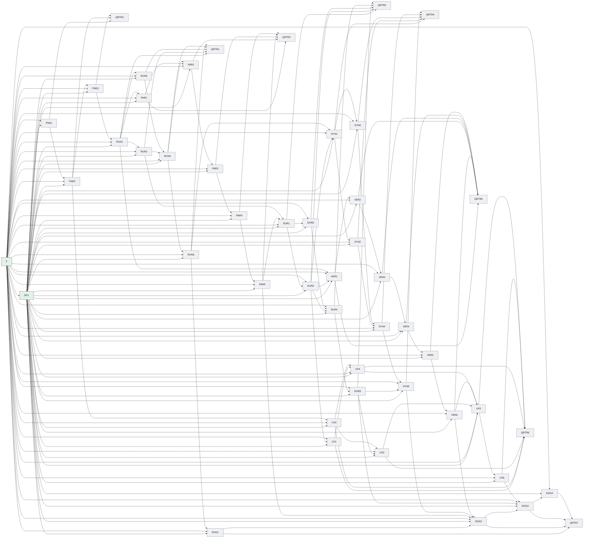

### Dependency edge table

| From | To | Dependency type | Dependency scope | Required upstream state | Assumption IDs | Invalidation keys | Transferred input | Gate/evidence |
|---|---|---|---|---|---|---|---|---|
| DOG1 | DOG2 | hard | specific-output | ACCEPTED | none | requirement.dog1 | Deliver source requirement DOG1. | acceptance contract evidence |
| DOG1 | QRTR7 | hard | specific-output | ACCEPTED | none | requirement.dog1 | Deliver source requirement DOG1. | acceptance contract evidence |
| DOG2 | DOG3 | hard | specific-output | ACCEPTED | none | requirement.dog2 | Deliver source requirement DOG2. | acceptance contract evidence |
| DOG2 | QRTR7 | hard | specific-output | ACCEPTED | none | requirement.dog2 | Deliver source requirement DOG2. | acceptance contract evidence |
| DOG3 | DOG4 | hard | specific-output | ACCEPTED | none | requirement.dog3 | Deliver source requirement DOG3. | acceptance contract evidence |
| DOG3 | QRTR7 | hard | specific-output | ACCEPTED | none | requirement.dog3 | Deliver source requirement DOG3. | acceptance contract evidence |
| DOG4 | QRTR7 | hard | specific-output | ACCEPTED | none | requirement.dog4 | Deliver source requirement DOG4. | acceptance contract evidence |
| DP1 | DOG1 | hard | specific-output | ACCEPTED | none | decision.matharc-native-runtime.v1 | MathArc 原生运行时拥有执行状态和数学权威；GitHub Harness 只提供治理工具链。 | acceptance contract evidence |
| DP1 | DOG2 | hard | specific-output | ACCEPTED | none | decision.matharc-native-runtime.v1 | MathArc 原生运行时拥有执行状态和数学权威；GitHub Harness 只提供治理工具链。 | acceptance contract evidence |
| DP1 | DOG3 | hard | specific-output | ACCEPTED | none | decision.matharc-native-runtime.v1 | MathArc 原生运行时拥有执行状态和数学权威；GitHub Harness 只提供治理工具链。 | acceptance contract evidence |
| DP1 | DOG4 | hard | specific-output | ACCEPTED | none | decision.matharc-native-runtime.v1 | MathArc 原生运行时拥有执行状态和数学权威；GitHub Harness 只提供治理工具链。 | acceptance contract evidence |
| DP1 | DUR1 | hard | specific-output | ACCEPTED | none | decision.matharc-native-runtime.v1 | MathArc 原生运行时拥有执行状态和数学权威；GitHub Harness 只提供治理工具链。 | acceptance contract evidence |
| DP1 | DUR2 | hard | specific-output | ACCEPTED | none | decision.matharc-native-runtime.v1 | MathArc 原生运行时拥有执行状态和数学权威；GitHub Harness 只提供治理工具链。 | acceptance contract evidence |
| DP1 | DUR3 | hard | specific-output | ACCEPTED | none | decision.matharc-native-runtime.v1 | MathArc 原生运行时拥有执行状态和数学权威；GitHub Harness 只提供治理工具链。 | acceptance contract evidence |
| DP1 | DUR4 | hard | specific-output | ACCEPTED | none | decision.matharc-native-runtime.v1 | MathArc 原生运行时拥有执行状态和数学权威；GitHub Harness 只提供治理工具链。 | acceptance contract evidence |
| DP1 | DUR5 | hard | specific-output | ACCEPTED | none | decision.matharc-native-runtime.v1 | MathArc 原生运行时拥有执行状态和数学权威；GitHub Harness 只提供治理工具链。 | acceptance contract evidence |
| DP1 | FND1 | hard | specific-output | ACCEPTED | none | decision.matharc-native-runtime.v1 | MathArc 原生运行时拥有执行状态和数学权威；GitHub Harness 只提供治理工具链。 | acceptance contract evidence |
| DP1 | FND2 | hard | specific-output | ACCEPTED | none | decision.matharc-native-runtime.v1 | MathArc 原生运行时拥有执行状态和数学权威；GitHub Harness 只提供治理工具链。 | acceptance contract evidence |
| DP1 | FND3 | hard | specific-output | ACCEPTED | none | decision.matharc-native-runtime.v1 | MathArc 原生运行时拥有执行状态和数学权威；GitHub Harness 只提供治理工具链。 | acceptance contract evidence |
| DP1 | PAR1 | hard | specific-output | ACCEPTED | none | decision.matharc-native-runtime.v1 | MathArc 原生运行时拥有执行状态和数学权威；GitHub Harness 只提供治理工具链。 | acceptance contract evidence |
| DP1 | PAR2 | hard | specific-output | ACCEPTED | none | decision.matharc-native-runtime.v1 | MathArc 原生运行时拥有执行状态和数学权威；GitHub Harness 只提供治理工具链。 | acceptance contract evidence |
| DP1 | PAR3 | hard | specific-output | ACCEPTED | none | decision.matharc-native-runtime.v1 | MathArc 原生运行时拥有执行状态和数学权威；GitHub Harness 只提供治理工具链。 | acceptance contract evidence |
| DP1 | PAR4 | hard | specific-output | ACCEPTED | none | decision.matharc-native-runtime.v1 | MathArc 原生运行时拥有执行状态和数学权威；GitHub Harness 只提供治理工具链。 | acceptance contract evidence |
| DP1 | PAR5 | hard | specific-output | ACCEPTED | none | decision.matharc-native-runtime.v1 | MathArc 原生运行时拥有执行状态和数学权威；GitHub Harness 只提供治理工具链。 | acceptance contract evidence |
| DP1 | RUN1 | hard | specific-output | ACCEPTED | none | decision.matharc-native-runtime.v1 | MathArc 原生运行时拥有执行状态和数学权威；GitHub Harness 只提供治理工具链。 | acceptance contract evidence |
| DP1 | RUN2 | hard | specific-output | ACCEPTED | none | decision.matharc-native-runtime.v1 | MathArc 原生运行时拥有执行状态和数学权威；GitHub Harness 只提供治理工具链。 | acceptance contract evidence |
| DP1 | RUN3 | hard | specific-output | ACCEPTED | none | decision.matharc-native-runtime.v1 | MathArc 原生运行时拥有执行状态和数学权威；GitHub Harness 只提供治理工具链。 | acceptance contract evidence |
| DP1 | RUN4 | hard | specific-output | ACCEPTED | none | decision.matharc-native-runtime.v1 | MathArc 原生运行时拥有执行状态和数学权威；GitHub Harness 只提供治理工具链。 | acceptance contract evidence |
| DP1 | RUN5 | hard | specific-output | ACCEPTED | none | decision.matharc-native-runtime.v1 | MathArc 原生运行时拥有执行状态和数学权威；GitHub Harness 只提供治理工具链。 | acceptance contract evidence |
| DP1 | SYN1 | hard | specific-output | ACCEPTED | none | decision.matharc-native-runtime.v1 | MathArc 原生运行时拥有执行状态和数学权威；GitHub Harness 只提供治理工具链。 | acceptance contract evidence |
| DP1 | SYN2 | hard | specific-output | ACCEPTED | none | decision.matharc-native-runtime.v1 | MathArc 原生运行时拥有执行状态和数学权威；GitHub Harness 只提供治理工具链。 | acceptance contract evidence |
| DP1 | SYN3 | hard | specific-output | ACCEPTED | none | decision.matharc-native-runtime.v1 | MathArc 原生运行时拥有执行状态和数学权威；GitHub Harness 只提供治理工具链。 | acceptance contract evidence |
| DP1 | SYN4 | hard | specific-output | ACCEPTED | none | decision.matharc-native-runtime.v1 | MathArc 原生运行时拥有执行状态和数学权威；GitHub Harness 只提供治理工具链。 | acceptance contract evidence |
| DP1 | SYN5 | hard | specific-output | ACCEPTED | none | decision.matharc-native-runtime.v1 | MathArc 原生运行时拥有执行状态和数学权威；GitHub Harness 只提供治理工具链。 | acceptance contract evidence |
| DP1 | UX1 | hard | specific-output | ACCEPTED | none | decision.matharc-native-runtime.v1 | MathArc 原生运行时拥有执行状态和数学权威；GitHub Harness 只提供治理工具链。 | acceptance contract evidence |
| DP1 | UX2 | hard | specific-output | ACCEPTED | none | decision.matharc-native-runtime.v1 | MathArc 原生运行时拥有执行状态和数学权威；GitHub Harness 只提供治理工具链。 | acceptance contract evidence |
| DP1 | UX3 | hard | specific-output | ACCEPTED | none | decision.matharc-native-runtime.v1 | MathArc 原生运行时拥有执行状态和数学权威；GitHub Harness 只提供治理工具链。 | acceptance contract evidence |
| DP1 | UX4 | hard | specific-output | ACCEPTED | none | decision.matharc-native-runtime.v1 | MathArc 原生运行时拥有执行状态和数学权威；GitHub Harness 只提供治理工具链。 | acceptance contract evidence |
| DP1 | UX5 | hard | specific-output | ACCEPTED | none | decision.matharc-native-runtime.v1 | MathArc 原生运行时拥有执行状态和数学权威；GitHub Harness 只提供治理工具链。 | acceptance contract evidence |
| DP1 | UX6 | hard | specific-output | ACCEPTED | none | decision.matharc-native-runtime.v1 | MathArc 原生运行时拥有执行状态和数学权威；GitHub Harness 只提供治理工具链。 | acceptance contract evidence |
| DP1 | VER1 | hard | specific-output | ACCEPTED | none | decision.matharc-native-runtime.v1 | MathArc 原生运行时拥有执行状态和数学权威；GitHub Harness 只提供治理工具链。 | acceptance contract evidence |
| DP1 | VER2 | hard | specific-output | ACCEPTED | none | decision.matharc-native-runtime.v1 | MathArc 原生运行时拥有执行状态和数学权威；GitHub Harness 只提供治理工具链。 | acceptance contract evidence |
| DP1 | VER3 | hard | specific-output | ACCEPTED | none | decision.matharc-native-runtime.v1 | MathArc 原生运行时拥有执行状态和数学权威；GitHub Harness 只提供治理工具链。 | acceptance contract evidence |
| DP1 | VER4 | hard | specific-output | ACCEPTED | none | decision.matharc-native-runtime.v1 | MathArc 原生运行时拥有执行状态和数学权威；GitHub Harness 只提供治理工具链。 | acceptance contract evidence |
| DP1 | VER5 | hard | specific-output | ACCEPTED | none | decision.matharc-native-runtime.v1 | MathArc 原生运行时拥有执行状态和数学权威；GitHub Harness 只提供治理工具链。 | acceptance contract evidence |
| DP1 | VER6 | hard | specific-output | ACCEPTED | none | decision.matharc-native-runtime.v1 | MathArc 原生运行时拥有执行状态和数学权威；GitHub Harness 只提供治理工具链。 | acceptance contract evidence |
| DUR1 | DUR2 | hard | specific-output | ACCEPTED | none | requirement.dur1 | Deliver source requirement DUR1. | acceptance contract evidence |
| DUR1 | DUR3 | hard | specific-output | ACCEPTED | none | requirement.dur1 | Deliver source requirement DUR1. | acceptance contract evidence |
| DUR1 | QRTR3 | hard | specific-output | ACCEPTED | none | requirement.dur1 | Deliver source requirement DUR1. | acceptance contract evidence |
| DUR2 | DUR4 | hard | specific-output | ACCEPTED | none | requirement.dur2 | Deliver source requirement DUR2. | acceptance contract evidence |
| DUR2 | QRTR3 | hard | specific-output | ACCEPTED | none | requirement.dur2 | Deliver source requirement DUR2. | acceptance contract evidence |
| DUR2 | SYN1 | hard | specific-output | ACCEPTED | none | requirement.dur2 | Deliver source requirement DUR2. | acceptance contract evidence |
| DUR2 | UX1 | hard | specific-output | ACCEPTED | none | requirement.dur2 | Deliver source requirement DUR2. | acceptance contract evidence |
| DUR2 | VER1 | hard | specific-output | ACCEPTED | none | requirement.dur2 | Deliver source requirement DUR2. | acceptance contract evidence |
| DUR3 | DUR4 | hard | specific-output | ACCEPTED | none | requirement.dur3 | Deliver source requirement DUR3. | acceptance contract evidence |
| DUR3 | QRTR3 | hard | specific-output | ACCEPTED | none | requirement.dur3 | Deliver source requirement DUR3. | acceptance contract evidence |
| DUR4 | DUR5 | hard | specific-output | ACCEPTED | none | requirement.dur4 | Deliver source requirement DUR4. | acceptance contract evidence |
| DUR4 | QRTR3 | hard | specific-output | ACCEPTED | none | requirement.dur4 | Deliver source requirement DUR4. | acceptance contract evidence |
| DUR5 | DOG3 | hard | specific-output | ACCEPTED | none | requirement.dur5 | Deliver source requirement DUR5. | acceptance contract evidence |
| DUR5 | QRTR3 | hard | specific-output | ACCEPTED | none | requirement.dur5 | Deliver source requirement DUR5. | acceptance contract evidence |
| DUR5 | SYN5 | hard | specific-output | ACCEPTED | none | requirement.dur5 | Deliver source requirement DUR5. | acceptance contract evidence |
| DUR5 | UX3 | hard | specific-output | ACCEPTED | none | requirement.dur5 | Deliver source requirement DUR5. | acceptance contract evidence |
| F | DOG1 | hard | specific-output | ACCEPTED | none | source.identity | Freeze the readable identity of every normative source artifact. | acceptance contract evidence |
| F | DOG2 | hard | specific-output | ACCEPTED | none | source.identity | Freeze the readable identity of every normative source artifact. | acceptance contract evidence |
| F | DOG3 | hard | specific-output | ACCEPTED | none | source.identity | Freeze the readable identity of every normative source artifact. | acceptance contract evidence |
| F | DOG4 | hard | specific-output | ACCEPTED | none | source.identity | Freeze the readable identity of every normative source artifact. | acceptance contract evidence |
| F | DP1 | hard | specific-output | ACCEPTED | none | source.identity | Freeze the readable identity of every normative source artifact. | acceptance contract evidence |
| F | DUR1 | hard | specific-output | ACCEPTED | none | source.identity | Freeze the readable identity of every normative source artifact. | acceptance contract evidence |
| F | DUR2 | hard | specific-output | ACCEPTED | none | source.identity | Freeze the readable identity of every normative source artifact. | acceptance contract evidence |
| F | DUR3 | hard | specific-output | ACCEPTED | none | source.identity | Freeze the readable identity of every normative source artifact. | acceptance contract evidence |
| F | DUR4 | hard | specific-output | ACCEPTED | none | source.identity | Freeze the readable identity of every normative source artifact. | acceptance contract evidence |
| F | DUR5 | hard | specific-output | ACCEPTED | none | source.identity | Freeze the readable identity of every normative source artifact. | acceptance contract evidence |
| F | FND1 | hard | specific-output | ACCEPTED | none | source.identity | Freeze the readable identity of every normative source artifact. | acceptance contract evidence |
| F | FND2 | hard | specific-output | ACCEPTED | none | source.identity | Freeze the readable identity of every normative source artifact. | acceptance contract evidence |
| F | FND3 | hard | specific-output | ACCEPTED | none | source.identity | Freeze the readable identity of every normative source artifact. | acceptance contract evidence |
| F | PAR1 | hard | specific-output | ACCEPTED | none | source.identity | Freeze the readable identity of every normative source artifact. | acceptance contract evidence |
| F | PAR2 | hard | specific-output | ACCEPTED | none | source.identity | Freeze the readable identity of every normative source artifact. | acceptance contract evidence |
| F | PAR3 | hard | specific-output | ACCEPTED | none | source.identity | Freeze the readable identity of every normative source artifact. | acceptance contract evidence |
| F | PAR4 | hard | specific-output | ACCEPTED | none | source.identity | Freeze the readable identity of every normative source artifact. | acceptance contract evidence |
| F | PAR5 | hard | specific-output | ACCEPTED | none | source.identity | Freeze the readable identity of every normative source artifact. | acceptance contract evidence |
| F | RUN1 | hard | specific-output | ACCEPTED | none | source.identity | Freeze the readable identity of every normative source artifact. | acceptance contract evidence |
| F | RUN2 | hard | specific-output | ACCEPTED | none | source.identity | Freeze the readable identity of every normative source artifact. | acceptance contract evidence |
| F | RUN3 | hard | specific-output | ACCEPTED | none | source.identity | Freeze the readable identity of every normative source artifact. | acceptance contract evidence |
| F | RUN4 | hard | specific-output | ACCEPTED | none | source.identity | Freeze the readable identity of every normative source artifact. | acceptance contract evidence |
| F | RUN5 | hard | specific-output | ACCEPTED | none | source.identity | Freeze the readable identity of every normative source artifact. | acceptance contract evidence |
| F | SYN1 | hard | specific-output | ACCEPTED | none | source.identity | Freeze the readable identity of every normative source artifact. | acceptance contract evidence |
| F | SYN2 | hard | specific-output | ACCEPTED | none | source.identity | Freeze the readable identity of every normative source artifact. | acceptance contract evidence |
| F | SYN3 | hard | specific-output | ACCEPTED | none | source.identity | Freeze the readable identity of every normative source artifact. | acceptance contract evidence |
| F | SYN4 | hard | specific-output | ACCEPTED | none | source.identity | Freeze the readable identity of every normative source artifact. | acceptance contract evidence |
| F | SYN5 | hard | specific-output | ACCEPTED | none | source.identity | Freeze the readable identity of every normative source artifact. | acceptance contract evidence |
| F | UX1 | hard | specific-output | ACCEPTED | none | source.identity | Freeze the readable identity of every normative source artifact. | acceptance contract evidence |
| F | UX2 | hard | specific-output | ACCEPTED | none | source.identity | Freeze the readable identity of every normative source artifact. | acceptance contract evidence |
| F | UX3 | hard | specific-output | ACCEPTED | none | source.identity | Freeze the readable identity of every normative source artifact. | acceptance contract evidence |
| F | UX4 | hard | specific-output | ACCEPTED | none | source.identity | Freeze the readable identity of every normative source artifact. | acceptance contract evidence |
| F | UX5 | hard | specific-output | ACCEPTED | none | source.identity | Freeze the readable identity of every normative source artifact. | acceptance contract evidence |
| F | UX6 | hard | specific-output | ACCEPTED | none | source.identity | Freeze the readable identity of every normative source artifact. | acceptance contract evidence |
| F | VER1 | hard | specific-output | ACCEPTED | none | source.identity | Freeze the readable identity of every normative source artifact. | acceptance contract evidence |
| F | VER2 | hard | specific-output | ACCEPTED | none | source.identity | Freeze the readable identity of every normative source artifact. | acceptance contract evidence |
| F | VER3 | hard | specific-output | ACCEPTED | none | source.identity | Freeze the readable identity of every normative source artifact. | acceptance contract evidence |
| F | VER4 | hard | specific-output | ACCEPTED | none | source.identity | Freeze the readable identity of every normative source artifact. | acceptance contract evidence |
| F | VER5 | hard | specific-output | ACCEPTED | none | source.identity | Freeze the readable identity of every normative source artifact. | acceptance contract evidence |
| F | VER6 | hard | specific-output | ACCEPTED | none | source.identity | Freeze the readable identity of every normative source artifact. | acceptance contract evidence |
| FND1 | FND2 | hard | specific-output | ACCEPTED | none | requirement.fnd1 | Deliver source requirement FND1. | acceptance contract evidence |
| FND1 | QRTRZ | hard | specific-output | ACCEPTED | none | requirement.fnd1 | Deliver source requirement FND1. | acceptance contract evidence |
| FND2 | FND3 | hard | specific-output | ACCEPTED | none | requirement.fnd2 | Deliver source requirement FND2. | acceptance contract evidence |
| FND2 | QRTRZ | hard | specific-output | ACCEPTED | none | requirement.fnd2 | Deliver source requirement FND2. | acceptance contract evidence |
| FND2 | UX2 | hard | specific-output | ACCEPTED | none | requirement.fnd2 | Deliver source requirement FND2. | acceptance contract evidence |
| FND3 | QRTRZ | hard | specific-output | ACCEPTED | none | requirement.fnd3 | Deliver source requirement FND3. | acceptance contract evidence |
| FND3 | RUN1 | hard | specific-output | ACCEPTED | none | requirement.fnd3 | Deliver source requirement FND3. | acceptance contract evidence |
| PAR1 | PAR2 | hard | specific-output | ACCEPTED | none | requirement.par1 | Deliver source requirement PAR1. | acceptance contract evidence |
| PAR1 | QRTR2 | hard | specific-output | ACCEPTED | none | requirement.par1 | Deliver source requirement PAR1. | acceptance contract evidence |
| PAR2 | PAR3 | hard | specific-output | ACCEPTED | none | requirement.par2 | Deliver source requirement PAR2. | acceptance contract evidence |
| PAR2 | QRTR2 | hard | specific-output | ACCEPTED | none | requirement.par2 | Deliver source requirement PAR2. | acceptance contract evidence |
| PAR3 | PAR4 | hard | specific-output | ACCEPTED | none | requirement.par3 | Deliver source requirement PAR3. | acceptance contract evidence |
| PAR3 | QRTR2 | hard | specific-output | ACCEPTED | none | requirement.par3 | Deliver source requirement PAR3. | acceptance contract evidence |
| PAR4 | PAR5 | hard | specific-output | ACCEPTED | none | requirement.par4 | Deliver source requirement PAR4. | acceptance contract evidence |
| PAR4 | QRTR2 | hard | specific-output | ACCEPTED | none | requirement.par4 | Deliver source requirement PAR4. | acceptance contract evidence |
| PAR5 | DOG2 | hard | specific-output | ACCEPTED | none | requirement.par5 | Deliver source requirement PAR5. | acceptance contract evidence |
| PAR5 | DUR1 | hard | specific-output | ACCEPTED | none | requirement.par5 | Deliver source requirement PAR5. | acceptance contract evidence |
| PAR5 | QRTR2 | hard | specific-output | ACCEPTED | none | requirement.par5 | Deliver source requirement PAR5. | acceptance contract evidence |
| RUN1 | PAR1 | hard | specific-output | ACCEPTED | none | requirement.run1 | Deliver source requirement RUN1. | acceptance contract evidence |
| RUN1 | QRTR1 | hard | specific-output | ACCEPTED | none | requirement.run1 | Deliver source requirement RUN1. | acceptance contract evidence |
| RUN1 | RUN2 | hard | specific-output | ACCEPTED | none | requirement.run1 | Deliver source requirement RUN1. | acceptance contract evidence |
| RUN1 | RUN3 | hard | specific-output | ACCEPTED | none | requirement.run1 | Deliver source requirement RUN1. | acceptance contract evidence |
| RUN1 | VER1 | hard | specific-output | ACCEPTED | none | requirement.run1 | Deliver source requirement RUN1. | acceptance contract evidence |
| RUN2 | DUR1 | hard | specific-output | ACCEPTED | none | requirement.run2 | Deliver source requirement RUN2. | acceptance contract evidence |
| RUN2 | QRTR1 | hard | specific-output | ACCEPTED | none | requirement.run2 | Deliver source requirement RUN2. | acceptance contract evidence |
| RUN2 | RUN4 | hard | specific-output | ACCEPTED | none | requirement.run2 | Deliver source requirement RUN2. | acceptance contract evidence |
| RUN3 | QRTR1 | hard | specific-output | ACCEPTED | none | requirement.run3 | Deliver source requirement RUN3. | acceptance contract evidence |
| RUN3 | RUN4 | hard | specific-output | ACCEPTED | none | requirement.run3 | Deliver source requirement RUN3. | acceptance contract evidence |
| RUN4 | PAR2 | hard | specific-output | ACCEPTED | none | requirement.run4 | Deliver source requirement RUN4. | acceptance contract evidence |
| RUN4 | QRTR1 | hard | specific-output | ACCEPTED | none | requirement.run4 | Deliver source requirement RUN4. | acceptance contract evidence |
| RUN4 | RUN5 | hard | specific-output | ACCEPTED | none | requirement.run4 | Deliver source requirement RUN4. | acceptance contract evidence |
| RUN5 | DOG1 | hard | specific-output | ACCEPTED | none | requirement.run5 | Deliver source requirement RUN5. | acceptance contract evidence |
| RUN5 | QRTR1 | hard | specific-output | ACCEPTED | none | requirement.run5 | Deliver source requirement RUN5. | acceptance contract evidence |
| RUN5 | SYN1 | hard | specific-output | ACCEPTED | none | requirement.run5 | Deliver source requirement RUN5. | acceptance contract evidence |
| SYN1 | QRTR4 | hard | specific-output | ACCEPTED | none | requirement.syn1 | Deliver source requirement SYN1. | acceptance contract evidence |
| SYN1 | SYN2 | hard | specific-output | ACCEPTED | none | requirement.syn1 | Deliver source requirement SYN1. | acceptance contract evidence |
| SYN1 | SYN3 | hard | specific-output | ACCEPTED | none | requirement.syn1 | Deliver source requirement SYN1. | acceptance contract evidence |
| SYN2 | QRTR4 | hard | specific-output | ACCEPTED | none | requirement.syn2 | Deliver source requirement SYN2. | acceptance contract evidence |
| SYN2 | SYN4 | hard | specific-output | ACCEPTED | none | requirement.syn2 | Deliver source requirement SYN2. | acceptance contract evidence |
| SYN3 | QRTR4 | hard | specific-output | ACCEPTED | none | requirement.syn3 | Deliver source requirement SYN3. | acceptance contract evidence |
| SYN3 | SYN4 | hard | specific-output | ACCEPTED | none | requirement.syn3 | Deliver source requirement SYN3. | acceptance contract evidence |
| SYN4 | QRTR4 | hard | specific-output | ACCEPTED | none | requirement.syn4 | Deliver source requirement SYN4. | acceptance contract evidence |
| SYN4 | SYN5 | hard | specific-output | ACCEPTED | none | requirement.syn4 | Deliver source requirement SYN4. | acceptance contract evidence |
| SYN5 | DOG2 | hard | specific-output | ACCEPTED | none | requirement.syn5 | Deliver source requirement SYN5. | acceptance contract evidence |
| SYN5 | QRTR4 | hard | specific-output | ACCEPTED | none | requirement.syn5 | Deliver source requirement SYN5. | acceptance contract evidence |
| UX1 | QRTR6 | hard | specific-output | ACCEPTED | none | requirement.ux1 | Deliver source requirement UX1. | acceptance contract evidence |
| UX1 | UX4 | hard | specific-output | ACCEPTED | none | requirement.ux1 | Deliver source requirement UX1. | acceptance contract evidence |
| UX2 | QRTR6 | hard | specific-output | ACCEPTED | none | requirement.ux2 | Deliver source requirement UX2. | acceptance contract evidence |
| UX2 | UX3 | hard | specific-output | ACCEPTED | none | requirement.ux2 | Deliver source requirement UX2. | acceptance contract evidence |
| UX2 | UX4 | hard | specific-output | ACCEPTED | none | requirement.ux2 | Deliver source requirement UX2. | acceptance contract evidence |
| UX3 | QRTR6 | hard | specific-output | ACCEPTED | none | requirement.ux3 | Deliver source requirement UX3. | acceptance contract evidence |
| UX3 | UX5 | hard | specific-output | ACCEPTED | none | requirement.ux3 | Deliver source requirement UX3. | acceptance contract evidence |
| UX4 | QRTR6 | hard | specific-output | ACCEPTED | none | requirement.ux4 | Deliver source requirement UX4. | acceptance contract evidence |
| UX4 | UX5 | hard | specific-output | ACCEPTED | none | requirement.ux4 | Deliver source requirement UX4. | acceptance contract evidence |
| UX5 | QRTR6 | hard | specific-output | ACCEPTED | none | requirement.ux5 | Deliver source requirement UX5. | acceptance contract evidence |
| UX5 | UX6 | hard | specific-output | ACCEPTED | none | requirement.ux5 | Deliver source requirement UX5. | acceptance contract evidence |
| UX6 | DOG3 | hard | specific-output | ACCEPTED | none | requirement.ux6 | Deliver source requirement UX6. | acceptance contract evidence |
| UX6 | QRTR6 | hard | specific-output | ACCEPTED | none | requirement.ux6 | Deliver source requirement UX6. | acceptance contract evidence |
| VER1 | QRTR5 | hard | specific-output | ACCEPTED | none | requirement.ver1 | Deliver source requirement VER1. | acceptance contract evidence |
| VER1 | VER2 | hard | specific-output | ACCEPTED | none | requirement.ver1 | Deliver source requirement VER1. | acceptance contract evidence |
| VER2 | QRTR5 | hard | specific-output | ACCEPTED | none | requirement.ver2 | Deliver source requirement VER2. | acceptance contract evidence |
| VER2 | VER3 | hard | specific-output | ACCEPTED | none | requirement.ver2 | Deliver source requirement VER2. | acceptance contract evidence |
| VER3 | QRTR5 | hard | specific-output | ACCEPTED | none | requirement.ver3 | Deliver source requirement VER3. | acceptance contract evidence |
| VER3 | VER4 | hard | specific-output | ACCEPTED | none | requirement.ver3 | Deliver source requirement VER3. | acceptance contract evidence |
| VER4 | QRTR5 | hard | specific-output | ACCEPTED | none | requirement.ver4 | Deliver source requirement VER4. | acceptance contract evidence |
| VER4 | VER5 | hard | specific-output | ACCEPTED | none | requirement.ver4 | Deliver source requirement VER4. | acceptance contract evidence |
| VER5 | QRTR5 | hard | specific-output | ACCEPTED | none | requirement.ver5 | Deliver source requirement VER5. | acceptance contract evidence |
| VER5 | VER6 | hard | specific-output | ACCEPTED | none | requirement.ver5 | Deliver source requirement VER5. | acceptance contract evidence |
| VER6 | DOG2 | hard | specific-output | ACCEPTED | none | requirement.ver6 | Deliver source requirement VER6. | acceptance contract evidence |
| VER6 | QRTR5 | hard | specific-output | ACCEPTED | none | requirement.ver6 | Deliver source requirement VER6. | acceptance contract evidence |
| VER6 | UX5 | hard | specific-output | ACCEPTED | none | requirement.ver6 | Deliver source requirement VER6. | acceptance contract evidence |

### ASCII topology graph

```text
Layer 0: F
Layer 1: DP1
Layer 2: FND1
Layer 3: FND2
Layer 4: FND3, UX2
Layer 5: QRTRZ, RUN1
Layer 6: PAR1, RUN2, RUN3
Layer 7: RUN4
Layer 8: PAR2, RUN5
Layer 9: DOG1, PAR3, QRTR1
Layer 10: PAR4
Layer 11: PAR5
Layer 12: DUR1, QRTR2
Layer 13: DUR2, DUR3
Layer 14: DUR4, SYN1, UX1, VER1
Layer 15: DUR5, SYN2, SYN3, UX4, VER2
Layer 16: QRTR3, SYN4, UX3, VER3
Layer 17: SYN5, VER4
Layer 18: QRTR4, VER5
Layer 19: VER6
Layer 20: DOG2, QRTR5, UX5
Layer 21: UX6
Layer 22: DOG3, QRTR6
Layer 23: DOG4
Layer 24: QRTR7
Edges:
  DOG1 -> DOG2
  DOG1 -> QRTR7
  DOG2 -> DOG3
  DOG2 -> QRTR7
  DOG3 -> DOG4
  DOG3 -> QRTR7
  DOG4 -> QRTR7
  DP1 -> DOG1
  DP1 -> DOG2
  DP1 -> DOG3
  DP1 -> DOG4
  DP1 -> DUR1
  DP1 -> DUR2
  DP1 -> DUR3
  DP1 -> DUR4
  DP1 -> DUR5
  DP1 -> FND1
  DP1 -> FND2
  DP1 -> FND3
  DP1 -> PAR1
  DP1 -> PAR2
  DP1 -> PAR3
  DP1 -> PAR4
  DP1 -> PAR5
  DP1 -> RUN1
  DP1 -> RUN2
  DP1 -> RUN3
  DP1 -> RUN4
  DP1 -> RUN5
  DP1 -> SYN1
  DP1 -> SYN2
  DP1 -> SYN3
  DP1 -> SYN4
  DP1 -> SYN5
  DP1 -> UX1
  DP1 -> UX2
  DP1 -> UX3
  DP1 -> UX4
  DP1 -> UX5
  DP1 -> UX6
  DP1 -> VER1
  DP1 -> VER2
  DP1 -> VER3
  DP1 -> VER4
  DP1 -> VER5
  DP1 -> VER6
  DUR1 -> DUR2
  DUR1 -> DUR3
  DUR1 -> QRTR3
  DUR2 -> DUR4
  DUR2 -> QRTR3
  DUR2 -> SYN1
  DUR2 -> UX1
  DUR2 -> VER1
  DUR3 -> DUR4
  DUR3 -> QRTR3
  DUR4 -> DUR5
  DUR4 -> QRTR3
  DUR5 -> DOG3
  DUR5 -> QRTR3
  DUR5 -> SYN5
  DUR5 -> UX3
  F -> DOG1
  F -> DOG2
  F -> DOG3
  F -> DOG4
  F -> DP1
  F -> DUR1
  F -> DUR2
  F -> DUR3
  F -> DUR4
  F -> DUR5
  F -> FND1
  F -> FND2
  F -> FND3
  F -> PAR1
  F -> PAR2
  F -> PAR3
  F -> PAR4
  F -> PAR5
  F -> RUN1
  F -> RUN2
  F -> RUN3
  F -> RUN4
  F -> RUN5
  F -> SYN1
  F -> SYN2
  F -> SYN3
  F -> SYN4
  F -> SYN5
  F -> UX1
  F -> UX2
  F -> UX3
  F -> UX4
  F -> UX5
  F -> UX6
  F -> VER1
  F -> VER2
  F -> VER3
  F -> VER4
  F -> VER5
  F -> VER6
  FND1 -> FND2
  FND1 -> QRTRZ
  FND2 -> FND3
  FND2 -> QRTRZ
  FND2 -> UX2
  FND3 -> QRTRZ
  FND3 -> RUN1
  PAR1 -> PAR2
  PAR1 -> QRTR2
  PAR2 -> PAR3
  PAR2 -> QRTR2
  PAR3 -> PAR4
  PAR3 -> QRTR2
  PAR4 -> PAR5
  PAR4 -> QRTR2
  PAR5 -> DOG2
  PAR5 -> DUR1
  PAR5 -> QRTR2
  RUN1 -> PAR1
  RUN1 -> QRTR1
  RUN1 -> RUN2
  RUN1 -> RUN3
  RUN1 -> VER1
  RUN2 -> DUR1
  RUN2 -> QRTR1
  RUN2 -> RUN4
  RUN3 -> QRTR1
  RUN3 -> RUN4
  RUN4 -> PAR2
  RUN4 -> QRTR1
  RUN4 -> RUN5
  RUN5 -> DOG1
  RUN5 -> QRTR1
  RUN5 -> SYN1
  SYN1 -> QRTR4
  SYN1 -> SYN2
  SYN1 -> SYN3
  SYN2 -> QRTR4
  SYN2 -> SYN4
  SYN3 -> QRTR4
  SYN3 -> SYN4
  SYN4 -> QRTR4
  SYN4 -> SYN5
  SYN5 -> DOG2
  SYN5 -> QRTR4
  UX1 -> QRTR6
  UX1 -> UX4
  UX2 -> QRTR6
  UX2 -> UX3
  UX2 -> UX4
  UX3 -> QRTR6
  UX3 -> UX5
  UX4 -> QRTR6
  UX4 -> UX5
  UX5 -> QRTR6
  UX5 -> UX6
  UX6 -> DOG3
  UX6 -> QRTR6
  VER1 -> QRTR5
  VER1 -> VER2
  VER2 -> QRTR5
  VER2 -> VER3
  VER3 -> QRTR5
  VER3 -> VER4
  VER4 -> QRTR5
  VER4 -> VER5
  VER5 -> QRTR5
  VER5 -> VER6
  VER6 -> DOG2
  VER6 -> QRTR5
  VER6 -> UX5
```

### Dependency graph (mermaid)



### State ledger

| Task ID | Stage | State |
|---|---|---|
| DOG1 | RTR7 | PLANNED |
| DOG2 | RTR7 | PLANNED |
| DOG3 | RTR7 | PLANNED |
| DOG4 | RTR7 | PLANNED |
| DP1 | RTRZ | ACCEPTED |
| DUR1 | RTR3 | PLANNED |
| DUR2 | RTR3 | PLANNED |
| DUR3 | RTR3 | PLANNED |
| DUR4 | RTR3 | PLANNED |
| DUR5 | RTR3 | PLANNED |
| F | RTRZ | ACCEPTED |
| FND1 | RTRZ | PLANNED |
| FND2 | RTRZ | PLANNED |
| FND3 | RTRZ | PLANNED |
| PAR1 | RTR2 | PLANNED |
| PAR2 | RTR2 | PLANNED |
| PAR3 | RTR2 | PLANNED |
| PAR4 | RTR2 | PLANNED |
| PAR5 | RTR2 | PLANNED |
| QRTR1 | RTR1 | PLANNED |
| QRTR2 | RTR2 | PLANNED |
| QRTR3 | RTR3 | PLANNED |
| QRTR4 | RTR4 | PLANNED |
| QRTR5 | RTR5 | PLANNED |
| QRTR6 | RTR6 | PLANNED |
| QRTR7 | RTR7 | PLANNED |
| QRTRZ | RTRZ | PLANNED |
| RUN1 | RTR1 | PLANNED |
| RUN2 | RTR1 | PLANNED |
| RUN3 | RTR1 | PLANNED |
| RUN4 | RTR1 | PLANNED |
| RUN5 | RTR1 | PLANNED |
| SYN1 | RTR4 | PLANNED |
| SYN2 | RTR4 | PLANNED |
| SYN3 | RTR4 | PLANNED |
| SYN4 | RTR4 | PLANNED |
| SYN5 | RTR4 | PLANNED |
| UX1 | RTR6 | PLANNED |
| UX2 | RTR6 | PLANNED |
| UX3 | RTR6 | PLANNED |
| UX4 | RTR6 | PLANNED |
| UX5 | RTR6 | PLANNED |
| UX6 | RTR6 | PLANNED |
| VER1 | RTR5 | PLANNED |
| VER2 | RTR5 | PLANNED |
| VER3 | RTR5 | PLANNED |
| VER4 | RTR5 | PLANNED |
| VER5 | RTR5 | PLANNED |
| VER6 | RTR5 | PLANNED |

### Semantic node registry

| Task ID | Semantic key | Execution state |
|---|---|---|
| DOG1 | requirement.dog1 | PLANNED |
| DOG2 | requirement.dog2 | PLANNED |
| DOG3 | requirement.dog3 | PLANNED |
| DOG4 | requirement.dog4 | PLANNED |
| DP1 | decision.matharc-native-runtime | ACCEPTED |
| DUR1 | requirement.dur1 | PLANNED |
| DUR2 | requirement.dur2 | PLANNED |
| DUR3 | requirement.dur3 | PLANNED |
| DUR4 | requirement.dur4 | PLANNED |
| DUR5 | requirement.dur5 | PLANNED |
| F | source.identity-baseline | ACCEPTED |
| FND1 | requirement.fnd1 | PLANNED |
| FND2 | requirement.fnd2 | PLANNED |
| FND3 | requirement.fnd3 | PLANNED |
| PAR1 | requirement.par1 | PLANNED |
| PAR2 | requirement.par2 | PLANNED |
| PAR3 | requirement.par3 | PLANNED |
| PAR4 | requirement.par4 | PLANNED |
| PAR5 | requirement.par5 | PLANNED |
| QRTR1 | acceptance.release.rtr1 | PLANNED |
| QRTR2 | acceptance.release.rtr2 | PLANNED |
| QRTR3 | acceptance.release.rtr3 | PLANNED |
| QRTR4 | acceptance.release.rtr4 | PLANNED |
| QRTR5 | acceptance.release.rtr5 | PLANNED |
| QRTR6 | acceptance.release.rtr6 | PLANNED |
| QRTR7 | acceptance.release.rtr7 | PLANNED |
| QRTRZ | acceptance.release.rtrz | PLANNED |
| RUN1 | requirement.run1 | PLANNED |
| RUN2 | requirement.run2 | PLANNED |
| RUN3 | requirement.run3 | PLANNED |
| RUN4 | requirement.run4 | PLANNED |
| RUN5 | requirement.run5 | PLANNED |
| SYN1 | requirement.syn1 | PLANNED |
| SYN2 | requirement.syn2 | PLANNED |
| SYN3 | requirement.syn3 | PLANNED |
| SYN4 | requirement.syn4 | PLANNED |
| SYN5 | requirement.syn5 | PLANNED |
| UX1 | requirement.ux1 | PLANNED |
| UX2 | requirement.ux2 | PLANNED |
| UX3 | requirement.ux3 | PLANNED |
| UX4 | requirement.ux4 | PLANNED |
| UX5 | requirement.ux5 | PLANNED |
| UX6 | requirement.ux6 | PLANNED |
| VER1 | requirement.ver1 | PLANNED |
| VER2 | requirement.ver2 | PLANNED |
| VER3 | requirement.ver3 | PLANNED |
| VER4 | requirement.ver4 | PLANNED |
| VER5 | requirement.ver5 | PLANNED |
| VER6 | requirement.ver6 | PLANNED |

### Ready frontier

| Task ID | Eligibility |
|---|---|
| DOG1 | not-ready |
| DOG2 | not-ready |
| DOG3 | not-ready |
| DOG4 | not-ready |
| DP1 | not-ready |
| DUR1 | not-ready |
| DUR2 | not-ready |
| DUR3 | not-ready |
| DUR4 | not-ready |
| DUR5 | not-ready |
| F | not-ready |
| FND1 | not-ready |
| FND2 | not-ready |
| FND3 | not-ready |
| PAR1 | not-ready |
| PAR2 | not-ready |
| PAR3 | not-ready |
| PAR4 | not-ready |
| PAR5 | not-ready |
| QRTR1 | not-ready |
| QRTR2 | not-ready |
| QRTR3 | not-ready |
| QRTR4 | not-ready |
| QRTR5 | not-ready |
| QRTR6 | not-ready |
| QRTR7 | not-ready |
| QRTRZ | not-ready |
| RUN1 | not-ready |
| RUN2 | not-ready |
| RUN3 | not-ready |
| RUN4 | not-ready |
| RUN5 | not-ready |
| SYN1 | not-ready |
| SYN2 | not-ready |
| SYN3 | not-ready |
| SYN4 | not-ready |
| SYN5 | not-ready |
| UX1 | not-ready |
| UX2 | not-ready |
| UX3 | not-ready |
| UX4 | not-ready |
| UX5 | not-ready |
| UX6 | not-ready |
| VER1 | not-ready |
| VER2 | not-ready |
| VER3 | not-ready |
| VER4 | not-ready |
| VER5 | not-ready |
| VER6 | not-ready |
